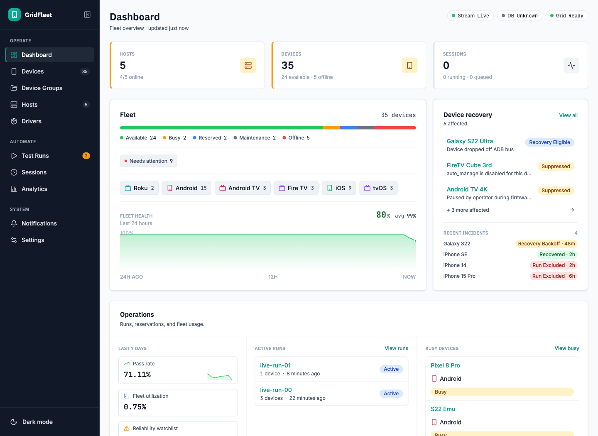

# GridFleet

[](https://github.com/quidow/gridfleet/actions/workflows/ci.yml)
[](https://github.com/quidow/gridfleet/actions/workflows/security.yml)

GridFleet is an Appium control plane for device labs and CI
fleets. From one place, operators register hosts, discover devices, start
Appium nodes, route WebDriver sessions, reserve capacity for test runs, and
check fleet health. A built-in Rust WebDriver router on `:4444` allocates a
device and proxies each session directly to Appium on the host.

Driver-specific behavior lives in driver packs. The core manager owns Appium
process lifecycle, session allocation and routing, scheduling, reservations,
health monitoring, and the dashboard; packs provide discovery rules, platform
metadata, readiness fields, lifecycle actions, capability defaults, and optional
adapter code.



## What you get

- FastAPI backend with PostgreSQL, async SQLAlchemy, Alembic migrations, and
  leader-owned background workers.
- Host agent that runs on each device host and manages discovery, Appium
  processes, tools, and telemetry.
- Rust WebDriver router that allocates a device via the backend and proxies
  W3C sessions directly to Appium.
- React operator dashboard for devices, hosts, sessions, runs, analytics,
  driver packs, settings, notifications, and bulk operations.
- Python testkit for pytest/Appium suites that need run registration,
  reservations, platform selection, and Grid connection helpers.
- Curated Appium driver-pack manifests and adapter source for Android,
  Apple/XCUITest, and Roku lanes.

## Repository layout

```text
gridfleet/
├── backend/       FastAPI manager API, services, models, migrations, tests
├── agent/         Host-side FastAPI agent and native install/update scripts
├── frontend/      React + TypeScript operator console
├── driver-packs/  Curated manifests and adapter source
├── testkit/       Supported Python pytest/Appium helper package
├── docker/        Development and production compose files
├── docs/          Guides, references, and runbooks
└── scripts/       Backup/restore, agent install, and driver-pack helpers
```

## Quick start

The fastest local trial is the Docker stack:

```bash
cd docker
docker compose up --build -d
```

Local endpoints:

- Dashboard: `http://localhost:3000`
- Backend API: `http://localhost:8000`
- WebDriver router: `http://localhost:4444`

To stop the stack:

```bash
cd docker
docker compose down
```

## Driver pack tarballs

GridFleet does not check in generated `.tar.gz` driver-pack artifacts. Build
them locally when you want uploadable packs for another GridFleet instance or
for exercising the upload path.

Build all curated packs:

```bash
python3 scripts/build_driver_tarballs.py
ls dist/driver-packs
```

The script reads manifests from `driver-packs/curated/`, builds matching
adapter wheels from `driver-packs/adapters/`, and writes deterministic tarballs
to `dist/driver-packs/`.

Build one custom or curated pack:

```bash
python3 scripts/build_driver_pack_tarball.py \
  --pack-dir driver-packs/curated/appium-roku-dlenroc \
  --out /tmp/appium-roku-dlenroc-upload.tar.gz \
  --id uploaded/appium-roku-dlenroc \
  --release 2026.04.0-upload
```

If the pack needs custom adapter code, add `--adapter-dir path/to/adapter`.
Adapter builds require `uv` on `PATH`; uploaded adapter wheels execute on agent
hosts, so only upload code you trust.

Read the full upload guide in
[docs/guides/driver-pack-tarball-upload.md](docs/guides/driver-pack-tarball-upload.md).

## Production compose

For a production-style manager deployment:

```bash
cd docker
cp .env.example .env
docker compose --env-file .env -f docker-compose.prod.yml up --build -d
```

Before using production compose, edit `docker/.env` and replace all placeholder
passwords and session secrets. Deployment, backup, restore, and rollback notes
are in [docs/guides/deployment.md](docs/guides/deployment.md).

## Development setup

Prerequisites:

- Python 3.14 (backend and agent)
- `uv`
- Node.js 24
- Docker with `docker compose`
- PostgreSQL 18 for backend tests, or the Docker Postgres service

Backend:

```bash
cd backend
uv sync --extra dev
uv run alembic upgrade head
uv run uvicorn app.main:app --reload
```

Agent:

```bash
cd agent
uv sync --extra dev
uv run uvicorn agent_app.main:app --reload --port 5100
```

Frontend:

```bash
cd frontend
npm ci
npm run dev
```

Host agents can be bootstrapped from the published Python package:

```bash
VERSION=0.3.0 bash scripts/install-agent.sh --manager-url http://MANAGER_IP:8000
```

## Validation

Run the fastest relevant checks for the area you changed:

```bash
cd backend && uv run ruff check app/ tests/ && uv run mypy app/ && uv run pytest -q -n auto
cd agent && uv run ruff check agent_app/ tests/ && uv run mypy agent_app/ && uv run pytest -q
cd testkit && uv run --extra dev pytest -q
cd frontend && npm run lint && npm run build && npm run test:e2e:mocked
```

Frontend live E2E requires backend, Postgres, and the frontend dev server:

```bash
cd frontend
npm run test:e2e:live
```

## Documentation

- [Docs index](docs/README.md)
- [Architecture reference](docs/reference/architecture.md)
- [Environment reference](docs/reference/environment.md)
- [Settings reference](docs/reference/settings.md)
- [Capabilities reference](docs/reference/capabilities.md)
- [Device intake and discovery](docs/guides/device-intake-and-discovery.md)
- [Host onboarding](docs/guides/host-onboarding.md)
- [CI integration](docs/guides/ci-integration.md)
- [Testkit reference](docs/reference/testkit.md)
- [Release policy](docs/reference/release-policy.md)

## Security

GridFleet controls Appium nodes, host agents, driver-pack execution, and optional
host terminals. Treat deployments as trusted lab or CI infrastructure, not as
public internet services.

Start with [SECURITY.md](SECURITY.md) and
[docs/guides/security.md](docs/guides/security.md). Do not expose backend,
agent, WebDriver router, device-host Appium, or host-terminal ports directly to the public internet.

## Project status

GridFleet is in an initial public preview. The system is usable for lab and CI
experiments, but pre-1.0 API, deployment, driver-pack, and testkit contracts may
change across minor releases. Real-device smoke coverage remains a local/manual
release gate.

## Community and license

- License: [Apache License 2.0](LICENSE)
- Changelog: [CHANGELOG.md](CHANGELOG.md)
- Contributing: [CONTRIBUTING.md](CONTRIBUTING.md)
- Code of conduct: [CODE_OF_CONDUCT.md](CODE_OF_CONDUCT.md)
- Security policy: [SECURITY.md](SECURITY.md)
