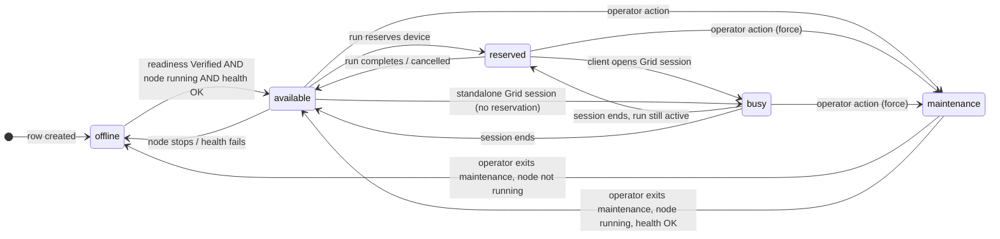
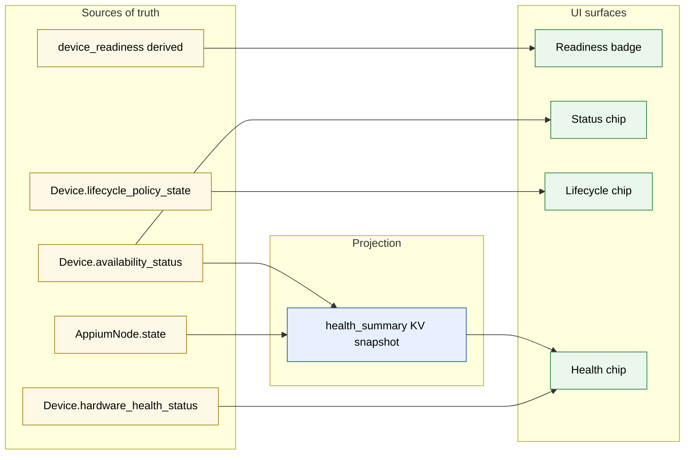

# Doc 1 — Device State Model

> Implementation-level reference. For operator-facing semantics see
> `docs/guides/lifecycle-maintenance-and-recovery.md` and
> `docs/guides/verification-and-readiness.md`.

A `Device` row carries **multiple independent axes** of state. They look related on the UI, but they are written by different code paths, gated by different rules, and recover at different speeds. Treating them as one knob is the root cause of most "split-brain" bugs we have shipped fixes for.

This doc is the contract for those axes: what each one means, where it lives, who is allowed to write it, and how they compose.

## TL;DR

| Axis | Source of truth | Type | Writers |
| --- | --- | --- | --- |
| Readiness | derived from `Device.verified_at` + setup gates | computed | `device_readiness.is_ready_for_use_async` |
| Availability | `Device.availability_status` | enum | API mutators + `node_manager_state` + `device_availability` |
| Hardware health | `Device.hardware_health_status` | enum | `hardware_telemetry` loop |
| Lifecycle policy | `Device.lifecycle_policy_state` | JSON | `lifecycle_policy.record_control_action` only |
| Node state | `AppiumNode.state` | enum | `node_manager_state.mark_node_*` only |
| Health snapshot | control-plane KV `device.health_summary:<id>` | JSON | `device_health_summary.patch_health_snapshot` |

The DB column is always authoritative; the snapshot is a **projection** that exists to feed the UI without joining seven tables. Whenever the snapshot disagrees with the column, the column wins and the snapshot is stale until the next loop tick (or until a writer remembers to sync — see Rule 3 below).

## Axis 1 — Readiness

Readiness answers "is the saved configuration safe to start a node against?". It is derived, not stored as a single column.

- Inputs: `Device.verified_at` (last successful verification), `Device.device_config` (Roku password, tvOS WDA, etc.), `Device.ip_address` for network-connected lanes, `Device.connection_type`.
- Computed by `app.services.device_readiness.is_ready_for_use_async`.
- Surfaces as the readiness badge (`Setup Required` / `Needs Verification` / `Verified`).

Readiness is the **first gate** on every state-changing API call. `RemoteNodeManager.start_node` (`backend/app/services/node_manager.py:174`) refuses to start a node when readiness fails. The lifecycle loop (`node_health.py:83`) uses it to decide whether a device should be probed at all.

Readiness changes only when an operator-driven flow updates `verified_at` or readiness-impacting fields. There is no background loop that flips it.

## Axis 2 — Availability (`Device.availability_status`)

```
available · busy · offline · reserved · maintenance
```

Defined in `backend/app/models/device.py:34-39` (`DeviceAvailabilityStatus`).

Semantics:

- `available` — verified, idle, no node-health failure, no run hold.
- `busy` — Appium session is live against this device.
- `reserved` — held by a run/reservation, even if no session is active yet.
- `offline` — node missing, agent unreachable, health failed, or never started.
- `maintenance` — explicit operator hold; takes precedence over the others.

### Who is allowed to write `availability_status`

There is exactly **one** sanctioned writer:

```text
app.services.device_availability.set_device_availability_status
```

`backend/app/services/device_availability.py:23-51`. It asserts the device is loaded in the current session — i.e. that the row was acquired through `device_locking.lock_device` first — and publishes `device.availability_changed` to the event bus on every transition. Bypassing it (assigning `device.availability_status = ...` directly) is now blocked by `backend/tests/test_no_direct_availability_writes.py`.

The `device.availability_changed` event is queued on the writer's SQLAlchemy session and dispatched **after** the outer transaction commits, via `app.services.event_bus.queue_event_for_session`. If the outer transaction rolls back, the queued event is dropped — webhook and SSE subscribers never see a transition that was not actually persisted. Contract test: `backend/tests/test_availability_event_after_commit.py`. Note: only `device.availability_changed` follows this contract today; other event types (`node.state_changed`, `host.heartbeat_lost`, `run.state_changed`) still publish synchronously inside their transactions and remain divergent on rollback — see follow-up issue.

Seeding scripts under `backend/app/seeding/` are exempt from the rule because fixture builders run in a single short-lived transaction with no event consumers attached.

### Transition rules



Computed transitions live in `node_manager_state._node_started_availability_status` and `_node_stopped_availability_status` (`backend/app/services/node_manager_state.py:103-120`). They preserve `busy / reserved / maintenance` across node start/stop — the node lifecycle never overrides operator or run intent.

After a `busy` session ends, the next state is computed by `resolve_post_busy_availability_status` (`device_availability.py:54-63`), which checks for an open reservation before falling back to readiness-based status.

## Axis 3 — Hardware health (`Device.hardware_health_status`)

```
unknown · healthy · warning · critical
```

Defined in `device.py:50-54`. Written exclusively by `hardware_telemetry_loop` from agent battery/temperature reports. Never read or written by node-lifecycle code; it feeds the operator dashboard only. Treat it as out-of-band telemetry.

## Axis 4 — Lifecycle policy (`Device.lifecycle_policy_state`)

JSON blob in `device.py:127-129`. Captures the auto-recovery state machine — last action, failure source, deferred-stop intent, run-exclusion, backoff, suppression reason, manual-recovery hold.

- Single writer: `app.services.lifecycle_policy.record_control_action`.
- Read by: every loop that decides whether to attempt recovery (`node_health`, `device_connectivity`, `session_viability`).
- Surface: lifecycle summary chip, derived through `DeviceLifecyclePolicySummaryState`.

Operator-facing semantics are documented in `docs/guides/lifecycle-maintenance-and-recovery.md`. The implementation rule that matters here:

> The lifecycle JSON moves only through `record_control_action`. Other code paths must read it (to gate behavior) but never patch it directly.

## Axis 5 — Node state (`AppiumNode.state`)

```
running · stopped · error
```

`backend/app/models/appium_node.py:18-21`. The Appium node is a **separate row** (one-to-one with `Device`, FK with cascade). This separation is deliberate: a device exists without a node, but a node cannot exist without a device.

Sanctioned writers:

| Writer | Transition | File |
| --- | --- | --- |
| `mark_node_started` | `stopped/error → running` | `node_manager_state.py:123-155` |
| `mark_node_stopped` | `running/error → stopped` | `node_manager_state.py:158-190` |
| `_process_node_health` (auto-recover branch) | `running → error`, then `error → running` on auto-restart | `node_health.py:354,408,433` |
| `restart_node_via_agent` | mutates `port/pid/state` together inside its own lock window | `node_manager_remote.py:404-408` |

Writers outside this list are bugs — they bypass the snapshot sync (Axis 6) and the device row lock.

Doc 2 covers the full transition graph and the agent-acknowledgement contract that gates `running → stopped`.

## Axis 6 — Health snapshot (KV projection)

A single JSON document keyed by `device_id`, stored in the control-plane KV namespace `device.health_summary` (`backend/app/services/device_health_summary.py:21`). Fields:

```text
device_checks_healthy : bool | None
device_checks_summary : str
node_running          : bool | None
node_state            : str
session_viability_status : "passed" | "failed" | None
session_viability_error  : str | None
last_checked_at       : ISO timestamp
```

The snapshot is a **projection**, not a source of truth. It exists so `/api/devices` can render a healthy/unhealthy chip without joining `appium_nodes`, the lifecycle JSON, and the session-viability table on every poll.

### Three rules the snapshot must obey

1. **Tri-state values are mandatory.** `node_running` and `device_checks_healthy` are `bool | None`. `None` means *unknown* (agent unreachable, transport error, circuit open). Loops must never coerce `None` to `False`. See `node_health._check_node_health` (`node_health.py:99-150`) — transient HTTP failures intentionally return `None` and `_process_node_health` early-exits at `node_health.py:229-230`.

2. **Every node-state writer must sync the snapshot in the same transaction.** `mark_node_started` and `mark_node_stopped` call `device_health_summary.update_node_state` before commit (`node_manager_state.py:142, 172`). Without this, the snapshot keeps the previous `node_running=true` value for one full `node_health` cycle (~30s) and the device renders as "offline + healthy".

3. **Snapshot writes acquire the device row lock.** `patch_health_snapshot` (`device_health_summary.py:237-254`) calls `_lock_device_for_health_transition` so that any cross-axis effects (e.g. flipping `availability_status` to `offline` on a failed health signal) happen under the same lock window.

### Snapshot → availability cross-link

Two cross-links exist intentionally:

- `_mark_offline_for_failed_health_signal` — when a definitive failure arrives and the device is currently `available`, drop it to `offline` so the UI does not advertise an unhealthy device for allocation.
- `_restore_available_for_healthy_signal` — when the snapshot recovers (node running + checks healthy + readiness OK + auto_manage on) and the device is `offline`, lift it back to `available`.

Both run under the device row lock and only act when the *current* `availability_status` would not stomp on operator/run intent (`available` only ↔ `offline`; never `busy/reserved/maintenance`).

## The locking invariant

```text
Any write to Device.availability_status or Device.lifecycle_policy_state
MUST hold the row-level lock from device_locking.lock_device(),
acquired in the same transaction as the write.
```

`backend/app/services/device_locking.py:1-15`. The reason is concrete: API mutators run on every Uvicorn worker, but background loops only run on the leader. The advisory lock keeps loops singleton; the device row lock keeps loops and API workers from racing each other on the same device.

`AppiumNode.state` writes additionally hold the `appium_node_locking.lock_appium_node_for_device` row lock — both `mark_node_started` and `mark_node_stopped` acquire it after the device lock (`node_manager_state.py:131-134, 159-162`).

Multi-row mutators (group actions, bulk reconnect) must use `lock_devices` which sorts ids ascending. Mixing single-row and batch callers stays deadlock-free as long as the batch order matches.

## How the axes compose for the UI



The UI never reads `AppiumNode.state` directly for the health chip — only through the snapshot. That is what makes Rule 2 above non-negotiable.

## Common failure modes (and which axis is wrong)

| Symptom | Wrong axis | Fix path |
| --- | --- | --- |
| "Offline + healthy" rendered together | Snapshot stale; node-state write skipped sync | Add `update_node_state` to writer (commit `9298bad`) |
| Device flaps `available → offline → available` every minute | Loop coerced `None` to `False` | Use `bool \| None` everywhere a probe can be unreachable (commit `a58c8e5`) |
| Device shows `stopped` in DB but Grid still routes to it | `mark_node_stopped` ran without agent ack | Gate node-state flip on agent ack returning `True` (commits `4171847`, `bdfae85`) |
| Operator sets `maintenance` and a loop reverts it to `available` | Loop bypassed `set_device_availability_status` and stomped operator intent | Loop must call the helper, which respects operator-precedent ordering |
| Two workers race on the same device | Mutator skipped `lock_device` | Acquire row lock before any availability/lifecycle write |

## What this doc does NOT cover

- The full state machine for `AppiumNode.state` and the agent acknowledgement contract — see Doc 2.
- The cadence and contracts of background loops — see Doc 3.
- The HTTP shapes between backend and agent — see Doc 4.
- Owner allocations, port pools, and Grid sessions — see Doc 5.
