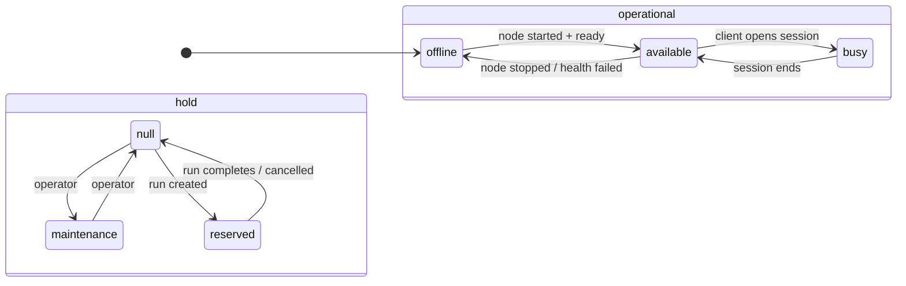

# Doc 1 — Device State Model

> Implementation-level reference. For operator-facing semantics see
> `docs/guides/lifecycle-maintenance-and-recovery.md` and
> `docs/guides/verification-and-readiness.md`.

A `Device` row carries **multiple independent axes** of state. They look related on the UI, but they are written by different code paths, gated by different rules, and recover at different speeds. Treating them as one knob is the root cause of most "split-brain" bugs we have shipped fixes for.

This doc is the contract for those axes: what each one means, where it lives, who is allowed to write it, and how they compose.

## TL;DR

| Axis | Source of truth | Type | Writers |
| --- | --- | --- | --- |
| Readiness | derived from `Device.verified_at` + setup gates | computed | `device_readiness.is_ready_for_use_async` |
| Operational state + hold | `Device.operational_state`, `Device.hold` | enum + nullable enum | node/session loops + operator/run mutators through `device_state` |
| Hardware health | `Device.hardware_health_status` | enum | `hardware_telemetry` loop |
| Lifecycle policy | `Device.lifecycle_policy_state` | JSON | `lifecycle_policy` / `lifecycle_policy_actions` through `lifecycle_policy_state.write_state` |
| Node state | `AppiumNode.state` | enum | `node_service` and health/reconciliation paths through `device_health.apply_node_state_transition` |
| Health | `Device.device_checks_*`, `Device.session_viability_*`, `Device.emulator_state`, `AppiumNode.health_*` | typed columns | `device_health` service |

The DB columns are always authoritative. The public `health_summary` returned by `/api/devices` is derived on read by `app.services.device_health.build_public_summary(device)`.

## Axis 1 — Readiness

Readiness answers "is the saved configuration safe to start a node against?". It is derived, not stored as a single column.

- Inputs: `Device.verified_at` (last successful verification), `Device.device_config` (Roku password, tvOS WDA, etc.), `Device.ip_address` for network-connected lanes, `Device.connection_type`.
- Computed by `app.services.device_readiness.is_ready_for_use_async`.
- Surfaces as the readiness badge (`Setup Required` / `Needs Verification` / `Verified`).

Readiness is the **first gate** on every state-changing API call. `node_service.start_node` (`backend/app/services/node_service.py`) refuses to start a node when readiness fails. The lifecycle loop (`node_health._should_probe_node_health` in `node_health.py`) uses it to decide whether a device should be probed at all.

Readiness changes only when an operator-driven flow updates `verified_at` or readiness-impacting fields. There is no background loop that flips it.

## Axis 2 — Operational state + hold

Two orthogonal columns replace the legacy availability enum:

```text
Device.operational_state : available | busy | offline   (NOT NULL)
Device.hold              : maintenance | reserved | null
```

Defined in `backend/app/models/device.py` as `DeviceOperationalState` and `DeviceHold`.

Semantics:

- **operational_state** — what the device is doing right now. Owned by node lifecycle (`available`/`offline`) and `session_sync_loop` (`busy`).
- **hold** — what is blocking use, regardless of operational state. Owned by operator actions (`maintenance`) and run/reservation logic (`reserved`).

The combinations make sense in any pairing. `operational_state=offline, hold=reserved` means the agent died but the reservation is still live; the operator sees "Reserved (offline)" and the run keeps the device. `operational_state=available, hold=maintenance` means the node is up but the operator put the device on hold; the chip reads "Maintenance".

### Sanctioned writers

Two helpers in `backend/app/services/device_state.py` own writes:

```text
set_operational_state(device, new_state, *, reason=None, publish_event=True)
set_hold(device, new_hold, *, reason=None, publish_event=True)
```

Both assert the device is loaded in a session, publish `device.operational_state_changed` / `device.hold_changed` on transition unless `publish_event=False`, and return `False` when the value is unchanged. A row-level lock is required before calling them. Most writers acquire it through `device_locking.lock_device` or `lock_devices`; run creation uses its matching query's `SELECT ... FOR UPDATE SKIP LOCKED` window before setting `hold=reserved`. `backend/tests/test_no_direct_device_state_writes.py` enforces the single-writer rule.

Seeding scripts under `backend/app/seeding/` are exempt because fixture builders run in a single short-lived transaction with no event consumers attached.

### UI projection

The legacy chip, one of `available|busy|offline|maintenance|reserved`, is computed:

```text
chip = hold if hold else operational_state
```

Frontend implements this in `frontend/src/lib/deviceState.ts`. Backend exposes the audit-only legacy label via `device_state.legacy_label_for_audit(device)` for log messages.

### Transition rules



The two state machines run independently. Node lifecycle never touches `hold`; operator and run logic never touch `operational_state` except when a stop transition flips operational state to `offline` as a side effect of entering maintenance.

## Axis 3 — Hardware health (`Device.hardware_health_status`)

```
unknown · healthy · warning · critical
```

Defined in `device.py` (`HardwareHealthStatus`). Written exclusively by `hardware_telemetry_loop` from agent battery/temperature reports. Never read or written by node-lifecycle code; it feeds the operator dashboard only. Treat it as out-of-band telemetry.

Live event surface:

- `device.hardware_health_changed` reports warning/critical hardware telemetry transitions.
- `device.health_changed` reports aggregate health summary transitions.
- `device.crashed` reports per-device crash incidents whenever a persisted `node_crash` event is recorded. It is separate from `node.crash`, which is per-Appium-process and may carry process granularity such as `appium` or `grid_relay`.

## Axis 4 — Lifecycle policy (`Device.lifecycle_policy_state`)

JSON blob on `Device` (`device.py`). Captures the auto-recovery state machine — last action, failure source, deferred-stop intent, run-exclusion, backoff, suppression reason, manual-recovery hold.

- Low-level writer: `app.services.lifecycle_policy_state.write_state`.
- Sanctioned service writers: `app.services.lifecycle_policy` and `app.services.lifecycle_policy_actions`. The run-preparation failure path calls `lifecycle_policy_actions.record_ci_preparation_failed`, so `run_service` does not import the low-level JSON writer directly.
- Read by: every loop that decides whether to attempt recovery (`node_health`, `device_connectivity`, `session_viability`).
- Surface: lifecycle summary chip, derived through `DeviceLifecyclePolicySummaryState`.

Operator-facing semantics are documented in `docs/guides/lifecycle-maintenance-and-recovery.md`. The implementation rule that matters here:

> The lifecycle JSON is a read-modify-write field. Any writer must use `lifecycle_policy_state.state(...)` + `write_state(...)` while holding the device row lock for the whole RMW window. Direct assignment to `device.lifecycle_policy_state` in production code is a bug.

Current fields:

| Field | Meaning |
| --- | --- |
| `last_failure_source` / `last_failure_reason` | Most recent lifecycle-relevant failure signal |
| `last_action` / `last_action_at` | Most recent lifecycle policy action |
| `stop_pending` / `stop_pending_reason` / `stop_pending_since` | Deferred auto-stop intent while a client session is still running |
| `recovery_suppressed_reason` | Why automatic recovery is currently blocked |
| `backoff_until` / `recovery_backoff_attempts` | Automatic recovery backoff state |

## Axis 5 — Node state (`AppiumNode.state`)

```
running · stopped · error
```

`backend/app/models/appium_node.py` (`NodeState`). The Appium node is a **separate row** (one-to-one with `Device`, FK with cascade). This separation is deliberate: a device exists without a node, but a node cannot exist without a device.

Sanctioned writers:

| Writer | Transition | File |
| --- | --- | --- |
| `mark_node_started` | `stopped/error → running` | `node_service.py` |
| `mark_node_stopped` | `running/error → stopped` | `node_service.py` |
| `_process_node_health` (auto-recover branch) | `running → error`, then `error → running` on auto-restart | `node_health.py` |
| `_stop_disconnected_node` | `running → stopped/error` after connectivity loss, depending on agent stop ack | `device_connectivity.py` |
| `_ingest_appium_restart_events` | local agent restart events update node health and can restore `running` | `heartbeat.py` |
| `restart_node_via_agent` | mutates `port/pid/state` together inside its own lock window | `node_service.py` |
| `nodes` API router post-service refresh | re-applies the service result to health columns after `start/stop/restart` | `routers/nodes.py` |

Writers outside this list are bugs unless they route through `device_health.apply_node_state_transition` while holding the documented locks. The API-router refresh rows are current implementation detail; the durable node-state transition is still owned by `node_service`.

Doc 2 covers the full transition graph and the agent-acknowledgement contract that gates `running → stopped`.

## Axis 6 — Health (derived on read)

The public health snapshot is not stored in KV. Health-relevant state lives in typed columns:

- `Device.device_checks_healthy : bool | null`
- `Device.device_checks_summary : str | null`
- `Device.device_checks_checked_at : timestamptz | null`
- `Device.session_viability_status : "passed" | "failed" | null`
- `Device.session_viability_error : str | null`
- `Device.session_viability_checked_at : timestamptz | null`
- `Device.emulator_state : str | null`
- `AppiumNode.state` (Axis 5, lifecycle: running|stopped|error)
- `AppiumNode.health_running : bool | null`, `AppiumNode.health_state : text | null`
- `AppiumNode.consecutive_health_failures : int`
- `AppiumNode.last_health_checked_at : timestamptz | null`

The public summary returned by `/api/devices` is computed by `app.services.device_health.build_public_summary(device)`, a pure function that reads the row plus `device.appium_node`. There is no separate document to keep in sync.

### Three rules the writers must obey

1. **`update_device_checks` and `update_session_viability` take typed values.** `update_device_checks(healthy: bool, ...)` requires a real bool. Indeterminate probe results must short-circuit before the call. See `app.services.agent_probe_result.ProbeResult`.
2. **Cross-link to operational state is centralised.** Failed signals can flip `available -> offline`; healthy recovery can lift `offline -> available` when readiness, `auto_manage`, and node state allow. Writers use `set_operational_state` for these paths and never touch `hold`.
3. **No public health KV.** The legacy health-summary and node-health counter namespaces no longer exist. `control_plane_state_store` still exists for ephemeral loop coordination and diagnostics, such as heartbeat failure counts, appium-process snapshots, connectivity "previously offline" markers, and session-viability in-progress state. Those entries are not the public device health source of truth.

### Health → operational-state cross-link

Two cross-links exist intentionally:

- `_mark_offline_for_failed_signal` — when a definitive failure arrives and the device is currently `available`, drop it to `offline` so the UI does not advertise an unhealthy device for allocation.
- `_restore_available_for_healthy_signal` — when the derived health projection recovers (node running + checks healthy + readiness OK + auto_manage on) and the device is `offline`, lift it back to `available`.

Both run under the device row lock and only act on `operational_state` (`available` only ↔ `offline`). They do not change `hold`, so operator/run intent is preserved.

## The locking invariant

```text
Any write to Device.operational_state, Device.hold, or Device.lifecycle_policy_state
MUST hold a row-level lock in the same transaction as the write.
```

Prefer `backend/app/services/device_locking.py` (`lock_device` / `lock_devices`) for that lock. The current run allocator is the exception: `_find_matching_devices` in `run_service.py` locks allocatable rows with `SELECT ... FOR UPDATE SKIP LOCKED` before reserving them. The reason is concrete: API mutators run on every Uvicorn worker, but background loops only run on the leader. The advisory lock keeps loops singleton; the device row lock keeps loops and API workers from racing each other on the same device.

`AppiumNode.state` writes additionally hold the `appium_node_locking.lock_appium_node_for_device` row lock — both `mark_node_started` and `mark_node_stopped` acquire it after the device lock (`node_service.py`).

Multi-row mutators (group actions, bulk reconnect) must use `lock_devices` which sorts ids ascending. Mixing single-row and batch callers stays deadlock-free as long as the batch order matches.

## How the axes compose for the UI


The UI health chip reads the derived public summary, not a stored health document.

## Common failure modes (and which axis is wrong)

| Symptom | Wrong axis | Fix path |
| --- | --- | --- |
| "Offline + healthy" rendered together | Derived health writer bypassed `apply_node_state_transition` | Route node health/lifecycle transitions through `device_health` |
| Device flaps `available -> offline -> available` every minute | Loop coerced indeterminate probe result to refused | Use `ProbeResult` and short-circuit `indeterminate` (commit `a58c8e5`) |
| Device shows `stopped` in DB but Grid still routes to it | `mark_node_stopped` ran without agent ack | Gate node-state flip on agent ack returning `True` (commits `4171847`, `bdfae85`) |
| Operator sets `maintenance` and a loop reverts it to `available` | Loop wrote `hold` or derived chip state instead of only updating `operational_state` | Loop must call `set_operational_state` and leave `hold` untouched |
| Two workers race on the same device | Mutator skipped the row lock | Acquire row lock before any device-state/lifecycle write |

## What this doc does NOT cover

- The full state machine for `AppiumNode.state` and the agent acknowledgement contract — see Doc 2.
- The cadence and contracts of background loops — see Doc 3.
- The HTTP shapes between backend and agent — see Doc 4.
- Owner allocations, port pools, and Grid sessions — see Doc 5.
