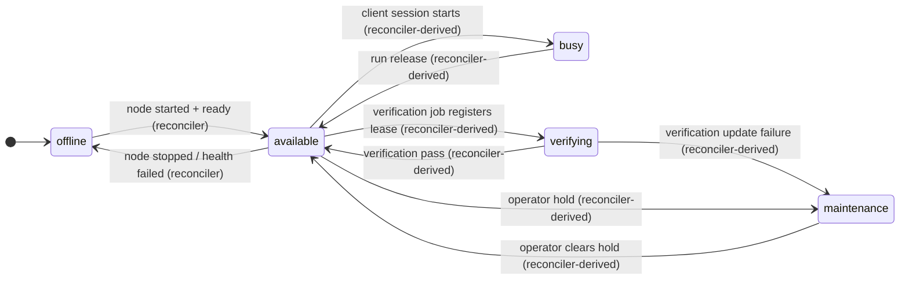
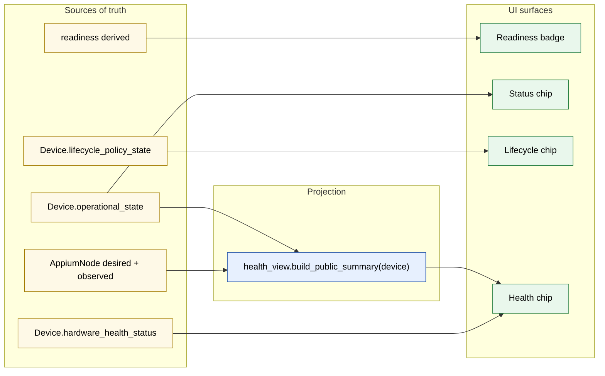

# Doc 1: Device State Model

> Implementation-level reference. For operator-facing semantics see
> `docs/guides/lifecycle-maintenance-and-recovery.md` and
> `docs/guides/verification-and-readiness.md`.

A `Device` row carries **multiple independent axes** of state. They look related on the UI, but they are written by different code paths, gated by different rules, and recover at different speeds. Treating them as one knob is the root cause of most "split-brain" bugs we have shipped fixes for.

This doc is the contract for those axes: what each one means, where it lives, who is allowed to write it, and how they compose.

## TL;DR

| Axis | Source of truth | Type | Writers |
| --- | --- | --- | --- |
| Readiness | derived from `Device.verified_at` + setup gates | computed | `app.devices.services.readiness.is_ready_for_use_async` |
| Operational state | `Device.operational_state` | 5-value enum | `device_intent_reconciler` loop via `apply_derived_state`, the sole caller of `app.devices.services.state.set_operational_state`; other paths record durable facts and call `IntentService.mark_dirty` / `mark_dirty_and_reconcile` |
| Reservation | `device_reservations` rows | computed flag (`is_reserved`) | run/reservation logic via inserts into the `device_reservations` table |
| Hardware health | `Device.hardware_health_status` | enum | `hardware_telemetry` loop |
| Lifecycle policy | `Device.lifecycle_policy_state` | JSON | `lifecycle_policy` / `lifecycle_policy_actions` through `app.devices.services.lifecycle_policy_state.write_state` |
| Node state | `AppiumNode.desired_state` + observed columns | desired enum + observed columns; effective state derived | desired state via `app.appium_nodes.services.desired_state_writer.write_desired_state`; observed columns via reconciler/health/heartbeat writers |
| Health | `Device.device_checks_*`, `Device.session_viability_*`, `Device.emulator_state`, `AppiumNode.health_*` | typed columns | `device_health` service |

The DB columns are always authoritative. The public `health_summary` returned by `/api/devices` is derived on read by `app.devices.services.health_view.build_public_summary(device)` (re-exported via `app.devices.services.health`).

## Axis 1: Readiness

Readiness answers "is the saved configuration safe to start a node against?". It is derived, not stored as a single column.

- Inputs: `Device.verified_at` (last successful verification), `Device.device_config` (Roku password, tvOS WDA, etc.), `Device.ip_address` for network-connected lanes, `Device.connection_type`.
- Computed by `app.devices.services.readiness.is_ready_for_use_async`.
- Surfaces as the readiness badge (`Setup Required` / `Needs Verification` / `Verified`).

Readiness is the **first gate** on every state-changing API call. The start-node path (`app.appium_nodes.routers.nodes.start_node`, and `app.appium_nodes.services.reconciler_agent.start_node`) refuses to start a node when `is_ready_for_use_async` fails.

Readiness changes only when an operator-driven flow updates `verified_at` or readiness-impacting fields. There is no background loop that flips it.

## Axis 2: Operational state

A single authoritative enum captures what the device is doing right now:

```text
Device.operational_state : available | busy | offline | verifying | maintenance   (NOT NULL)
```

Defined in `backend/app/devices/models/device.py` as `DeviceOperationalState`. There is no separate `hold` column or `DeviceHold` enum: `maintenance` is just one of the five `operational_state` values, and **reservation is orthogonal but not a column**: it is the computed `is_reserved` flag derived from the `device_reservations` table (see Reservation, below).

Semantics:

- `operational_state` is what the device is doing right now. The sole writer is the `device_intent_reconciler` loop, which derives the value via `apply_derived_state` from durable facts (an active client session, an active verification lease, `maintenance_reason`, a node stop-in-flight, readiness). No other production code calls `set_operational_state` directly; see Sanctioned writers below.
- `maintenance` is the operator-hold value; `offline` is the unhealthy/node-down value; `busy` is derived once a client session is live; `available` is the ready value the reconciler derives once health and node state allow.

### Reservation (computed, not a column)

Reservation is tracked in a separate table, not on `Device`. Active reservations are rows in `device_reservations` (`app.devices.models.reservation.DeviceReservation`). The `is_reserved` flag is computed from those rows via `app.devices.services.reservation_query.device_is_reserved` and surfaced through the presenter. A device can be reserved while `operational_state=offline` (the agent died but the reservation is still live, so the run keeps the device). That combination is reservation-row-plus-operational-state, not a second column on `Device`.

### Sanctioned writers

The authoritative runtime path is `app.devices.services.state.apply_derived_state`, whose **sole production caller** is the `device_intent_reconciler` loop (`app.devices.services.intent_reconciler`). It derives `operational_state` purely from durable facts (an active client session, an active verification lease, `maintenance_reason`, a node stop-in-flight, readiness) gathered by `gather_device_state_facts` from health flags, session rows, and `DeviceIntent` rows recorded by the observation loops and operator/run flows.

The single low-level writer is `set_operational_state` in `app.devices.services.state`:

```text
async def set_operational_state(
    device, new_state, *, reason=None, publish_event=True,
    severity=None, publisher: EventPublisher,
) -> bool
```

It publishes `device.operational_state_changed` via `publisher.queue_for_session` (queued for commit) unless `publish_event=False`, and returns `False` when the value is unchanged. A row-level lock is required before calling it. `set_operational_state` has **no production callers outside `apply_derived_state`**. Every other code path records the durable fact instead and calls `IntentService.mark_dirty` or `mark_dirty_and_reconcile` to trigger a reconcile:

- `app.verification.services.execution` registers a `DeviceIntent` (`verification_intent_source`) when a verification job starts and revokes it via `IntentService.revoke_intents_and_reconcile` on pass/fail; the reconciler derives `verifying` from the active lease rather than a direct write.
- `app.appium_nodes.services.heartbeat` records the host-offline fact via `DeviceHealthService.update_device_checks(healthy=False)` for every device on a downed host; the reconciler derives `offline` from the resulting not-ready fact.
- `app.runs.service_lifecycle_release` (`RunReleaseService.release_devices`) calls `IntentService.mark_dirty_and_reconcile` after releasing a device's reservation; the reconciler derives the ready state.

Run allocation does not write `operational_state` to reserve; it inserts rows into the `device_reservations` table. Its matching query uses a `SELECT ... FOR UPDATE SKIP LOCKED` window (`with_for_update(of=Device, skip_locked=True)` in `app.runs.service_allocator._find_matching_devices`) to lock allocatable rows before reserving them. `backend/tests/contracts/test_no_direct_device_state_writes.py` enforces the single-writer rule, including that `set_operational_state` is called only from `app/devices/services/state.py`.

### UI projection

The status chip is simply `operational_state`, one of the five values `available|busy|offline|maintenance|verifying`:

```text
chip = operational_state
```

Frontend implements this in `frontend/src/lib/deviceState.ts` (`deviceChipStatus` returns `device.operational_state`). Reservation is **not** part of the chip projection. It is an orthogonal boolean device-list filter (`reserved=true`, derived from active reservation rows), not a status value.

### Transition rules



Every transition is derived by the `device_intent_reconciler` loop via `apply_derived_state`. Verification, session register/end, host-offline, and run release all feed durable facts (a verification lease, a `Session` row, a health flag, `maintenance_reason`, `device_reservations` rows) that the reconciler folds into the derived value; none of them write `operational_state` directly.

## Axis 3: Hardware health (`Device.hardware_health_status`)

```
unknown · healthy · warning · critical
```

Defined in `device.py` (`HardwareHealthStatus`). Written exclusively by the `host_sweep` hardware-telemetry stage from agent battery/temperature reports. Never read or written by node-lifecycle code; it feeds the operator dashboard only. Treat it as out-of-band telemetry.

Live event surface:

- `device.hardware_health_changed` reports warning/critical hardware telemetry transitions.
- `device.health_changed` reports aggregate health summary transitions.
- `device.crashed` reports per-device crash incidents whenever a persisted `node_crash` event is recorded. It is separate from `node.crash`, which is per-Appium-process and may carry process granularity such as `appium` or `grid_relay`.

## Axis 4: Lifecycle policy (`Device.lifecycle_policy_state`)

JSON blob on `Device` (`device.py`). Captures the auto-recovery state machine: last action, failure source, deferred-stop intent, run-exclusion, backoff, suppression reason, manual-recovery hold.

- Low-level writer: `app.devices.services.lifecycle_policy_state.write_state` (read side: `.state`).
- Sanctioned service writers: `app.lifecycle.services.policy` and `app.lifecycle.services.actions`. The run-preparation-failure and cooldown-escalation paths call `actions.record_run_escalation_failure`, so `app.runs.service_lifecycle_failures` does not import the low-level JSON writer directly.
- Read by: every loop that decides whether to attempt recovery (`node_health`, `device_connectivity`, `session_viability`).
- Surface: lifecycle summary chip, derived through `DeviceLifecyclePolicySummaryState`.

Operator-facing semantics are documented in `docs/guides/lifecycle-maintenance-and-recovery.md`. The implementation rule that matters here:

> The lifecycle JSON is a read-modify-write field. Any writer must use `lifecycle_policy_state.state(...)` + `write_state(...)` while holding the device row lock for the whole RMW window. Direct assignment to `device.lifecycle_policy_state` in production code is a bug.

Current fields:

| Field | Meaning |
| --- | --- |
| `last_failure_source` / `last_failure_reason` | Most recent lifecycle-relevant failure signal |
| `last_action` / `last_action_at` | Most recent lifecycle policy action |
| `stop_pending` / `stop_pending_reason` / `stop_pending_since` | Deferred auto-stop intent while a client session is still running |
| `recovery_suppressed_reason` | Why automatic recovery is currently blocked |
| `backoff_until` / `recovery_backoff_attempts` | Automatic recovery backoff state |

## Axis 5: Node state (desired vs observed)

There is no single `AppiumNode.state` column or `NodeState` enum. The node row carries an **intent** column plus separate **observed** columns; the effective state is derived, not stored.

```text
AppiumNode.desired_state : running | stopped   (NOT NULL, DB CHECK constraint)
observed: pid · port · active_connection_target · health_running · health_state
          · last_observed_at · last_health_checked_at · consecutive_health_failures
```

`backend/app/appium_nodes/models/node.py` defines `AppiumDesiredState` (with `CheckConstraint("desired_state IN ('running', 'stopped')")`). The effective state is derived in `app.devices.schemas.device` (`DesiredNodeState` / `EffectiveNodeState`). The Appium node is a **separate row** (one-to-one with `Device`, FK with cascade). This separation is deliberate: a device exists without a node, but a node cannot exist without a device.

Sanctioned writers (defer to `PROTECTED_COLUMN_WRITERS` in
`backend/tests/contracts/test_no_direct_device_state_writes.py` for the authoritative enumeration):

| Column(s) | Writers |
| --- | --- |
| `desired_state`, `desired_port` | only `app.appium_nodes.services.desired_state_writer.write_desired_state`, under the device row lock |
| `transition_token`, `transition_deadline` | `desired_state_writer.write_desired_state`, plus direct clears in `app.appium_nodes.routers.admin` (under the device row lock) and `app.appium_nodes.services.reconciler_agent` |
| `pid`, `port`, `active_connection_target` | reconciler writers (`app.appium_nodes.services.reconciler*`); active-target cache fill in `app.devices.services.capability` |
| `health_running`, `health_state`, `last_health_checked_at` | `app.devices.services.health.apply_node_state_transition` and the reconciler/heartbeat health writers listed in `PROTECTED_COLUMN_WRITERS` |
| `last_observed_at` | the reconciler's Core bulk update (`_touch_last_observed`) |

The intent-vs-observation split mirrors the operational-state axis. Operator routes and lifecycle flows write **desired state only** (`mark_node_started` / `mark_node_stopped` / `restart_node` live in `app.appium_nodes.services.reconciler_agent`). `apply_node_state_transition` (`app.devices.services.health`) writes only `health_running` / `health_state` / `last_health_checked_at` and then delegates state derivation to `IntentService.mark_dirty_and_reconcile`; it does not write a node `state` enum. Observation loops live at `app.appium_nodes.services.node_health` (`_process_node_health`), `app.devices.services.connectivity` (`_stop_disconnected_node`), and `app.appium_nodes.services.heartbeat` (`_ingest_appium_restart_events`).

Doc 2 covers the full transition graph and the agent-acknowledgement contract that gates `running → stopped`.

## Axis 6: Health (derived on read)

The public health snapshot is not stored in KV. Health-relevant state lives in typed columns:

- `Device.device_checks_healthy : bool | null`
- `Device.device_checks_summary : str | null`
- `Device.device_checks_checked_at : timestamptz | null`
- `Device.session_viability_status : "passed" | "failed" | null`
- `Device.session_viability_error : str | null`
- `Device.session_viability_checked_at : timestamptz | null`
- `Device.emulator_state : str | null`
- `AppiumNode.desired_state` plus observed columns (Axis 5: `pid`, `port`, `active_connection_target`; effective state derived as `EffectiveNodeState`)
- `AppiumNode.health_running : bool | null`, `AppiumNode.health_state : text | null`
- `AppiumNode.consecutive_health_failures : int`
- `AppiumNode.last_health_checked_at : timestamptz | null`

The public summary returned by `/api/devices` is computed by `app.devices.services.health_view.build_public_summary(device)` (re-exported via `app.devices.services.health`), a pure function that reads the row plus `device.appium_node`. There is no separate document to keep in sync.

### Three rules the writers must obey

1. **`update_device_checks` and `update_session_viability` take typed values.** `update_device_checks(healthy: bool, ...)` requires a real bool. Indeterminate probe results must short-circuit before the call. See `app.agent_comm.probe_result.ProbeResult`.
2. **Cross-link to operational state is centralised.** Observation writers record durable health facts and mark the device dirty; the `device_intent_reconciler` then derives `available -> offline` on a definitive failure and lifts `offline -> available` once readiness and node state recover. Observation writers never write `operational_state` directly.
3. **No public health KV.** The legacy health-summary and node-health counter namespaces no longer exist. `control_plane_state_store` still exists for ephemeral loop coordination and diagnostics, such as heartbeat failure counts, appium-process snapshots, connectivity "previously offline" markers, and session-viability in-progress state. Those entries are not the public device health source of truth.

### Health → operational-state cross-link

The cross-link is reconciler-mediated, not a pair of direct flip helpers:

- On a definitive failure the observation writer records the durable health fact (e.g. `apply_node_state_transition` / `update_session_viability` in `app.devices.services.health`, or the connectivity loop) and calls `IntentService.mark_dirty_and_reconcile` / `mark_dirty`. The reconciler then drops an `available` device to `offline` so the UI does not advertise an unhealthy device for allocation.
- On recovery (node running + checks healthy + readiness OK) the same path marks the device dirty and the reconciler lifts it back to `available`.

The `device_intent_reconciler` loop (`app.devices.services.intent_reconciler`, the sole production caller of `apply_derived_state`) owns the `available` ↔ `offline` derivation under the device row lock. Operator/run intent (`maintenance_reason`, `device_reservations` rows) is preserved because it lives in durable facts the reconciler folds in, not in a column the observation writers touch.

## The locking invariant

```text
Any write to Device.operational_state or Device.lifecycle_policy_state
MUST hold a row-level lock in the same transaction as the write.
```

Prefer `app.devices.locking` (`backend/app/devices/locking.py`, `lock_device` / `lock_devices`) for that lock. The current run allocator is the exception: `_find_matching_devices` in `app.runs.service_allocator` locks allocatable rows with `SELECT ... FOR UPDATE SKIP LOCKED` (`with_for_update(of=Device, skip_locked=True)`) before reserving them. API mutators run on every Uvicorn worker, while background loops run in the scheduler process. The advisory lock keeps the loop runner singleton; the device row lock keeps loops and API workers from racing on the same device.

`AppiumNode` desired-state writes also hold the `app.appium_nodes.services.locking.lock_appium_node_for_device` row lock; `mark_node_started` and `mark_node_stopped` (in `app.appium_nodes.services.reconciler_agent`) acquire it after the device lock.

Multi-row mutators (group actions, bulk reconnect) must use `lock_devices` which sorts ids ascending. Mixing single-row and batch callers stays deadlock-free as long as the batch order matches.

## How the axes compose for the UI



The UI health chip reads the derived public summary, not a stored health document.

## Common failure modes (and which axis is wrong)

| Symptom | Wrong axis | Fix path |
| --- | --- | --- |
| "Offline + healthy" rendered together | Derived health writer bypassed `apply_node_state_transition` | Route node health/lifecycle transitions through `device_health` |
| Device flaps `available -> offline -> available` every minute | Loop coerced indeterminate probe result to refused | Use `ProbeResult` and short-circuit `indeterminate` (commit `a58c8e5`) |
| Device shows `stopped` in DB but Grid still routes to it | `mark_node_stopped` ran without agent ack | Gate node-state flip on agent ack returning `True` (commits `4171847`, `bdfae85`) |
| Operator sets `maintenance` and a loop reverts it to `available` | A loop wrote `operational_state` directly instead of recording a durable fact and letting the reconciler derive it | Observation loops must record durable facts and call `IntentService.mark_dirty` / `mark_dirty_and_reconcile`; only `apply_derived_state` (the reconciler's sole writer) writes `operational_state` |
| Two workers race on the same device | Mutator skipped the row lock | Acquire row lock before any device-state/lifecycle write |

## What this doc does NOT cover

- The full state machine for the Appium node (desired vs effective state) and the agent acknowledgement contract: see Doc 2.
- The cadence and contracts of background loops: see Doc 3.
- The HTTP shapes between backend and agent: see Doc 4.
- Owner allocations, port pools, and Grid sessions: see Doc 5.
