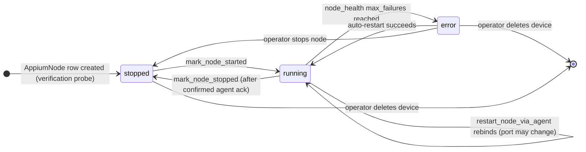
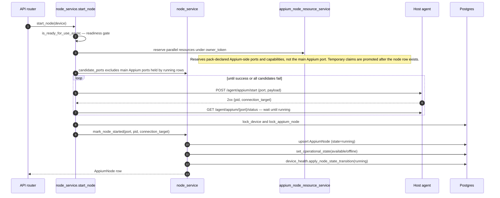
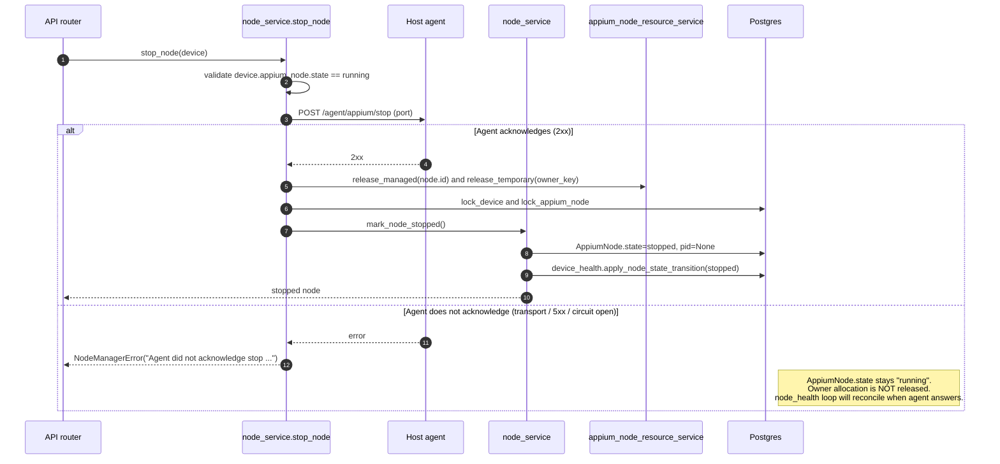
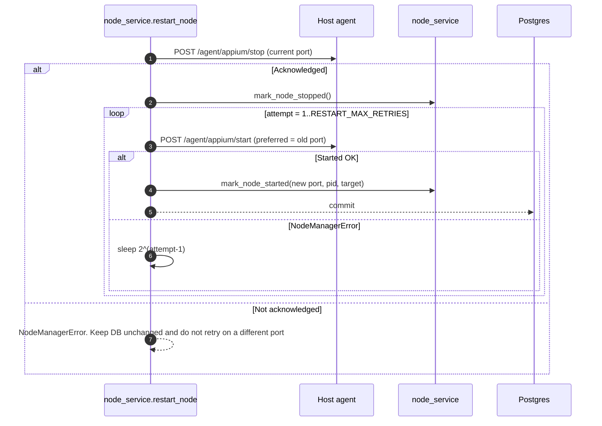
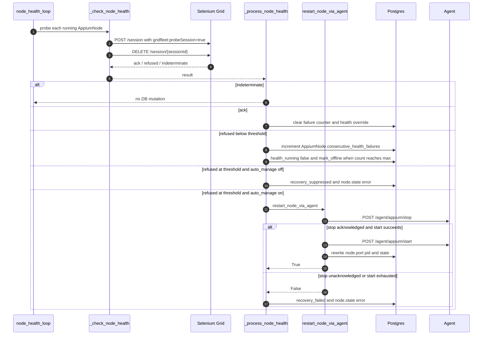

# Doc 2 — Node Lifecycle

> Implementation contract for starting, stopping, restarting, and recovering an Appium node. Covers the **backend↔agent split-brain** rules that recent fixes (`bdfae85`, `4171847`, `9298bad`, `a58c8e5`, `54707d1`) enforce.

The Appium node is the most failure-prone object in GridFleet. It lives in two places at once — a row in `appium_nodes` on the manager and a real Appium subprocess on the host agent — and a session is served only when both halves agree. Most node-related bugs are split-brain bugs: one half flipped state without the other.

This doc captures every transition, who triggers it, and the acknowledgement rules that keep the two halves consistent.

## Cast of characters

| Component | Role |
| --- | --- |
| `node_service` (`backend/app/services/node_service.py`) | All operator + loop-driven node lifecycle: start/stop/restart, `mark_node_*`, agent dispatch helpers |
| `node_health_loop` (`backend/app/services/node_health.py`) | Periodic health probe, owns auto-restart |
| `agent_operations` (`backend/app/services/agent_operations.py`) | Typed wrapper around agent HTTP endpoints |
| Host agent (`agent/agent_app/`) | Spawns Appium subprocesses and in-process Python Grid Node services |

## The DB↔agent contract in one sentence

> **The DB row only flips state on confirmed agent acknowledgement, and the agent only owns process state.**

Translating that into rules:

1. Lifecycle code must project every state-changing agent call into a definitive ack before mutating DB state: success/2xx means acknowledged; transport failures, open circuits, and failed HTTP statuses mean not acknowledged. Probe endpoints use the `ack | refused | indeterminate` projection from Doc 3.
2. A missing or failed ack MUST NOT promote to success. The DB stays where it was; the caller raises or retries.
3. `mark_node_started` / `mark_node_stopped` only run after a definitive ack from the agent.
4. `device_health.apply_node_state_transition` records node health detail and emits `device.health_changed` inside the same transaction as the DB state flip.
5. Owner allocations (ports + per-host capabilities) are released only after a confirmed stop. Unconfirmed stops keep the allocation so the orphan cannot collide with a fresh start.

These five rules are what made the recent split-brain fixes possible. They are also why `stop_remote_temporary_node` returns `bool` and `_check_node_health` returns `ProbeResult` — the contract is encoded in the return types.

## Node state machine



Important non-transitions:

- `running → stopped` **never** happens without agent ack. If the agent does not acknowledge, the manager raises and leaves the row at `running`. A future health-loop pass will reconcile when the agent answers.
- `error` is reachable only via the auto-recovery path, never via operator action. Operator-initiated stop always lands in `stopped` (by definition — the operator chose to stop).
- `running → error` does not run an agent stop; it just promotes the row to `error` after `max_failures` consecutive bad probes, then attempts `restart_node_via_agent`.

## Flow A — Operator start (`node_service.start_node`)



Key call-outs:

- **Readiness gate** in `_start_with_owner` (`node_service.py`) refuses if `is_ready_for_use_async` says no.
- **Parallel-resource allocation first, main Appium port second** — the typed allocator owns pack-declared per-node resources such as `mjpegServerPort`, `chromedriverPort`, and non-port live capabilities. The main Appium port is still selected by `candidate_ports` and persisted on `AppiumNode.port` only after the agent confirms the process is running. On failure during start, temporary typed claims are released by the same try/except in `_start_with_owner` (`node_service.py`).
- **Port conflict retry** — if the agent rejects with "already in use", the manager continues to the next candidate port (`_start_with_owner` loop in `node_service.py`). Conflicts on the managed range come from external listeners or stale agent state; trying the next port is correct.
- **Readiness wait** — `_wait_for_remote_appium_ready` (`node_service.py`) polls `/agent/appium/{port}/status` for up to `stabilization_timeout_sec`. If it never returns `running=True`, the start is treated as a failed dispatch and `start_remote_temporary_node` calls `stop_remote_temporary_node` to clean up before raising.
- **DB write last** — `mark_node_started` only runs after the agent says the process is running. Order is: agent OK → temporary resource-claim promotion + node health transition → commit.

Failure modes:

| Failure | Behavior |
| --- | --- |
| Readiness fails | Raise `NodeManagerError` with detail; no agent call made |
| Agent unreachable (transport) | Allocation released, raise — DB unchanged |
| Agent 5xx with non-conflict detail | Allocation released, raise `NodeManagerError` |
| Agent says "already in use" | Mapped to `NodePortConflictError`, retry next candidate port |
| Agent OK but readiness probe times out | `start_remote_temporary_node` calls stop, releases allocation, raises |

## Flow B — Operator stop (`node_service.stop_node`)



The two clauses of the `alt` are the entire point of the recent fixes. **Do not collapse them.** Specifically:

- If the agent does not ack, *do not* mark the node stopped (commit `4171847`). The manager would otherwise believe the orphan is gone while the orphan keeps serving traffic via the Selenium Grid registration.
- If the agent does not ack, *do not* release the owner allocation (commit `bdfae85`). Otherwise the allocator hands the same port to a new owner and the next `start_node` collides with the still-alive orphan.

Both rules collapse to the same primitive: `stop_remote_temporary_node` returns `bool` and the caller gates state mutations on `True`.

## Flow C — Operator restart (`node_service.restart_node`)



Why "do not retry on a different port" when the stop is unacknowledged:

> Starting on the next free port while the agent has not confirmed the previous Appium process is dead causes the orphan and the new node to both register with the Selenium Grid hub. Sessions for the device may then be routed to either Relay node depending on the hub's selection logic — non-deterministic, hard to reproduce, painful to debug.

So `restart_node` **must** see a confirmed stop before it considers the start side. Same rule applies to the loop-driven path below.

`RESTART_BACKOFF_BASE = 2`, `RESTART_MAX_RETRIES = 3` (`node_service.py`). After 3 failures the owner allocation is released and `NodeManagerError` propagates.

## Flow D — Auto-restart from `node_health_loop`



Three things this flow gets right that earlier versions did not:

1. **`indeterminate` is not `refused`.** A single agent transport blip used to drop the device offline; commit `a58c8e5` made indeterminate results short-circuit `_process_node_health` so transient blips no longer flap health or increment the failure counter.
2. **Node state transitions go through `device_health.apply_node_state_transition`.** The helper writes lifecycle state, transient health detail, last-check timestamp, availability cross-link, and the derived `device.health_changed` event under the correct locks.
3. **Grid-registration grace.** A node that just started but has not yet appeared in Selenium Grid's `/status` is given a grace window equal to `appium.startup_timeout_sec`. Inside the grace window the loop holds the derived node health at running instead of penalising a still-warming relay.

## The owner_key + port allocation interaction

`appium_node_resource_service` reserves ports and per-host parallel-resource capabilities under an owner token. The token shape (built by `_build_device_owner_key` in `node_service.py`):

- Managed device → `device:<device_uuid>` (stable across restarts of the *same* device)
- Verification probe / transient start → `temp:<host_id>:<identity>` (transient)

Why this matters for the lifecycle:

- `start_node` reserves under the managed owner token, then promotes the temporary claim into a managed claim attached to the AppiumNode row, and only releases it on confirmed stop.
- `restart_node` keeps the same owner token across the stop→start sequence (`node_service.py`) so allocation does not flap and the agent can recognise the same owner across the restart.
- `restart_node_via_agent` (the loop-driven path) reads the existing managed claim rather than creating a new one (`node_service.py`).

If a stop is unacknowledged the allocation persists. The next operator-driven start for that device finds the existing allocation, which is correct: we want the same owner to retake its ports when the agent comes back, not for a different owner to grab them while the orphan is still alive.

Doc 5 covers the allocator in detail.

## Port-conflict semantics

There are two distinct kinds of conflict:

| Kind | Surface | Behavior |
| --- | --- | --- |
| External listener on a managed port | Agent rejects start with "already in use" | Mapped to `NodePortConflictError`, manager tries next candidate port (`_start_with_owner` in `node_service.py`) |
| Stale agent-side state for a managed port | Agent rejects start with "already running on port" | Same `NodePortConflictError` mapping; agent has its own cleanup via the bootstrap fix (commit `54707d1`) |

The `candidate_ports` helper (`node_service.py`) excludes ports already held by `state=running` rows in the DB. After an unmanaged-listener conflict, the manager moves to the next free managed port. After a managed conflict that the agent could not clean up, the same retry loop applies — eventually one port wins or the manager raises `NodeManagerError("No free ports available in the configured range")`.

`restart_node_via_agent` (the loop-driven path) does **not** call `mark_node_stopped` between the agent stop and the next start; it rewrites `node.port/pid/state` in place after a successful start (`node_service.py`). Because the DB row stays `state=running` across that window, `candidate_ports` intentionally **excludes** the old `node.port` from the candidate set — the next attempt lands on a different free port. That is the desired behaviour after an unmanaged-listener conflict on the old port: rebind elsewhere, do not retry the same one (`node_service.py`).

## Lock acquisition order (deadlock avoidance)

```text
1. device_locking.lock_device(db, device.id)
2. appium_node_locking.lock_appium_node_for_device(db, device.id)
3. (writes to AppiumNode.state, Device.operational_state,
    Device.lifecycle_policy_state)
4. device_health.apply_node_state_transition(...)
5. queue_event_for_session(...)
6. db.commit()
```

`mark_node_started` and `mark_node_stopped` (`node_service.py`) follow this exact order. New writers must too.

The `event_bus.publish` for `device.health_changed` is **deferred to after-commit** by `queue_event_for_session` inside `device_health`. Subscribers must never observe a transition that did not become durable. Subscribers for `node.state_changed` are queued with `queue_event_for_session` and are also dispatched after the writer transaction commits.

## Split-brain prevention checklist

For every new code path that touches node state, verify:

- [ ] The agent call returns a definitive ack (`bool`) — not just an exception/no-exception split.
- [ ] DB writes are gated on `True`. `False` raises or returns; `None` keeps current state.
- [ ] `mark_node_started` / `mark_node_stopped` run inside a transaction that holds the device row lock.
- [ ] `device_health.apply_node_state_transition` is the node-health writer in that transaction.
- [ ] Owner allocation is released only after confirmed stop.
- [ ] On port conflict, the next candidate port is tried — *unless* the conflict came from an unconfirmed stop, in which case no retry is allowed.
- [ ] After any `mark_node_*`, `queue_event_for_session("node.state_changed", ...)` is registered before commit.

The recent fixes above each tightened one of these rules. The next class of bugs to ship will come from new code paths that skipped one — this checklist is the trip-wire.

## What this doc does NOT cover

- Per-axis details of `Device` state — see Doc 1.
- Loop cadences, leader pattern, and reconciliation rules — see Doc 3.
- HTTP request/response shapes for agent endpoints — see Doc 4.
- Owner-allocation implementation details, port-pool seeding, Grid session reaping — see Doc 5.
