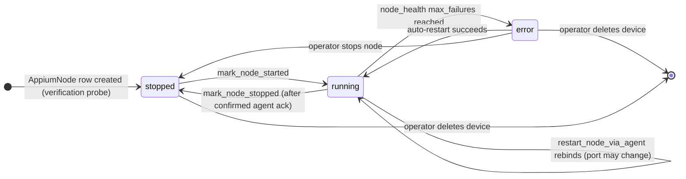
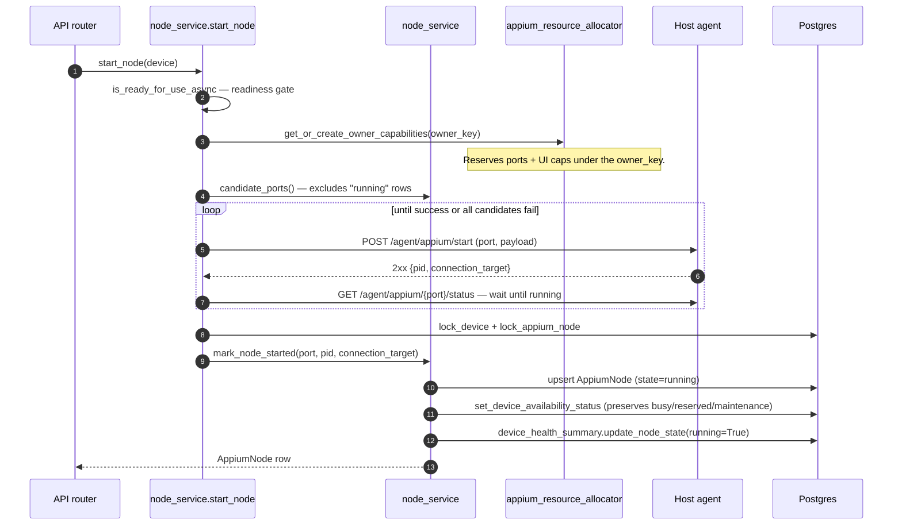
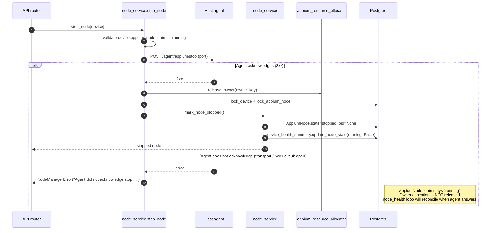

# Doc 2 — Node Lifecycle

> Implementation contract for starting, stopping, restarting, and recovering an Appium node. Covers the **backend↔agent split-brain** rules that recent fixes (`bdfae85`, `4171847`, `9298bad`, `a58c8e5`, `54707d1`) enforce.

The Appium node is the most failure-prone object in GridFleet. It lives in two places at once — a row in `appium_nodes` on the manager and a real Appium subprocess on the host agent — and a session is served only when both halves agree. Most node-related bugs are split-brain bugs: one half flipped state without the other.

This doc captures every transition, who triggers it, and the acknowledgement rules that keep the two halves consistent.

## Cast of characters

| Component | Role |
| --- | --- |
| `node_service` (`backend/app/services/node_service.py`) | All operator + loop-driven node lifecycle: start/stop/restart, `mark_node_*`, agent dispatch helpers |
| `node_health_loop` (`backend/app/services/node_health.py`) | Periodic health probe, owns auto-restart |
| `agent_operations` (`backend/app/services/agent_operations.py`) | Typed wrapper around agent HTTP endpoints |
| Host agent (`agent/agent_app/`) | Spawns Appium + Selenium Grid relay subprocesses |

## The DB↔agent contract in one sentence

> **The DB row only flips state on confirmed agent acknowledgement, and the agent only owns process state.**

Translating that into rules:

1. Every state-changing call to the agent returns a definitive `True` (acknowledged), `False` (not acknowledged), or `None` (transport failure / agent unreachable).
2. `False` and `None` MUST NOT promote to `True`. The DB stays where it was; the caller raises or retries.
3. `mark_node_started` / `mark_node_stopped` only run after a definitive ack from the agent.
4. The health snapshot is updated **inside the same transaction** as the DB state flip — never in a separate write.
5. Owner allocations (ports + per-host capabilities) are released only after a confirmed stop. Unconfirmed stops keep the allocation so the orphan cannot collide with a fresh start.

These five rules are what made the recent split-brain fixes possible. They are also why `stop_remote_temporary_node` returns `bool` and `_check_node_health` returns `bool | None` — the contract is encoded in the return types.

## Node state machine



Important non-transitions:

- `running → stopped` **never** happens without agent ack. If the agent does not acknowledge, the manager raises and leaves the row at `running`. A future health-loop pass will reconcile when the agent answers.
- `error` is reachable only via the auto-recovery path, never via operator action. Operator-initiated stop always lands in `stopped` (by definition — the operator chose to stop).
- `running → error` does not run an agent stop; it just promotes the row to `error` after `max_failures` consecutive bad probes, then attempts `restart_node_via_agent`.

## Flow A — Operator start (`node_service.start_node`)



Key call-outs:

- **Readiness gate** (`node_service.py:694-698`) refuses if `is_ready_for_use_async` says no.
- **Owner allocation first, port second** — the allocator owns ports because they are part of the host's parallel-resource pool (`appium_resource_allocator.get_or_create_owner_capabilities`). On failure during start, the allocation is released by the same try/except in `_start_with_owner` (`node_service.py:653-688`).
- **Port conflict retry** — if the agent rejects with "already in use", the manager continues to the next candidate port (`node_service.py:661-683`). Conflicts on the managed range come from external listeners or stale agent state; trying the next port is correct.
- **Readiness wait** — `_wait_for_remote_appium_ready` (`node_service.py:268-291`) polls `/agent/appium/{port}/status` for up to `stabilization_timeout_sec`. If it never returns `running=True`, the start is treated as a failed dispatch and `start_remote_temporary_node` calls `stop_remote_temporary_node` to clean up before raising.
- **DB write last** — `mark_node_started` only runs after the agent says the process is running. Order is: agent OK → snapshot sync → commit.

Failure modes:

| Failure | Behavior |
| --- | --- |
| Readiness fails | Raise `NodeManagerError` with detail; no agent call made |
| Agent unreachable (transport) | Allocation released, raise — DB unchanged |
| Agent 5xx with non-conflict detail | Allocation released, raise `NodeManagerError` |
| Agent says "already in use" | Mapped to `NodePortConflictError`, retry next candidate port |
| Agent OK but readiness probe times out | `start_remote_temporary_node` calls stop, releases allocation, raises |

## Flow B — Operator stop (`node_service.stop_node`)



The two clauses of the `alt` are the entire point of the recent fixes. **Do not collapse them.** Specifically:

- If the agent does not ack, *do not* mark the node stopped (commit `4171847`). The manager would otherwise believe the orphan is gone while the orphan keeps serving traffic via the Selenium Grid registration.
- If the agent does not ack, *do not* release the owner allocation (commit `bdfae85`). Otherwise the allocator hands the same port to a new owner and the next `start_node` collides with the still-alive orphan.

Both rules collapse to the same primitive: `stop_remote_temporary_node` returns `bool` and the caller gates state mutations on `True`.

## Flow C — Operator restart (`node_service.restart_node`)

```mermaid
sequenceDiagram
    autonumber
    participant NM as node_service.restart_node
    participant Agent as Host agent
    participant State as node_service
    participant Pg as Postgres

    NM->>Agent: POST /agent/appium/stop (current port)
    alt Acknowledged
        NM->>State: mark_node_stopped()
        loop attempt = 1..RESTART_MAX_RETRIES
            NM->>Agent: POST /agent/appium/start (preferred = old port)
            alt Started OK
                NM->>State: mark_node_started(new port, pid, target)
                NM-->>Pg: commit
            else NodeManagerError
                NM->>NM: sleep 2^(attempt-1)
            end
        end
    else Not acknowledged
        NM-->>NM: NodeManagerError; do not flip DB; do not retry on a different port
    end
```

Why "do not retry on a different port" when the stop is unacknowledged:

> Starting on the next free port while the agent has not confirmed the previous Appium process is dead causes the orphan and the new node to both register with the Selenium Grid hub. Sessions for the device may then be routed to either Relay node depending on the hub's selection logic — non-deterministic, hard to reproduce, painful to debug.

So `restart_node` **must** see a confirmed stop before it considers the start side. Same rule applies to the loop-driven path below.

`RESTART_BACKOFF_BASE = 2`, `RESTART_MAX_RETRIES = 3` (`node_service.py:50-51`). After 3 failures the owner allocation is released and `NodeManagerError` propagates.

## Flow D — Auto-restart from `node_health_loop`

```mermaid
sequenceDiagram
    autonumber
    participant Loop as node_health_loop
    participant Probe as _check_node_health
    participant Agent as Host agent
    participant Process as _process_node_health
    participant Restart as restart_node_via_agent
    participant Pg as Postgres

    Loop->>Probe: probe each running AppiumNode
    Probe->>Agent: POST /agent/appium/{port}/probe-session
    Agent-->>Probe: True / False / None (unreachable)
    Probe-->>Process: result
    alt result is None
        Process->>Process: early return — keep snapshot, no counter bump
    else result True
        Process->>Pg: clear failure counter
        Process->>Pg: update_node_state(running=True)
    else result False
        Process->>Pg: increment failure counter
        Process->>Pg: update_node_state(running=False, mark_offline=count>=max)
        alt count >= max_failures
            alt auto_manage off
                Process->>Pg: lifecycle "recovery_suppressed"; node.state=error; offline
            else auto_manage on
                Process->>Restart: restart_node_via_agent
                Restart->>Agent: POST /agent/appium/stop
                alt stop acknowledged
                    Restart->>Agent: POST /agent/appium/start (try candidate ports)
                    alt started
                        Restart->>Pg: rewrite node.port/pid/state in place
                    else exhausted
                        Restart-->>Process: False
                    end
                else stop unacknowledged
                    Restart-->>Process: False (do not retry on another port)
                end
            end
        end
    end
```

Three things this flow gets right that earlier versions did not:

1. **`None` is not `False`.** A single agent transport blip used to drop the device offline; commit `a58c8e5` made `None` short-circuit `_process_node_health` so transient blips no longer flap the health snapshot or increment the failure counter.
2. **`device_health_summary` updates always run, even on `None`-skipped paths in `mark_node_started/stopped`.** Commit `9298bad` moved snapshot patching into the same transaction as the node-state write, eliminating the "offline + healthy" rendering window.
3. **Grid-registration grace.** A node that just started but has not yet appeared in Selenium Grid's `/status` is given a grace window equal to `appium.startup_timeout_sec` (`node_health.py:153-160`). Inside the grace window the loop holds the snapshot at `running=True` instead of penalising a still-warming relay.

## The owner_key + port allocation interaction

`appium_resource_allocator` reserves ports and per-host parallel-resource capabilities under an `owner_key`. The key shape:

- Managed device → `managed_owner_key(device.id)` (stable across restarts of the *same* device)
- Verification probe → `temporary_owner_key(device)` (transient)

Why this matters for the lifecycle:

- `start_node` allocates under `managed_owner_key` and only releases it on confirmed stop.
- `restart_node` keeps the same `owner_key` across the stop→start sequence (`node_service.py:801-808`) so allocation does not flap and the agent can recognise the same owner across the restart.
- `restart_node_via_agent` (the loop-driven path) reads the existing allocation rather than creating a new one (`node_service.py:569-573`).

If a stop is unacknowledged the allocation persists. The next operator-driven start for that device finds the existing allocation, which is correct: we want the same owner to retake its ports when the agent comes back, not for a different owner to grab them while the orphan is still alive.

Doc 5 covers the allocator in detail.

## Port-conflict semantics

There are two distinct kinds of conflict:

| Kind | Surface | Behavior |
| --- | --- | --- |
| External listener on a managed port | Agent rejects start with "already in use" | Mapped to `NodePortConflictError`, manager tries next candidate port (`node_service.py:432-438`) |
| Stale agent-side state for a managed port | Agent rejects start with "already running on port" | Same `NodePortConflictError` mapping; agent has its own cleanup via the bootstrap fix (commit `54707d1`) |

The `candidate_ports` helper (`node_service.py:98-127`) excludes ports already held by `state=running` rows in the DB. After an unmanaged-listener conflict, the manager moves to the next free managed port. After a managed conflict that the agent could not clean up, the same retry loop applies — eventually one port wins or the manager raises `NodeManagerError("No free ports available in the configured range")`.

`restart_node_via_agent` (the loop-driven path) does **not** call `mark_node_stopped` between the agent stop and the next start; it rewrites `node.port/pid/state` in place after a successful start (`node_service.py:613-617`). Because the DB row stays `state=running` across that window, `candidate_ports` intentionally **excludes** the old `node.port` from the candidate set — the next attempt lands on a different free port. That is the desired behaviour after an unmanaged-listener conflict on the old port: rebind elsewhere, do not retry the same one (`node_service.py:590-593`).

## Lock acquisition order (deadlock avoidance)

```text
1. device_locking.lock_device(db, device.id)
2. appium_node_locking.lock_appium_node_for_device(db, device.id)
3. (writes to AppiumNode.state, Device.availability_status,
    Device.lifecycle_policy_state)
4. device_health_summary.patch_health_snapshot(...)  # acquires its own
                                                     # device row lock,
                                                     # which is re-entrant
                                                     # within the same tx
5. queue_event_for_session(...)
6. db.commit()
```

`mark_node_started` (`node_service.py:178-210`) and `mark_node_stopped` (`node_service.py:214-245`) follow this exact order. New writers must too.

The `event_bus.publish` for `device.health_changed` is **deferred to after-commit** by `_schedule_health_event_after_commit` (`device_health_summary.py:128-174`). Subscribers must never observe a transition that did not become durable. Subscribers for `node.state_changed` are queued with `queue_event_for_session` (`node_service.py:198-208`, `node_service.py:235-244`) and are also dispatched after the writer transaction commits.

## Split-brain prevention checklist

For every new code path that touches node state, verify:

- [ ] The agent call returns a definitive ack (`bool`) — not just an exception/no-exception split.
- [ ] DB writes are gated on `True`. `False` raises or returns; `None` keeps current state.
- [ ] `mark_node_started` / `mark_node_stopped` run inside a transaction that holds the device row lock.
- [ ] `device_health_summary.update_node_state` is called in the same transaction (or `patch_health_snapshot` directly).
- [ ] Owner allocation is released only after confirmed stop.
- [ ] On port conflict, the next candidate port is tried — *unless* the conflict came from an unconfirmed stop, in which case no retry is allowed.
- [ ] After any `mark_node_*`, `queue_event_for_session("node.state_changed", ...)` is registered before commit.

The recent fixes above each tightened one of these rules. The next class of bugs to ship will come from new code paths that skipped one — this checklist is the trip-wire.

## What this doc does NOT cover

- Per-axis details of `Device` state — see Doc 1.
- Loop cadences, leader pattern, and reconciliation rules — see Doc 3.
- HTTP request/response shapes for agent endpoints — see Doc 4.
- Owner-allocation implementation details, port-pool seeding, Grid session reaping — see Doc 5.
