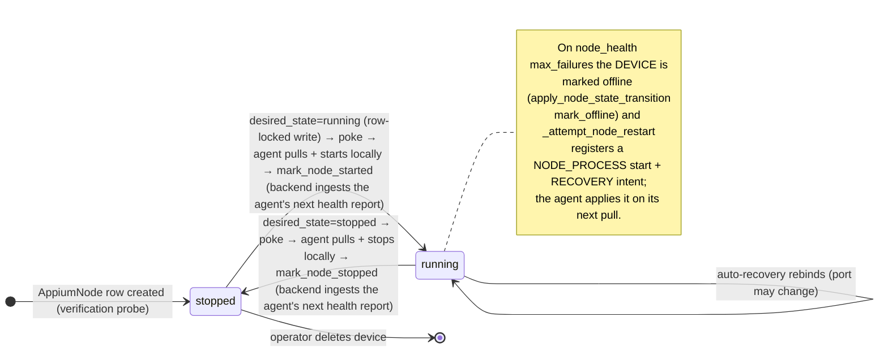
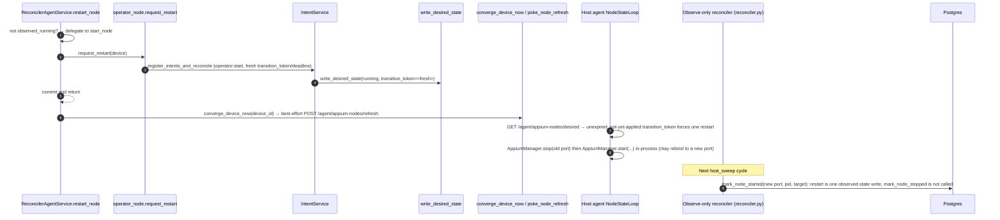
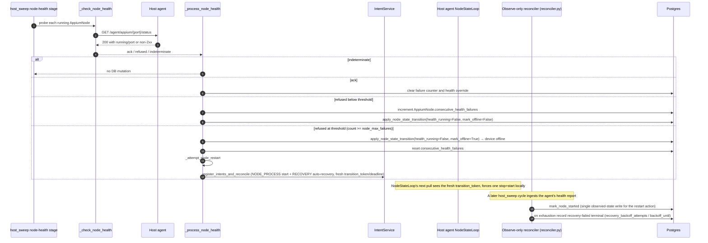

# Doc 2: Node Lifecycle

> Implementation contract for starting, stopping, restarting, and recovering an Appium node. Covers the **backend↔agent split-brain** rules that recent fixes (`4171847`, `9298bad`, `a58c8e5`, `5cf22de8`) enforce.

The Appium node is the most failure-prone object in GridFleet. It lives in two places at once (a row in `appium_nodes` on the manager and a real Appium subprocess on the host agent), and a session is served only when both halves agree. Most node-related bugs are split-brain bugs: one half flipped state without the other.

This doc captures every transition, who triggers it, and the acknowledgement rules that keep the two halves consistent.

## Cast of characters

| Component | Role |
| --- | --- |
| `reconciler_agent` (`backend/app/appium_nodes/services/reconciler_agent.py`) | Module-level `mark_node_started`/`mark_node_stopped` (observed-state writers), plus the `ReconcilerAgentService` class (`start_node`/`stop_node`/`restart_node`/`wait_for_node_running`) — these register desired-state intents only; none of them call the agent |
| Observe-only reconciler (`backend/app/appium_nodes/services/reconciler.py`) | Per-host convergence: matches the agent's latest pushed status report (`POST /agent/hosts/status`) against desired rows and writes DB-only observed facts; issues no start/stop/restart to the agent |
| `host_sweep` node-health stage (`backend/app/appium_nodes/services/node_health.py`) | Per-host cadence-gated health probe; on failure threshold registers an auto-recovery intent, never calls the agent directly |
| `poke_node_refresh` (`backend/app/agent_comm/node_poke.py`) | Fire-and-forget wake hint (`POST /agent/appium-nodes/refresh`) sent after every desired-state write — the only backend→agent node signal |
| Host agent `NodeStateLoop` (`agent/agent_app/appium/node_state.py`) | Pulls `GET /agent/appium-nodes/desired`, diffs against local Appium processes, and owns start/stop/reconfigure/orphan-reap for its host |

## The DB↔agent contract in one sentence

> **The DB row only flips state on confirmed agent acknowledgement, and the agent only owns process state.**

Translating that into rules:

1. The backend never starts or stops an Appium process itself. It writes `desired_state`/`desired_port` (row-locked, via `write_desired_state`) and sends a best-effort wake poke (`POST /agent/appium-nodes/refresh`); the agent's `NodeStateLoop` pulls `GET /agent/appium-nodes/desired`, diffs it against its own running processes, and applies the change locally.
2. Observed-state writes are gated on the agent's pushed self-report, not a synchronous call/response: `mark_node_started`/`mark_node_stopped` only run once the observe-only convergence pass (`reconciler.py`) matches a running/absent entry in the agent's pushed `appium_processes.running_nodes` payload (`POST /agent/hosts/status`) against the desired row. A missing or stale report changes nothing — the DB stays where it was until a later sweep sees a confirming report. Health-probe endpoints (Doc 3) still use the `ack | refused | indeterminate` projection.
3. `mark_node_started` / `mark_node_stopped` only run from that observed-fact match, inside the observe-only convergence pass — never speculatively.
4. `DeviceHealthService.apply_node_state_transition` (`app/devices/services/health.py`, invoked as `DeviceHealthService(publisher=...).apply_node_state_transition(...)`) records node health detail and emits `device.health_changed` inside the same transaction as the DB state flip.
5. Resource claims (ports + per-host capabilities) are keyed by `node_id` and are never released on stop, confirmed or not: they live for the lifetime of the `AppiumNode` row (cascade-deleted with it), so a stopped node's ports can never be handed to a different node.

These five rules are what made the recent split-brain fixes possible, and why the observe-only convergence path treats the agent's self-report as the only source of truth for process state: `mark_node_started`/`mark_node_stopped` are pure DB writes driven by that report, and `_check_node_health` returns a `ProbeResult` for the health-probe path — the contract is encoded in the return types.

## Node state machine

`AppiumNode` has **no `state` column**. There are two orthogonal axes: the **desired** axis `AppiumNode.desired_state` (a 2-value enum, `running` | `stopped` only; there is no `error` desired state), written through `desired_state_writer.write_desired_state`; and the **observed** axis, the computed `AppiumNode.observed_running` property (`pid is not None AND active_connection_target is not None`), written by `mark_node_started`/`mark_node_stopped`. Health failure is tracked on the node via `consecutive_health_failures` / `health_running` / `health_state`, but the failure terminal is on the *device* (offline), not a node `error` state.



Important non-transitions:

- `running → stopped` (observed) **never** happens until the agent's own health report confirms the process is gone. If the agent hasn't caught up yet, the convergence pass leaves `pid`/`active_connection_target` set. A later sweep reconciles once the agent's report shows the process absent.
- Operator action only writes the **desired** axis. Operator-initiated stop sets `desired_state=stopped` and pokes; the observed flip to stopped happens later, once the agent has pulled, stopped locally, and reported it gone.
- Health failure does not stop anything; it increments `consecutive_health_failures`, and at `general.node_max_failures` it marks the *device* offline (`apply_node_state_transition(mark_offline=…)`) and registers an auto-recovery intent (see Flow D), which the agent picks up on its next pull and applies by rebinding the node process.

## Flow A: Operator start (`ReconcilerAgentService.start_node`)

The operator path is **fully asynchronous** with respect to the actual process start. `ReconcilerAgentService.start_node` never calls the agent; it registers an operator:start intent and returns. The desired-state write, the wake poke, and the agent's own pull-and-start are what actually bring the process up.

```mermaid
sequenceDiagram
    autonumber
    participant API as API router
    participant NM as ReconcilerAgentService.start_node
    participant Op as operator_node.request_start
    participant Intent as IntentService
    participant DSW as write_desired_state
    participant Poke as converge_device_now / poke_node_refresh
    participant Agent as Host agent NodeStateLoop
    participant Rec as Observe-only reconciler (reconciler.py)
    participant Pg as Postgres

    API->>NM: start_node(device)
    NM->>NM: is_ready_for_use_async (readiness gate)
    NM->>Op: request_start(device)
    Op->>Intent: register_intents_and_reconcile (operator:start)
    Intent->>DSW: write_desired_state(running, desired_port=candidate_ports()[0])
    NM-->>API: AppiumNode row (desired_state=running); returns, process not yet started
    API->>Poke: converge_device_now(device_id) → best-effort POST /agent/appium-nodes/refresh
    Note over Agent: NodeStateLoop wakes (or its next 5s poll fires anyway)
    Agent->>Agent: GET /agent/appium-nodes/desired → sees desired_state=running, launch payload
    Agent->>Agent: AppiumManager.start(...) in-process — spawns the Appium subprocess locally
    Note over Agent: Next status-push tick (unrelated to the poke), AGENT_STATUS_PUSH_INTERVAL_SEC
    Agent->>Rec: POST /agent/hosts/status — appium_processes.running_nodes includes this device's (port, pid, connection_target)
    Note over Rec: Next host_sweep cycle reads the pushed snapshot
    Rec->>Rec: decide_convergence_action → db_mark_running
    Rec->>Pg: lock_device and lock_appium_node
    Rec->>Rec: mark_node_started(port, pid, connection_target)
    Rec->>Pg: write AppiumNode.pid / active_connection_target (observed_running becomes true)
    Rec->>Pg: DeviceHealthService(...).apply_node_state_transition(mark_offline=False)
    Note right of Pg: device operational-state restore is DERIVED by the device_intent_reconciler (reconcile_now), never written directly here.
```

Call-outs:

- **Readiness gate** in `ReconcilerAgentService.start_node` (`reconciler_agent.py`) refuses if `is_ready_for_use_async` says no, before any intent is registered.
- **Port selection happens at desired-write time, not at process-start time.** `app/lifecycle/services/operator_node.py` calls `candidate_ports(db, host_id=...)` to pick `desired_port` when there is no existing node row; `write_desired_state` persists it. There is no separate agent-side port allocation call — the port the backend picked is what the agent's `launch` payload (built by `build_node_launch_payload`) tells it to bind.
- **The poke is a wake hint, not the source of truth.** `converge_device_now` (`reconciler.py`) fires the refresh poke and returns whatever the DB currently holds; it does not itself perform or wait for the start. Correctness comes from the agent's own poll loop (`NodeStateLoop`, 5 s default) — a lost poke costs at most one poll interval.
- **Readiness confirmation.** There is no in-flow agent status poll in the start path anymore. Observed-running is confirmed only once the agent's next consolidated status push feeds the observe-only reconciler on the following `host_sweep` cycle, plus `ReconcilerAgentService.wait_for_node_running` (`reconciler_agent.py`), which polls `AppiumNode.observed_running` (`pid` + `active_connection_target`) for callers that need to block on it.
- **DB write last.** `mark_node_started` only runs after the observe-only reconciler matches the agent's *reported* running process against the desired row — never speculatively.

Failure modes:

| Failure | Behavior |
| --- | --- |
| Readiness fails | Raise `NodeManagerError` with detail; no intent registered |
| Agent hasn't pulled yet, or the pull failed | No progress; `desired_state=running` persists, the agent converges on its next successful pull |
| Agent's local start raises `PortOccupiedError` | Agent reports `start_failures: [{kind: "port_conflict", port, ...}]` on its next consolidated status push; the backend's `_ingest_pull_host_reports` re-pins `desired_port` to the next candidate via `candidate_ports` (Doc 4) — the agent converges on its next pull |
| Agent's local start raises any other exception | Agent reports `start_failures: [{kind: "spawn_failed", ...}]`; the backend records the start-failure backoff (`_record_start_failure`) but does not re-pin the port |

## Flow B: Operator stop (`ReconcilerAgentService.stop_node`)

As with start, the operator path is asynchronous: `stop_node` registers an operator:stop intent and returns; it never calls the agent. The desired-state write, the poke, and the agent's own pull-and-stop are what actually take the process down.

```mermaid
sequenceDiagram
    autonumber
    participant API as API router
    participant NM as ReconcilerAgentService.stop_node
    participant Op as operator_node.request_stop
    participant Intent as IntentService
    participant DSW as write_desired_state
    participant Poke as converge_device_now / poke_node_refresh
    participant Agent as Host agent NodeStateLoop
    participant Rec as Observe-only reconciler (reconciler.py)
    participant Pg as Postgres

    API->>NM: stop_node(device)
    NM->>NM: validate device.appium_node.observed_running
    NM->>Op: request_stop(device)
    Op->>Intent: register_intents_and_reconcile (operator:stop)
    Intent->>DSW: write_desired_state(stopped)
    NM-->>API: AppiumNode row (desired_state=stopped); returns, process not yet stopped
    API->>Poke: converge_device_now(device_id) → best-effort POST /agent/appium-nodes/refresh
    Note over Agent: NodeStateLoop wakes (or its next 5s poll fires anyway)
    Agent->>Agent: GET /agent/appium-nodes/desired → sees desired_state=stopped
    Agent->>Agent: AppiumManager.stop(port) in-process
    Note over Agent: Next status-push tick, AGENT_STATUS_PUSH_INTERVAL_SEC
    Agent->>Rec: POST /agent/hosts/status — appium_processes.running_nodes no longer lists this device's port
    Note over Rec: Next host_sweep cycle reads the pushed snapshot
    Rec->>Rec: decide_convergence_action → db_clear_stale_running
    Rec->>Pg: lock_device and lock_appium_node
    Rec->>Rec: mark_node_stopped()
    Rec->>Pg: AppiumNode.pid=None, active_connection_target=None (observed_running becomes false)
    Rec->>Pg: DeviceHealthService(...).apply_node_state_transition()
```

The behaviour the recent split-brain fixes protect still holds, just asynchronous now: **`mark_node_stopped` never runs until the agent's own report shows the process gone.** If the agent hasn't pulled the stop yet (or its report still lists the port), the DB keeps the node observed-running; a later sweep clears it once the agent's report catches up (commit `4171847`'s rule, now enforced by fact-ingestion instead of a synchronous ack). This is what stops the manager from believing an orphan is gone while its Appium process keeps serving traffic on its allocated port (still reachable by the router).

The resource claim needs no equivalent gate: it is never released on stop at all (see "The resource-claim + port allocation interaction" below), so a not-yet-observed stop cannot leak the port to a new node either way.

## Flow C: Operator restart (`ReconcilerAgentService.restart_node`)

`restart_node` has **no retry loop and no backoff sleep**. It short-circuits to `start_node` when the node is not `observed_running`; otherwise it registers an operator:start restart-form intent (with a fresh `transition_token`/`transition_deadline`), commits, and returns. The agent's own stop/start and the observed-state flips are driven entirely by its next pull and the observe-only reconciler's next ingestion of its health report.



The fresh `transition_token`/`transition_deadline` is what forces exactly one restart per agent process even though the desired projection otherwise looks unchanged (`desired_state=running` before and after): `NodeStateLoop._token_requires_restart` treats an unexpired, not-yet-applied token as "restart now," then records it in `applied_transition_tokens` so it does not fire again. `/agent/health` echoes the applied token back (`applied_transition_token`) so the backend's `_ingest_pull_host_reports` (Doc 4) can clear it via the natural-clear path.

The constants `RESTART_BACKOFF_BASE = 2` and `RESTART_MAX_RETRIES = 3` exist in `reconciler_agent.py` (and its `__all__`) but are currently **dead**: they are referenced nowhere else in `app/` or `tests/`. There is no per-attempt backoff and no owner-allocation release after N failures in the restart path.

## Flow D: Auto-restart from the `host_sweep` node-health stage



Three things this flow gets right that earlier versions did not:

1. **`indeterminate` is not `refused`.** A single agent transport blip used to drop the device offline; commit `a58c8e5` made indeterminate results short-circuit `_process_node_health` so transient blips no longer flap health or increment the failure counter.
2. **Node state transitions go through `DeviceHealthService.apply_node_state_transition`.** The helper writes transient health detail, last-check timestamp, the dirty-and-reconcile (or dirty-only, below threshold) signal that drives derived operational state, and the derived `device.health_changed` event under the correct locks. It does not write a node `state` column (none exists).
3. **The agent probe is the authoritative health signal.** Post-cutover there is no Grid `/status` to defer to: the direct `/agent/appium/{port}/status` probe is the source of truth for "is this Appium up". An acked probe persists `health_running=True` truthfully rather than relying on a registration grace window.

At the failure threshold `_process_node_health` resets `consecutive_health_failures` and calls `_attempt_node_restart` (`node_health.py`), which registers a NODE_PROCESS `start` command plus a RECOVERY auto-recovery command (`IntentService.register_intents_and_reconcile`, fresh `transition_token`/`transition_deadline`, TTL-bounded via `expires_at`). It does **not** call the agent or rewrite node fields itself — the write goes through the same `write_desired_state` path as any other desired-state change. The agent applies the restart on its next pull; the observe-only reconciler (`reconciler.py`) performs the `mark_node_*` flips from the agent's next health report and, on exhaustion, records the recovery-failed/backoff terminal (`recovery_backoff_attempts`, `backoff_until`).

## The resource-claim + port allocation interaction

The allocator is `resource_service` (`app/appium_nodes/services/resource_service.py`; imported inside `reconciler_agent.py` under the in-file alias `appium_node_resource_service`). It reserves ports and per-host parallel-resource capabilities keyed by `node_id` + `capability_key` (one `AppiumNodeResourceClaim` row per claim). There is **no owner-token / owner-key concept**: `_build_device_owner_key`, `device:`/`temp:` token shapes, and `release_temporary` do not exist. The public surface is `reserve`, `release_managed(node_id)`, `release_capability(node_id, capability_key)`, `get_capabilities`, and `set_node_extra_capability`.

Why this matters for the lifecycle:

- The main Appium port is persisted on `AppiumNode.port` only once the observe-only reconciler matches the agent's confirmation that the process is running (`mark_node_started`).
- Claims are keyed by `node_id`, not released on stop, and live for the lifetime of the `AppiumNode` row: `appium_node_resource_claims.node_id` is `ON DELETE CASCADE`, so claims are freed only when the node (or its device) is deleted.
- Start no longer runs as a single backend-issued agent call, so there is no backend-side start-failure branch here to roll a claim back: the agent applies desired state locally and reports the outcome (`start_failures`) on its next health check. Port conflicts are handled by re-pinning `desired_port` (Doc 4's `kind="port_conflict"` path), not by a claim release/re-reserve cycle.
- Auto-recovery does not create a new claim; the node row (keyed by `node_id`) carries its claims across the stop→start sequence.

A stopped node's claims always persist: there is no ack gate to get wrong here. The next start for that device finds the existing claim, which is correct: the same node retakes its ports, and a different node can never grab them while this node's row is alive.

Doc 5 covers the allocator in detail.

## Port-conflict semantics

Port conflict is now detected locally by the agent, not by a backend-issued start call: `NodeStateLoop._converge_spec` calls `AppiumManager.start(...)` in-process, and a raised `PortOccupiedError` is reported as `start_failures: [{kind: "port_conflict", connection_target, port, detail, at}]` on the agent's next consolidated status push. Any other start exception is reported as `kind: "spawn_failed"`.

The backend's `_ingest_pull_host_reports` (`reconciler.py`, see Doc 4) ingests that report:

| Kind | Backend reaction |
| --- | --- |
| `port_conflict` | Records the start-failure backoff (`_record_start_failure`) **and** re-pins `desired_port` to the next free candidate via `candidate_ports` (`_repin_desired_port`) |
| `spawn_failed` | Records the start-failure backoff only; no re-pin |

There is no same-attempt candidate-port retry loop anymore: a port conflict costs one full pull/report/re-pin/pull round trip, not a synchronous fallback within a single call. The agent converges onto the re-pinned port on its next `GET /agent/appium-nodes/desired`.

A previously-tracked process that has already exited does not trigger a conflict report: the agent drops its own stale process-tracking entry (commit `54707d1`), so a genuinely-dead port self-heals on the agent's next attempt without backend involvement.

The `candidate_ports` helper (`reconciler_allocation.py`) excludes ports of nodes that are **observed-running** (`pid` AND `active_connection_target` both set) **or** have `desired_state == running`. Across an auto-recovery rebind, the node's `desired_state` stays `running`, so `candidate_ports` intentionally **excludes** the old `node.port` from the candidate set: the next pin lands on a different free port — rebind elsewhere, do not retry the same one.

`NodePortConflictError`/`NodeAlreadyRunningError`/`NodeStopNotAcknowledgedError` (`app/appium_nodes/exceptions.py`) still exist and are still caught defensively around the convergence loop (`reconciler.py`'s `converge_host_rows`), but nothing in the current start/stop path raises them — they are vestigial from the push-era synchronous-ack contract.

## Lock acquisition order (deadlock avoidance)

```text
1. device_locking.lock_device(db, device.id)
2. appium_node_locking.lock_appium_node_for_device(db, device.id)
3. observed-state writers: AppiumNode.pid / active_connection_target
   (mark_node_started/mark_node_stopped);
   desired-state writers: desired_state / desired_port / transition_token /
   transition_deadline via desired_state_writer.write_desired_state;
   plus Device.operational_state, Device.lifecycle_policy_state
4. DeviceHealthService(...).apply_node_state_transition(...)
5. publisher.queue_for_session(...)
6. db.commit()
```

`mark_node_started` and `mark_node_stopped` (`reconciler_agent.py`) follow this exact order. New writers must too.

The `event_bus.publish` for `device.health_changed` is **deferred to after-commit** by `queue_for_session` inside `DeviceHealthService`. Subscribers must never observe a transition that did not become durable. Subscribers for `node.state_changed` are queued with `publisher.queue_for_session` and are also dispatched after the writer transaction commits.

## Split-brain prevention checklist

For every new code path that touches node state, verify:

- [ ] Observed-state writes are gated on the agent's own pushed self-reported facts (`POST /agent/hosts/status`), never assumed from the absence of an error.
- [ ] `mark_node_started` / `mark_node_stopped` only fire from the observe-only convergence match, never speculatively.
- [ ] `mark_node_started` / `mark_node_stopped` run inside a transaction that holds the device row lock.
- [ ] `DeviceHealthService.apply_node_state_transition` is the node-health writer in that transaction.
- [ ] The resource claim is never released on stop, only on node/device deletion.
- [ ] On an agent-reported `port_conflict`, `desired_port` is re-pinned to the next candidate; the agent converges on its next pull.
- [ ] After any `mark_node_*`, `publisher.queue_for_session("node.state_changed", ...)` is registered before commit.

The recent fixes above each tightened one of these rules. The next class of bugs to ship will come from new code paths that skipped one. This checklist is the trip-wire.

## What this doc does NOT cover

- Per-axis details of `Device` state: see Doc 1.
- Loop cadences, leader pattern, and reconciliation rules: see Doc 3.
- HTTP request/response shapes for agent endpoints: see Doc 4.
- Owner-allocation implementation details, port-pool seeding, session reaping: see Doc 5.
