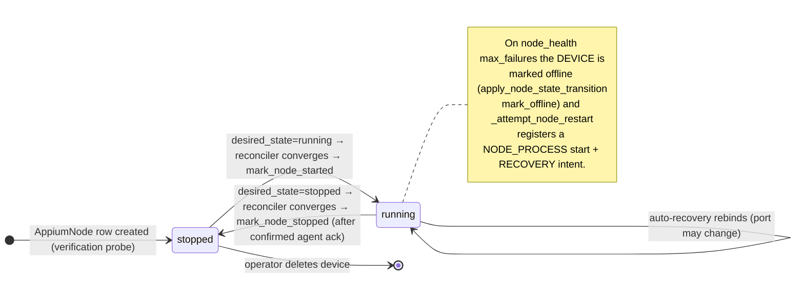
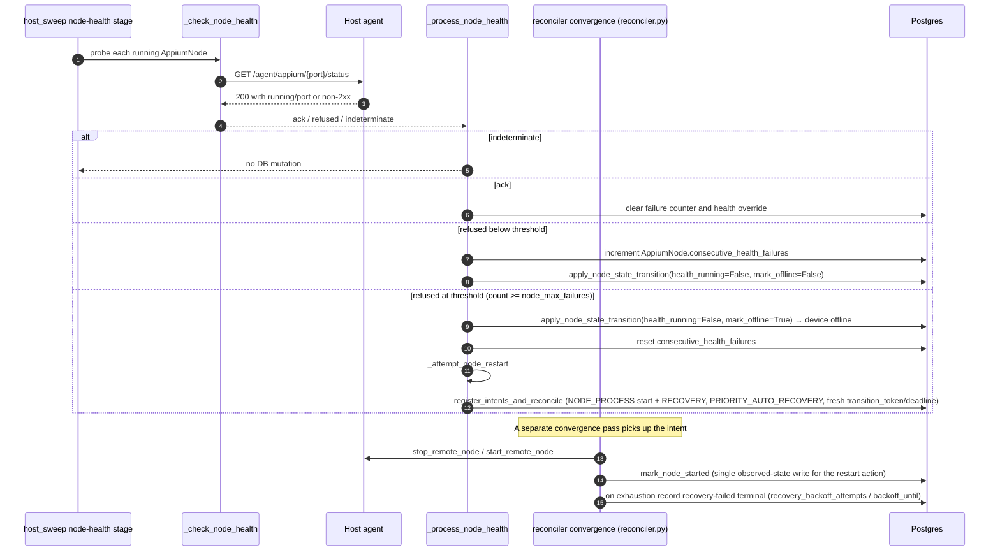

# Doc 2: Node Lifecycle

> Implementation contract for starting, stopping, restarting, and recovering an Appium node. Covers the **backend↔agent split-brain** rules that recent fixes (`4171847`, `9298bad`, `a58c8e5`, `5cf22de8`) enforce.

The Appium node is the most failure-prone object in GridFleet. It lives in two places at once (a row in `appium_nodes` on the manager and a real Appium subprocess on the host agent), and a session is served only when both halves agree. Most node-related bugs are split-brain bugs: one half flipped state without the other.

This doc captures every transition, who triggers it, and the acknowledgement rules that keep the two halves consistent.

## Cast of characters

| Component | Role |
| --- | --- |
| `node_service` → `reconciler_agent` (`backend/app/appium_nodes/services/reconciler_agent.py`) | "Single-module node lifecycle service": module-level `mark_node_started`/`mark_node_stopped`/`start_remote_node`/`stop_remote_node`/`_start_for_node`, plus the `ReconcilerAgentService` class (`start_node`/`stop_node`/`restart_node`/`wait_for_node_running`) |
| `host_sweep` node-health stage (`backend/app/appium_nodes/services/node_health.py`) | Per-host cadence-gated health probe, owns auto-restart |
| `agent_operations` (`backend/app/agent_comm/operations.py`, imported aliased as `agent_operations`) | Typed wrapper around agent HTTP endpoints |
| Host agent (`agent/agent_app/`) | Spawns Appium subprocesses (the WebDriver router reaches them directly; the agent runs no Grid relay) |

## The DB↔agent contract in one sentence

> **The DB row only flips state on confirmed agent acknowledgement, and the agent only owns process state.**

Translating that into rules:

1. Lifecycle code must project every state-changing agent call into a definitive ack before mutating DB state: success/2xx means acknowledged; transport failures, open circuits, and failed HTTP statuses mean not acknowledged. Probe endpoints use the `ack | refused | indeterminate` projection from Doc 3.
2. A missing or failed ack MUST NOT promote to success. The DB stays where it was; the caller raises or retries.
3. `mark_node_started` / `mark_node_stopped` only run after a definitive ack from the agent.
4. `DeviceHealthService.apply_node_state_transition` (`app/devices/services/health.py`, invoked as `DeviceHealthService(publisher=...).apply_node_state_transition(...)`) records node health detail and emits `device.health_changed` inside the same transaction as the DB state flip.
5. Resource claims (ports + per-host capabilities) are keyed by `node_id` and are never released on stop, confirmed or not: they live for the lifetime of the `AppiumNode` row (cascade-deleted with it, or rolled back on start failure), so a stopped node's ports can never be handed to a different node.

These five rules are what made the recent split-brain fixes possible. They are also why `stop_remote_node` returns `bool` and `_check_node_health` returns `ProbeResult`: the contract is encoded in the return types.

## Node state machine

`AppiumNode` has **no `state` column**. There are two orthogonal axes: the **desired** axis `AppiumNode.desired_state` (a 2-value enum, `running` | `stopped` only; there is no `error` desired state), written through `desired_state_writer.write_desired_state`; and the **observed** axis, the computed `AppiumNode.observed_running` property (`pid is not None AND active_connection_target is not None`), written by `mark_node_started`/`mark_node_stopped`. Health failure is tracked on the node via `consecutive_health_failures` / `health_running` / `health_state`, but the failure terminal is on the *device* (offline), not a node `error` state.



Important non-transitions:

- `running → stopped` (observed) **never** happens without agent ack. If the agent does not acknowledge, the reconciler raises/short-circuits and leaves `pid`/`active_connection_target` set. A future health-loop pass will reconcile when the agent answers.
- Operator action only writes the **desired** axis. Operator-initiated stop sets `desired_state=stopped`; the observed flip to stopped happens later in the reconciler convergence pass once the agent acks.
- Health failure does not run an agent stop; it increments `consecutive_health_failures`, and at `general.node_max_failures` it marks the *device* offline (`apply_node_state_transition(mark_offline=…)`) and registers an auto-recovery intent (see Flow D), which the reconciler converges by rebinding the node process.

## Flow A: Operator start (`ReconcilerAgentService.start_node`)

The operator path is **asynchronous** with respect to the actual process start. `ReconcilerAgentService.start_node` does not call the agent; it registers an operator:start intent and returns. A separate reconciler convergence pass performs the agent dispatch and the ack-gated `mark_node_started`.

```mermaid
sequenceDiagram
    autonumber
    participant API as API router
    participant NM as ReconcilerAgentService.start_node
    participant Op as operator_node.request_start
    participant Intent as IntentService
    participant Rec as reconciler convergence (reconciler.py)
    participant Alloc as resource_service
    participant Agent as Host agent
    participant Pg as Postgres

    API->>NM: start_node(device)
    NM->>NM: is_ready_for_use_async (readiness gate)
    NM->>Op: request_start(device)
    Op->>Intent: register_intents_and_reconcile (operator:start) → write_desired_state(running)
    NM-->>API: AppiumNode row (desired_state=running); returns, process not yet started
    Note over Rec: Later convergence pass (reconciler.py)
    Rec->>Alloc: reserve(node_id, capability_key), pack-declared Appium-side ports/caps
    Rec->>Rec: candidate_ports excludes ports of observed-running OR desired_state=running nodes
    loop _start_for_node: until success or all candidates fail
        Rec->>Agent: start_remote_node → POST /agent/appium/start (port, payload)
        Agent-->>Rec: 2xx {pid, connection_target}
    end
    Rec->>Pg: lock_device and lock_appium_node
    Rec->>Rec: mark_node_started(port, pid, connection_target)
    Rec->>Pg: write AppiumNode.pid / active_connection_target (observed_running becomes true)
    Rec->>Pg: DeviceHealthService(...).apply_node_state_transition(mark_offline=False)
    Note right of Pg: device operational-state restore is DERIVED by the device_intent_reconciler (mark_dirty_and_reconcile), never written directly here.
```

Call-outs:

- **Readiness gate** in `ReconcilerAgentService.start_node` (`reconciler_agent.py`) refuses if `is_ready_for_use_async` says no, before any intent is registered.
- **Parallel-resource allocation first, main Appium port second.** The typed allocator (`resource_service`) owns pack-declared per-node resources such as `mjpegServerPort`, `chromedriverPort`, and non-port live capabilities, keyed by `node_id` + `capability_key`. The main Appium port is still selected by `candidate_ports` and persisted on `AppiumNode.port` only after the agent confirms the process is running. On failure during start, the reserved port is released by the try/except in `_start_for_node` (`reconciler_agent.py`) via `resource_service.release_managed`.
- **Port conflict retry.** If the agent rejects with "already in use" (an external listener on the port), the convergence loop continues to the next candidate port (the `candidate_ports` loop in `_start_for_node`, `reconciler_agent.py`). A per-target "already running" rejection is a different case (see Port-conflict semantics below) and is not retried.
- **Readiness confirmation.** There is no in-flow agent status poll in the start helper. Observed-running is confirmed by reconciler convergence plus `ReconcilerAgentService.wait_for_node_running` (`reconciler_agent.py`), which polls `AppiumNode.observed_running` (`pid` + `active_connection_target`). The agent-side start timeout is governed by `appium.startup_timeout_sec` (via `_agent_start_timeout`).
- **DB write last.** `mark_node_started` only runs after the agent says the process is running. Order is: agent OK → resource-claim promotion + node health transition → commit.

Failure modes:

| Failure | Behavior |
| --- | --- |
| Readiness fails | Raise `NodeManagerError` with detail; no intent registered, no agent call made |
| Agent unreachable (transport) | Reserved port released, convergence raises; observed state unchanged |
| Agent 5xx with non-conflict detail | Reserved port released, raise `NodeManagerError` |
| Agent says "already in use" | Mapped to `NodePortConflictError`, retry next candidate port |
| Agent says "already running" (same port, or same connection target on another port) | Mapped to `NodeAlreadyRunningError`; node's resource claims released same as any start failure, but no candidate-port retry and no recovery-backoff count; convergence treats the row as already converged |

## Flow B: Operator stop (`ReconcilerAgentService.stop_node`)

As with start, the operator path is asynchronous: `stop_node` registers an operator:stop intent and returns. The agent `stop_remote_node` call and the ack-gated `mark_node_stopped` happen later in the reconciler convergence pass.

```mermaid
sequenceDiagram
    autonumber
    participant API as API router
    participant NM as ReconcilerAgentService.stop_node
    participant Op as operator_node.request_stop
    participant Intent as IntentService
    participant Rec as reconciler convergence (reconciler.py)
    participant Agent as Host agent
    participant Pg as Postgres

    API->>NM: stop_node(device)
    NM->>NM: validate device.appium_node.observed_running
    NM->>Op: request_stop(device)
    Op->>Intent: register_intents_and_reconcile (operator:stop) → write_desired_state(stopped)
    NM-->>API: AppiumNode row (desired_state=stopped); returns, process not yet stopped
    Note over Rec: Later convergence pass (reconciler.py)
    Rec->>Agent: stop_remote_node → POST /agent/appium/stop (port)
    alt Agent acknowledges (2xx) → stop_remote_node returns True
        Agent-->>Rec: 2xx
        Rec->>Pg: lock_device and lock_appium_node
        Rec->>Rec: mark_node_stopped()
        Rec->>Pg: AppiumNode.pid=None, active_connection_target=None (observed_running becomes false)
        Rec->>Pg: DeviceHealthService(...).apply_node_state_transition()
    else Agent does not acknowledge (transport / 5xx / circuit open) → stop_remote_node returns False
        Agent-->>Rec: error
        Note right of Pg: AppiumNode stays observed-running (pid/active_connection_target set).<br/>A later convergence pass reconciles when the agent answers.
    end
```

The two clauses of the `alt` are the entire point of the recent fixes. **Do not collapse them.** Specifically:

- If the agent does not ack, *do not* mark the node stopped (commit `4171847`). The manager would otherwise believe the orphan is gone while the orphan's Appium process keeps serving traffic on its allocated port (still reachable by the router).

The resource claim needs no equivalent ack gate: it is never released on stop at all, acked or not (see "The resource-claim + port allocation interaction" below), so an unacknowledged stop cannot leak the port to a new node either way.

This collapses to the same primitive: `stop_remote_node` returns `bool` and the caller (the reconciler convergence path, not the operator path) gates state mutations on `True`.

## Flow C: Operator restart (`ReconcilerAgentService.restart_node`)

`restart_node` has **no retry loop and no backoff sleep**. It short-circuits to `start_node` when the node is not `observed_running`; otherwise it registers an operator:start restart-form intent (with a fresh `transition_token`/`transition_deadline`), commits, and returns. The agent stop/start and the observed-state flips are driven entirely by the reconciler convergence pass.

```mermaid
sequenceDiagram
    autonumber
    participant NM as ReconcilerAgentService.restart_node
    participant Op as operator_node.request_restart
    participant Intent as IntentService
    participant Rec as reconciler convergence (reconciler.py)
    participant Agent as Host agent
    participant Pg as Postgres

    NM->>NM: not observed_running? → delegate to start_node
    NM->>Op: request_restart(device)
    Op->>Intent: register_intents_and_reconcile (operator:start, fresh transition_token/deadline) → write_desired_state(running)
    NM-->>NM: commit and return
    Note over Rec: Later convergence pass (reconciler.py)
    Rec->>Agent: stop_remote_node (current port); must ack True before start side
    Rec->>Agent: start_remote_node (preferred = old port, may rebind)
    Rec->>Pg: mark_node_started(new port, pid, target): restart is one observed-state write, mark_node_stopped is not called
```

Why convergence "does not retry on a different port" when the stop is unacknowledged:

> Starting on the next free port while the agent has not confirmed the previous Appium process is dead leaves two live Appium processes for the same device, each reachable on its own port. The backend may then allocate either one to a session: non-deterministic, hard to reproduce, painful to debug.

So the convergence path **must** see a confirmed stop (`stop_remote_node` returns `True`) before it considers the start side. Same rule applies to the loop-driven auto-recovery path below.

The constants `RESTART_BACKOFF_BASE = 2` and `RESTART_MAX_RETRIES = 3` exist in `reconciler_agent.py` (and its `__all__`) but are currently **dead**: they are referenced nowhere else in `app/` or `tests/`. There is no per-attempt backoff and no owner-allocation release after N failures in the restart path.

## Flow D: Auto-restart from the `host_sweep` node-health stage



Three things this flow gets right that earlier versions did not:

1. **`indeterminate` is not `refused`.** A single agent transport blip used to drop the device offline; commit `a58c8e5` made indeterminate results short-circuit `_process_node_health` so transient blips no longer flap health or increment the failure counter.
2. **Node state transitions go through `DeviceHealthService.apply_node_state_transition`.** The helper writes transient health detail, last-check timestamp, the dirty-and-reconcile (or dirty-only, below threshold) signal that drives derived operational state, and the derived `device.health_changed` event under the correct locks. It does not write a node `state` column (none exists).
3. **The agent probe is the authoritative health signal.** Post-cutover there is no Grid `/status` to defer to: the direct `/agent/appium/{port}/status` probe is the source of truth for "is this Appium up". An acked probe persists `health_running=True` truthfully rather than relying on a registration grace window.

At the failure threshold `_process_node_health` resets `consecutive_health_failures` and calls `_attempt_node_restart` (`node_health.py`), which registers a NODE_PROCESS `start` intent plus a RECOVERY auto-recovery intent (`IntentService.register_intents_and_reconcile`, `PRIORITY_AUTO_RECOVERY`, fresh `transition_token`/`transition_deadline`, TTL-bounded via `expires_at`). It does **not** call the agent or rewrite node fields itself. The reconciler convergence pass (`reconciler.py`) performs the agent `stop_remote_node`/`start_remote_node`, the `mark_node_*` flips, and, on exhaustion, records the recovery-failed/backoff terminal (`recovery_backoff_attempts`, `backoff_until`).

## The resource-claim + port allocation interaction

The allocator is `resource_service` (`app/appium_nodes/services/resource_service.py`; imported inside `reconciler_agent.py` under the in-file alias `appium_node_resource_service`). It reserves ports and per-host parallel-resource capabilities keyed by `node_id` + `capability_key` (one `AppiumNodeResourceClaim` row per claim). There is **no owner-token / owner-key concept**: `_build_device_owner_key`, `device:`/`temp:` token shapes, and `release_temporary` do not exist. The public surface is `reserve`, `release_managed(node_id)`, `release_capability(node_id, capability_key)`, `get_capabilities`, and `set_node_extra_capability`.

Why this matters for the lifecycle:

- Convergence reserves claims for the node and persists the main Appium port on `AppiumNode.port` only after the agent confirms the process is running.
- Claims are keyed by `node_id`, not released on stop, and live for the lifetime of the `AppiumNode` row: `appium_node_resource_claims.node_id` is `ON DELETE CASCADE`, so claims are freed only when the node (or its device) is deleted.
- On start failure (including a per-target `NodeAlreadyRunningError`), `_start_for_node` releases the reserved claims via `release_managed` (and the per-capability port via `release_capability` on a managed port conflict): the only production call sites for either function.
- Auto-recovery does not create a new claim; the node row (keyed by `node_id`) carries its claims across the stop→start sequence.

A stopped node's claims always persist: there is no ack gate to get wrong here. The next start for that device finds the existing claim, which is correct: the same node retakes its ports, and a different node can never grab them while this node's row is alive.

Doc 5 covers the allocator in detail.

## Port-conflict semantics

There are two distinct kinds of conflict, and they get different treatment:

| Kind | Surface | Behavior |
| --- | --- | --- |
| External listener on a managed port | Agent rejects start with "already in use" / "already bound" | Mapped to `NodePortConflictError`, convergence tries next candidate port (the `_start_for_node` loop in `reconciler_agent.py`) |
| Agent already tracks a live process on the requested port, or for the same connection target on a different port | Agent rejects start with "already running" | Mapped to `NodeAlreadyRunningError` (commit `5cf22de8`), not `NodePortConflictError`: `_start_for_node` short-circuits the candidate-port retry instead of iterating the range (the agent's guard keys on the target/port it already holds, so every candidate would hit the same rejection), and the convergence action treats it as already-converged |

A previously-tracked process that has already exited does not trigger this: the agent drops its own stale process-tracking entry rather than reporting a conflict (commit `54707d1`), so a genuinely-dead port self-heals on the next start attempt.

The `candidate_ports` helper (`reconciler_allocation.py`) excludes ports of nodes that are **observed-running** (`pid` AND `active_connection_target` both set) **or** have `desired_state == running`. After an unmanaged-listener conflict, convergence moves to the next free managed port; eventually one port wins or convergence raises `NodeManagerError("No free ports available in the configured range")`. A `NodeAlreadyRunningError` never reaches that retry loop.

Across an auto-recovery rebind, the node's `desired_state` stays `running`, so `candidate_ports` intentionally **excludes** the old `node.port` from the candidate set: the next attempt lands on a different free port. That is the desired behaviour after an unmanaged-listener conflict on the old port: rebind elsewhere, do not retry the same one.

## Lock acquisition order (deadlock avoidance)

```text
1. device_locking.lock_device(db, device.id)
2. appium_node_locking.lock_appium_node_for_device(db, device.id)
3. observed-state writers: AppiumNode.pid / active_connection_target
   (mark_node_started/mark_node_stopped);
   desired-state writers: desired_state / desired_port / transition_token /
   transition_deadline via desired_state_writer.write_desired_state;
   plus Device.operational_state, Device.lifecycle_policy_state
4. DeviceHealthService(...).apply_node_state_transition(...)
5. publisher.queue_for_session(...)
6. db.commit()
```

`mark_node_started` and `mark_node_stopped` (`reconciler_agent.py`) follow this exact order. New writers must too.

The `event_bus.publish` for `device.health_changed` is **deferred to after-commit** by `queue_for_session` inside `DeviceHealthService`. Subscribers must never observe a transition that did not become durable. Subscribers for `node.state_changed` are queued with `publisher.queue_for_session` and are also dispatched after the writer transaction commits.

## Split-brain prevention checklist

For every new code path that touches node state, verify:

- [ ] The agent call returns a definitive ack (`bool`), not just an exception/no-exception split.
- [ ] DB writes are gated on `True`. `False` raises or returns; `None` keeps current state.
- [ ] `mark_node_started` / `mark_node_stopped` run inside a transaction that holds the device row lock.
- [ ] `DeviceHealthService.apply_node_state_transition` is the node-health writer in that transaction.
- [ ] The resource claim is never released on stop, only on start-failure rollback or node/device deletion.
- [ ] On port conflict, the next candidate port is tried, *unless* the conflict came from an unconfirmed stop, in which case no retry is allowed.
- [ ] After any `mark_node_*`, `publisher.queue_for_session("node.state_changed", ...)` is registered before commit.

The recent fixes above each tightened one of these rules. The next class of bugs to ship will come from new code paths that skipped one. This checklist is the trip-wire.

## What this doc does NOT cover

- Per-axis details of `Device` state: see Doc 1.
- Loop cadences, leader pattern, and reconciliation rules: see Doc 3.
- HTTP request/response shapes for agent endpoints: see Doc 4.
- Owner-allocation implementation details, port-pool seeding, session reaping: see Doc 5.
