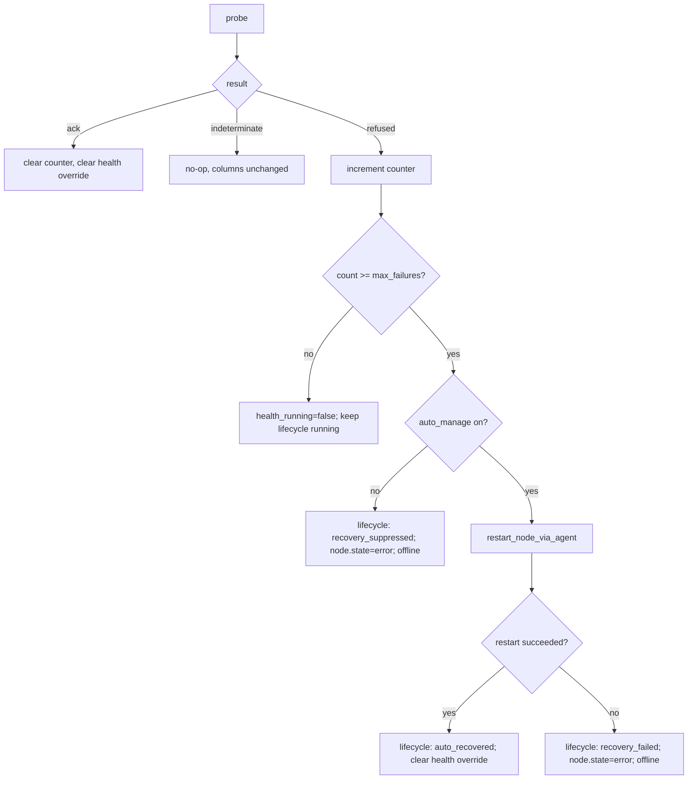

# Doc 3 — Health & Reconciliation Loops

> Reference for every leader-owned background loop that mutates device or node state. Covers cadence, read set, write set, idempotency, the leader-election contract, and the tri-state probe pattern.

GridFleet runs a multi-worker FastAPI process. Workers are stateless — every API mutator can run on any worker — but only **one** worker per cluster runs maintenance loops. That worker is elected via a PostgreSQL advisory lock. This doc is the contract for how loops cooperate with API mutators without racing each other.

## The leader contract

```text
loop ⇄ pg_try_advisory_lock(6001)
       held for the lifetime of the leader process
       released on shutdown via pg_advisory_unlock
```

`backend/app/services/control_plane_leader.py:14-51`. The lock is **process-wide**, held on a dedicated `AsyncConnection` for the whole leader lifetime, and not re-entrant. If `try_acquire` returns `False`, the worker becomes a non-leader: it serves the API and runs no loops at all.

```mermaid
sequenceDiagram
    autonumber
    participant W1 as Worker 1
    participant W2 as Worker 2
    participant Pg as Postgres advisory lock 6001

    W1->>Pg: pg_try_advisory_lock(6001)
    Pg-->>W1: TRUE
    Note over W1: leader; spawns 14 background loops
    W2->>Pg: pg_try_advisory_lock(6001)
    Pg-->>W2: FALSE
    Note over W2: non-leader; serves API only
    W1->>W1: process exits / SIGTERM
    W1->>Pg: pg_advisory_unlock(6001)
    W2->>Pg: pg_try_advisory_lock(6001)
    Pg-->>W2: TRUE
    Note over W2: becomes leader on next try (process restart)
```

Two consequences worth remembering:

- **The leader survives one process; it does not migrate live.** When the leader dies, the lock is released only after the connection is closed. Loops resume in the next process to acquire — i.e. the next start. Compose/k8s `restart: unless-stopped` is what makes this acceptable.
- **`GRIDFLEET_FREEZE_BACKGROUND_LOOPS=1`** skips `try_acquire` entirely (`backend/app/main.py:120-128`). Demo databases use this to keep seeded state from drifting.

The leader lock alone is **not** sufficient to prevent races. API mutators run on all workers and bypass the lock entirely. The device row lock from Doc 1 is what actually serialises a loop's write against an API write on the same device.

## Loop registry

All loops are spawned in `backend/app/main.py:129-145` under the leader gate. The table below captures the invariant data; cadences are the registry defaults from `backend/app/services/settings_registry.py` (DB-tunable at runtime via the Settings UI).

| Loop | Default cadence | Reads | Writes | Sole writer of |
| --- | --- | --- | --- | --- |
| `heartbeat_loop` | 15 s | Agent `/agent/health` | `Device.device_checks_*`, `AppiumNode.state` (recovery only), `AppiumNode.health_running`, `AppiumNode.health_state`, `AppiumNode.last_health_checked_at`, `AppiumNode.consecutive_health_failures`, `Device.operational_state` (cross-link) | `Host.status` (offline/online) |
| `node_health_loop` | 30 s | Agent `/agent/appium/{port}/probe-session` or `/status`, Grid `/status` | `AppiumNode.consecutive_health_failures`, `AppiumNode.state`, `AppiumNode.health_running`, `AppiumNode.health_state`, `AppiumNode.last_health_checked_at`, lifecycle JSON, `Device.operational_state` (cross-link, gated by failure threshold) | node-health counter, auto-restart trigger |
| `device_connectivity_loop` | 60 s | Agent `/agent/pack/devices` | `Device.device_checks_*`, `Device.emulator_state`, `AppiumNode.state`, `AppiumNode.last_health_checked_at`, lifecycle JSON, `Device.operational_state` (cross-link) | `Device.device_checks_*` |
| `session_sync_loop` | 5 s | Grid `/status` | `Session` rows, `Device.operational_state` (busy↔available) | `Session.state`, run-claim transitions |
| `session_viability_loop` | 60 s wake / per-device 3600 s | Agent `/agent/appium/{port}/probe-session` | `Device.session_viability_*`, `Device.operational_state` (cross-link) | `Device.session_viability_*` |
| `property_refresh_loop` | 600 s | Agent `/agent/pack/devices/.../properties` | `Device.os_version`, `software_versions`, etc. | device property fields |
| `hardware_telemetry_loop` | 300 s | Agent telemetry endpoints | `Device.battery_*`, `hardware_health_status` | hardware fields |
| `host_resource_telemetry_loop` | 60 s | Agent `/agent/host/telemetry` | `host_resource_telemetry` table | host telemetry rows |
| `run_reaper_loop` | (internal) | `TestRun`, `DeviceReservation`, Grid `/status` | run state transitions, `grid_service.terminate_grid_session` | abandoned-run reaping |
| `webhook_delivery_loop` | (queue-driven) | `outbound_webhook_deliveries` | webhook delivery rows | webhook delivery state |
| `durable_job_worker_loop` | (queue-driven) | `durable_jobs` | durable job state | durable-job state |
| `pack_drain_loop` | (internal) | pack desired-state | drain progress | pack-drain rows |
| `data_cleanup_loop` | (internal) | various retention windows | deletes old rows | data-retention deletions |
| `fleet_capacity_collector_loop` | 60 s | aggregate device counts | `fleet_capacity_snapshots` | capacity snapshot rows |

The first four loops (heartbeat, node_health, device_connectivity, session_sync) are the lifecycle-critical ones. The rest are telemetry, queue workers, and housekeeping — they cannot cause split-brain on their own.

## The tri-state probe pattern

Every probe that talks to the agent or to Selenium Grid is projected to `ProbeResult`:

```text
ack           : definite success / definitive yes
refused       : definitive failure (agent answered with "no" / explicit error)
indeterminate : transport error, HTTP error response, or open circuit
```

Loops that consume probes **must** branch on `None` separately:

- `ack` — clear failure counter, clear transient health override, mark recovered.
- `refused` — increment `AppiumNode.consecutive_health_failures`, write transient health detail, escalate when `count >= max_failures`.
- `indeterminate` — early-return. Do not change health columns, do not increment the counter, do not flip availability.

Reference implementation: `node_health._check_node_health`, `app.services.agent_probe_result`, and the consumer at `_process_node_health`. Commit `a58c8e5` made every transient agent blip stop flapping device health by enforcing this rule.

`appium_status` returns `None` for non-2xx responses (`agent_operations.py:171-173`). `appium_probe_session` distinguishes between Appium-side errors ("Probe session returned an invalid payload") and HTTP-shaped errors ("Probe session failed (HTTP 503)"); the consumer maps the HTTP-shaped ones to indeterminate (`node_health.py:127-136`).

## Idempotency rules

Loops can run multiple times against the same device without ill effect, provided they obey:

1. **Conditional writes only.** Writers compare the current value before mutating. `set_operational_state` and `set_hold` early-return when `old == new`. `device_health` only queues `device.health_changed` when the derived public summary's `healthy` value changes.

2. **Facts have one home.** Device checks, session viability, emulator state, node lifecycle, transient node health detail, and node failure counts live in typed columns. Readers compose them on demand.

3. **Counters live on the node row, not in memory.** `node_health` keeps consecutive-failure counts in `AppiumNode.consecutive_health_failures` so a leader handoff does not lose history or double-count.

4. **Stale-result detection.** `_process_node_health` records the observed `state/port/pid/active_connection_target` at probe time and rechecks against the locked node before mutating (`node_health.py:208-222`). If the node was restarted while a probe was in flight, the result is dropped silently. Other loops should follow the same pattern when the probe duration can exceed the iteration interval.

## Where State Lives

After Plan D every fact has exactly one home:

- `Device.device_checks_*` — owned by `device_connectivity_loop` and `heartbeat_loop`
- `Device.session_viability_*` — owned by `session_viability_loop`
- `Device.emulator_state` — owned by `device_connectivity_loop`
- `AppiumNode.state` — owned by `node_service.mark_node_*` and recovery/escalation paths
- `AppiumNode.health_running` / `AppiumNode.health_state` — transient node-health detail
- `AppiumNode.consecutive_health_failures` — owned by `node_health_loop`

`device_health.build_public_summary(device)` is the only consumer projection. Readers call it on demand. There is no eventually consistent health layer to drift.

## Cross-loop interactions

Loops are independent in the steady state but must not contradict each other when state transitions race:

- **`session_sync_loop` and `node_health_loop`.** A device that is in a live session has `operational_state = busy`. `node_health` skips probing devices that are not `available + ready` (`node_health.py:71-83`), so an in-flight session is invisible to it. After the session ends, `session_sync` flips operational state back to `available` or `offline` while preserving any reservation hold, then the next `node_health` tick can probe.

- **`device_connectivity_loop` and `node_health_loop`.** If the agent is unreachable, both loops see indeterminate results. Neither flips state. The first loop to see a definitive failure writes its typed column; the public summary aggregates them. Auto-restart only fires from `node_health` (one source for that escalation path).

- **`session_viability_loop` and `node_health_loop`.** Both probe Appium sessions, but viability is per-device on a long cadence (default 1h) while node_health is per-node every 30 s. Viability is a deeper probe (real session) and feeds `Device.session_viability_*`; node_health is a fast liveness check and feeds `AppiumNode.health_*` / `AppiumNode.state`. They contribute different facts to the same derived public summary.

- **`run_reaper_loop` and `session_sync_loop`.** Run reaping ends abandoned runs and explicitly calls `grid_service.terminate_grid_session` for each device's Grid session — the change in commit `54707d1` to stop orphaned Grid registrations from outliving the run. `session_sync` then reconciles the now-cleared session list.

## Failure escalation ladder

For node health, the ladder looks like:



Defined in `_process_node_health` (`node_health.py:186-435`). `max_failures` is `general.node_max_failures`, default `3`. Each rung records a lifecycle action via `lifecycle_policy.record_control_action` so the operator-facing summary reflects the escalation.

## When loops do NOT run

- **Demo freeze.** `GRIDFLEET_FREEZE_BACKGROUND_LOOPS=1` skips loop spawning entirely. The compose `docker-compose.demo.yml` sets this so seeded state never changes.
- **Non-leader workers.** Workers that lose the advisory lock race never spawn loops. Only one process runs maintenance work even with N replicas.
- **`device_connectivity` / `node_health` skip cases.** A device that is `maintenance` / unverified / not `available` is excluded from `_should_probe_node_health`. Virtual devices are excluded from network-style health probes. iOS/tvOS real devices use a different probe path.

## What a new loop must implement

When adding a new periodic task, copy the `node_health_loop` shape:

1. Add the loop function under `backend/app/services/<name>.py`. Wrap the body in `observe_background_loop(LOOP_NAME, interval).cycle()` for metrics.
2. Spawn it in `app/main.py` lifespan **inside the `try_acquire` branch** so non-leaders never run it. Never spawn a bare `asyncio.create_task`.
3. Read settings via `settings_service.get(...)`. Add the setting to `settings_registry.py` if it is operator-tunable.
4. Acquire device row locks via `device_locking.lock_device` for any device-state mutation.
5. Use the tri-state probe pattern for any agent or Grid call.
6. Route health and node-health writes through `app.services.device_health` so locks, cross-links, and `device.health_changed` events stay centralized.
7. Add a Prometheus gauge or counter via the metrics module so the loop is visible on the dashboards.
8. Defer `event_bus.publish` to after-commit when the published change must align with a durable transition (use `_schedule_health_event_after_commit` as the model).

## What this doc does NOT cover

- Per-axis state semantics — see Doc 1.
- The exact `running ↔ stopped ↔ error` transitions — see Doc 2.
- The HTTP shapes the loops call — see Doc 4.
- Owner/port allocator and Grid session reaping — see Doc 5.
