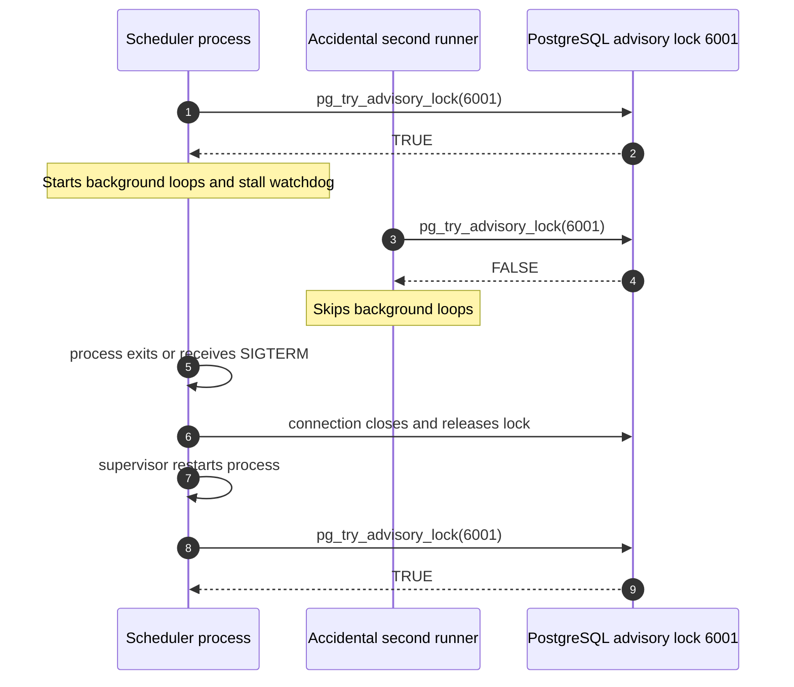
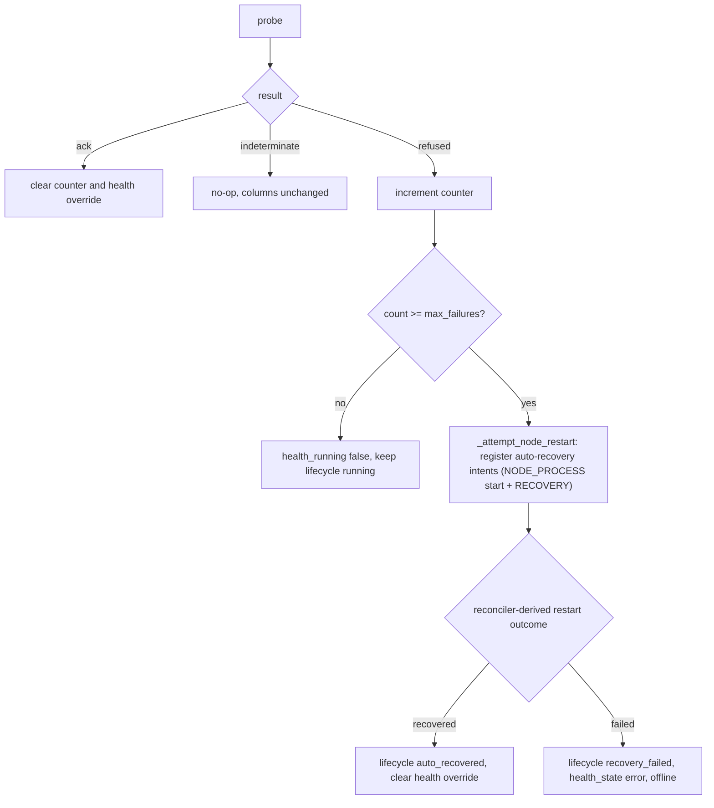

# Doc 3: Health & Reconciliation Loops

> Reference for every scheduler-owned background loop that mutates device or node state. Covers cadence, read set, write set, idempotency, the scheduler launch guard, and the tri-state probe pattern.

GridFleet's API workers are stateless, and API mutations can run on any worker. Background maintenance loops run in one scheduler process. Production uses the `backend-scheduler` Compose service with one worker; local and single-container runs can use the API process because `GRIDFLEET_RUN_BACKGROUND_LOOPS` defaults to `true`.

## Scheduler process and launch guard

The scheduler tries to acquire PostgreSQL advisory lock `6001` during lifespan startup. `backend/app/core/leader/advisory.py` holds the lock on a dedicated `AsyncConnection` for the process lifetime. This is a singleton launch guard against an accidental second loop runner, not a leader election. There is no heartbeat row, watcher, write fence, or cross-process preemption.



Failover is restart based. The supervisor restarts a dead scheduler, which acquires the lock during the next lifespan startup. The lock does not migrate between live processes. On clean shutdown, GridFleet calls `pg_advisory_unlock(6001)` and closes the dedicated connection; PostgreSQL also releases the lock if the connection dies.

The advisory lock does not serialize loop writes against API writes. API mutators bypass it entirely. The device row lock from Doc 1 protects each device's write window across the scheduler and API workers.

## Stall detection and restart

Each `BackgroundLoop` records cycle observations through `observe_background_loop`. The `background_loop_flush_loop` persists snapshots for operator visibility. A watchdog checks for stale loops every 60 seconds and allows an additional 600-second grace period. If a loop remains stale, the watchdog calls `os._exit(70)` so the supervisor restarts the scheduler.

A fully wedged event loop can also starve the watchdog. Prometheus loop-staleness alerts cover that case; recovery still depends on the process supervisor or an operator restart.

## Loop registry

Scheduler-owned loops are listed in `_build_leader_loop_tasks` in `backend/app/main.py` and start only after the process acquires the singleton lock. The table below captures the invariant data. Cadences are registry defaults from the `_DEFINITIONS` list of `SettingDefinition` in `backend/app/settings/registry.py` and can be changed through the Settings UI unless noted otherwise.

| Loop | Default cadence | Reads | Writes | Sole writer of |
| --- | --- | --- | --- | --- |
| `host_sweep_loop` | 15 s (`general.heartbeat_interval_sec`) | The latest pushed status snapshot per host (`POST /agent/hosts/status`, evaluated for recency against `general.host_offline_after_sec`), plus `AppiumNode` desired state | Applies host liveness from push recency and snapshot/restart-event ingest first; for freshly alive hosts the same pushed snapshot drives orphan reaping, node start/stop convergence, and `AppiumNode.pid`/`port`/`active_connection_target` observations. A cadence-gated `/agent/health` reachability probe (`general.partition_probe_interval_sec`) runs as a partition diagnostic only — it writes nothing. The host-offline cascade calls `IntentService.reconcile_now` per device (does not write `operational_state` directly). | `Host.status` (offline/online), Appium-node observed-state reconciliation |
| `host_sweep` node-health stage | 30 s stage (`general.node_check_interval_sec`, rounded to a multiple of the 15 s sweep via `stage_due`); runs only for hosts the same pass proved alive | Agent `/agent/appium/{port}/status` | `AppiumNode.consecutive_health_failures`, `AppiumNode.health_running`, `AppiumNode.health_state`, `AppiumNode.last_health_checked_at`, lifecycle JSON; on max failures registers auto-recovery intents via `IntentService.register_intents_and_reconcile` (does not write `operational_state` directly) | node-health counter, auto-restart trigger |
| `host_sweep` connectivity stage | 60 s stage (`general.device_check_interval_sec`, rounded to a multiple of the 15 s sweep via `stage_due`); a global pass that runs once after the per-host fan-out completes, against the host statuses the same sweep just wrote | Agent `/agent/pack/devices/{connection_target}/health` (direct per-device probe, tried first); `/agent/pack/devices` host enumeration only on miss, at most once per host per cycle | `Device.device_checks_*`, `Device.emulator_state`, lifecycle JSON; calls `IntentService.reconcile_now` / `register_intents_and_reconcile` (does not write `operational_state` directly) | `Device.device_checks_*` |
| `appium_sweep_loop` | 30 s (`grid.session_poll_interval_sec`) or doorbell wake; scheduled viability due-scan throttled to once per 60 s, with a 3600 s per-device default | Per-node Appium session state, then due direct-to-Appium WebDriver probe sessions | `Session` rows and `Device.session_viability_*`; calls `IntentService.reconcile_now` (does not write `operational_state` directly) | `Session.state`, run-claim transitions, `Device.session_viability_*` |
| `device_intent_reconciler_loop` | `general.intent_reconcile_interval_sec` | device intents + durable facts | `Device.operational_state` via `apply_derived_state` → `set_operational_state` | derived `Device.operational_state` (sole runtime writer) |
| `host_sweep` host-resource-telemetry stage | 60 s stage (`general.host_resource_telemetry_interval_sec`, rounded to a multiple of the 15 s sweep via `stage_due`); a global pass after the per-host fan-out | Agent `/agent/host/telemetry` | `host_resource_samples` table (model `HostResourceSample`) | host telemetry rows |
| `host_sweep` hardware-telemetry stage | 300 s stage (`general.hardware_telemetry_interval_sec`, rounded via `stage_due`); global pass after the fan-out | Agent telemetry endpoints | `Device.battery_*`, `hardware_health_status` | hardware fields |
| `host_sweep` property-refresh stage | 600 s stage (`general.property_refresh_interval_sec`, rounded via `stage_due`); global pass after the fan-out | Agent `/agent/pack/devices/.../properties` | `Device.os_version`, `software_versions`, etc. | device property fields |
| `run_reaper_loop` | 15 s | `TestRun`, `DeviceReservation`, `Session` rows | run state transitions, reservation release, `DELETE /session/{id}` direct to the device's Appium node through `appium_direct.terminate_session` | abandoned-run reaping |
| `grid_allocation_reaper_loop` | 5 s (hardcoded `INTERVAL_SEC` in `app/grid/allocation_reaper.py`, not settings-tunable) | Pending `Session` rows past `grid.claim_window_sec`, `GridSessionQueueTicket` rows | `Session.status` (error, via `AllocationService.fail`; calls `IntentService.reconcile_now`), `GridSessionQueueTicket.status` (expired) | stale allocation/queue-ticket expiry |
| `durable_job_worker_loop` | 1 s poll | `jobs` table (model `Job`) | durable job state | durable-job state |
| `pack_drain_loop` | 60 s | pack desired-state | drain progress | pack-drain rows |
| `data_cleanup_loop` | 1 h | various retention windows | deletes old rows | data-retention deletions |
| `fleet_capacity_collector_loop` | 60 s | aggregate device, host, session, and queue-ticket counts | `analytics_capacity_snapshots` (model `AnalyticsCapacitySnapshot`) | capacity snapshot rows |
| `background_loop_flush_loop` | `general.background_loop_flush_interval_sec` | in-memory background-loop heartbeat/observability snapshots | persists those snapshots to the control-plane state table | durable background-loop heartbeat snapshots |

The lifecycle-critical loops are `host_sweep` (which runs the node-health and connectivity stages) and `appium_sweep`. The remaining loops handle reconciliation, telemetry, queues, and housekeeping.

Node health folded into `host_sweep` (it is no longer a standalone loop). Its probe/apply phase metrics still report under the `node_health` label via `record_background_loop_phase`, but they are now recorded per swept host rather than once per global cycle, so a dashboard sums them across hosts to get a per-tick total.

Device connectivity folded into `host_sweep` too (it is no longer a standalone loop). Unlike node health, it runs as a single **global stage after the per-host fan-out completes** — its three-phase pipeline (DB prepass → cross-host probe gather → serial apply) is preserved byte-for-byte, and the host statuses it reads are the ones this same sweep cycle just wrote. Its cooldown/probe phase metrics still report under the `device_connectivity` label. On a due cycle the sweep's cycle duration grows by the connectivity pass (a timeout-bounded probe phase), so `BackgroundLoop` cadence self-corrects and host-liveness pings may stretch toward the cycle duration on due cycles. Soak criterion: `background_loop_overrun_total{loop="host_sweep"}` stays near zero; if it climbs, raise probe concurrency or the base interval rather than un-folding.

Host-resource telemetry, hardware telemetry, and property refresh folded into `host_sweep` as three more global stages (they are no longer standalone loops), each a `SweepStage` gated by its own interval setting and run in list order after connectivity. Their cycle bodies (`poll_once` / `refresh_all_properties`) are unchanged; the fold is drive-and-gate only. Delta from the old loops: each stage now reads host statuses this same sweep cycle just wrote, so a host taken offline mid-cycle sees zero telemetry attempts rather than one stale pass.

`appium_sweep` serializes the session-observation and scheduled viability passes in that order. A monotonic 60 s throttle keeps the viability due-scan query off the doorbell hot path; the state-store timestamps still enforce each device's configured probe cadence across scheduler restarts. Allocation-reaper wakes keep the historical `SESSION_SYNC_WAKE_SOURCE_TOTAL` metric name. The scheduler roster has 10 loops.

## The tri-state probe pattern

Every probe that talks to the agent or to a device's Appium node is projected to `ProbeResult`:

```text
ack           : definite success / definitive yes
refused       : definitive failure (agent answered with "no" / explicit error)
indeterminate : transport error, HTTP error response, or open circuit
```

Loops that consume probes **must** branch on `result.status` explicitly:

- `result.status == "ack"`: clear failure counter, clear transient health override, mark recovered.
- `result.status == "refused"`: increment `AppiumNode.consecutive_health_failures`, write transient health detail, escalate when `count >= max_failures`.
- `result.status == "indeterminate"`: early-return. Do not change health columns, do not increment the counter, do not flip availability.

Reference implementation: `node_health._check_node_health`, `app.agent_comm.probe_result` (dataclass `ProbeResult`, projector `from_status_response`), and the consumer at `_process_node_health`. Commit `a58c8e5` made every transient agent blip stop flapping device health by enforcing this rule.

`appium_status` returns `None` when the response status is not 200 (`app/agent_comm/operations.py`). The node-health stage only consumes that liveness signal; it does not create WebDriver sessions. The scheduled viability pass in `appium_sweep` runs deeper end-to-end checks. It uses `probe_session_direct` to create a WebDriver session directly against the device's Appium node (`node_target(device)`), tags it with `gridfleet:probeSession=true`, and deletes it on the same node.

## Idempotency rules

Loops can run multiple times against the same device without ill effect, provided they obey:

1. **Conditional writes only.** Writers compare the current value before mutating. `set_operational_state` (`app/devices/services/state.py`) early-returns when `old == new`. `app.devices.services.health` only queues `device.health_changed` when the derived public summary's status snapshot (`overall`, `device.status`, `node.status`, `viability.status`) changes.

2. **Facts have one home.** Device checks, session viability, emulator state, node lifecycle, transient node health detail, and node failure counts live in typed columns. Readers compose them on demand.

3. **Counters live on the node row, not in memory.** `node_health` keeps consecutive-failure counts in `AppiumNode.consecutive_health_failures` so a scheduler restart does not lose history or double-count.

4. **Stale-result detection.** `_process_node_health` records the observed `port`/`pid`/`active_connection_target` at probe time and rechecks against the locked node before mutating (`node_health.py`). If the node was restarted while a probe was in flight, the result is dropped silently. Other loops should follow the same pattern when the probe duration can exceed the iteration interval.

## Where health state lives

Every public health fact has exactly one durable home:

- `Device.device_checks_*`: owned by the `host_sweep` connectivity stage and the liveness concern in `host_sweep_loop`
- `Device.session_viability_*`: owned by the scheduled viability pass in `appium_sweep`
- `Device.emulator_state`: owned by the `host_sweep` connectivity stage
- `AppiumNode.desired_state` (running/stopped intent): written via `app.appium_nodes.services.desired_state_writer.write_desired_state`
- `AppiumNode.health_running` / `AppiumNode.health_state` (e.g. `health_state="error"`): observed node-health detail, written via `apply_node_state_transition`
- `AppiumNode.consecutive_health_failures`: owned by the `host_sweep` node-health stage

`app.devices.services.health.build_public_summary(device)` is the only consumer projection. Readers call it on demand. There is no eventually consistent health layer to drift.

`control_plane_state_store` still exists, but not as a public health source of truth. Current namespaces are used for ephemeral coordination and diagnostics:

| Namespace | Owner | Purpose |
| --- | --- | --- |
| `status_push.host_status` | `POST /agent/hosts/status` ingest (any worker); read by `host_sweep_loop` / host diagnostics | latest consolidated agent status push per host (Appium processes, host telemetry) — the single snapshot source |
| `heartbeat.appium_restart_sequence` | `host_sweep_loop` | last ingested local restart event sequence per host |
| `connectivity.previously_offline` | `host_sweep` connectivity stage | remembers why a reconnect is treated as recovery rather than first startup |
| `hardware_telemetry.state` | `host_sweep` hardware-telemetry stage | stale/fresh telemetry bookkeeping |
| `session_viability.state` / `session_viability.running` | `appium_sweep` viability pass | cadence and in-progress guard for deeper session probes |

These entries can be rebuilt or expire by behavior; they must not be used as canonical device/node state in new code.

## Cross-loop interactions

Loops are independent in the steady state but must not contradict each other when state transitions race:

- **The `appium_sweep` sync pass and the node-health stage.** A device that is in a live session has `operational_state = busy`. `node_health` checks the Appium `/status` endpoint on every running node regardless of operational state (it is a process-liveness probe, not a session check), so a busy device is still polled. The sync pass reconciles `Session` rows and run-claim transitions, then calls `IntentService.reconcile_now`; the `device_intent_reconciler` derives `Device.operational_state` (available/offline) from those facts. (Reservation is computed from the `device_reservations` table; there is no hold column.)

- **The connectivity and node-health stages.** If the agent is unreachable, both see indeterminate results. Neither flips state. The first loop to see a definitive failure writes its typed column; the public summary aggregates them. Auto-restart only fires from `node_health` (one source for that escalation path).

- **The `appium_sweep` viability pass and the node-health stage.** Two-tier probing. `node_health` is the fast per-node liveness check (default 30 s stage cadence) against agent `/status`; it feeds `AppiumNode.health_running` / `AppiumNode.health_state` and drives auto-restart on `general.node_max_failures` consecutive refusals. The viability pass is the deep per-device end-to-end probe on a long cadence (default 1h) that creates a real WebDriver session directly against the device's Appium node; it feeds `Device.session_viability_*`. The cheap probe runs often so 30 s cadence stays sustainable; the expensive probe runs rarely so it does not flood the nodes.

- **`run_reaper_loop` and the `appium_sweep` sync pass.** Run reaping expires abandoned runs through `RunLifecycleService.expire_run` → `RunReleaseService.release_devices(terminate_grid_sessions=True)`, which calls `appium_direct.terminate_session` (DELETE direct to the device's Appium node) for each running session before releasing reservations. The sync pass independently probes session liveness and kills orphaned Appium sessions (sessions with no matching DB row) via `_kill_orphans`. Both paths call `appium_direct.terminate_session` directly against the node; there is no Grid hub to reconcile against.

## Failure escalation ladder

For node health, the ladder looks like:



`_attempt_node_restart` registers auto-recovery intents via `IntentService.register_intents_and_reconcile`; the actual restart and the recovered/failed terminals are derived by `appium_reconciler` / `device_intent_reconciler`, not written directly by `node_health`. Defined in `_process_node_health` (`node_health.py`). `max_failures` is `general.node_max_failures`, default `3`. Each rung records a lifecycle action via `lifecycle_policy.record_control_action` so the operator-facing summary reflects the escalation.

## When loops do NOT run

- **Background loops are disabled.** A process with `GRIDFLEET_RUN_BACKGROUND_LOOPS=false` does not try to acquire the singleton lock or start scheduler tasks.
- **Another process holds the lock.** If `pg_try_advisory_lock(6001)` returns false, the process logs `background_loops_skipped_lock_held` and does not start maintenance loops. It does not watch or preempt the lock holder.
- **`node_health` skip cases.** The stage runs only for hosts the same sweep pass proved alive, and on those hosts polls every `AppiumNode` row whose `pid` and `active_connection_target` are populated; nodes that have been stopped (pid cleared) or never started are skipped, and on an off cadence cycle (per `stage_due`) the whole stage is skipped. There are no per-platform exclusions: the `/status` probe is platform-agnostic.
- **`device_connectivity` skip cases.** The stage probes every device directly via `/agent/pack/devices/{ct}/health` first (direct-first, sweep-on-miss); the host-wide `/agent/pack/devices` enumeration only runs, at most once per host per cycle, when a device's direct probe does not confirm health. If that enumeration is indeterminate, the stage skips the device (and every other device on that host, which hits the cached `None` and skips too); heartbeat handles host status instead. For disconnected devices, it suppresses lifecycle action when the device is in maintenance.

## What a new loop must implement

When adding a new periodic task, copy the `fleet_capacity_collector_loop` shape:

1. Add a `BackgroundLoop` subclass (`app/core/background_loop.py`) under the owning domain's `services/` package (e.g. `app/devices/services/<name>.py`, `app/appium_nodes/services/<name>.py`), implementing `_session_factory`, `_interval`, and `_run_cycle` and setting the `loop_name` and `cycle_failed_message` class vars. The base class wraps each cycle in `observe_background_loop(loop_name, interval).cycle()` for metrics.
2. Add it to `_build_leader_loop_tasks` in `app/main.py`. Do not spawn an independent periodic `asyncio.create_task` from another service.
3. Read settings via `settings_service.get(...)`. Add the setting to the `_DEFINITIONS` list in `app/settings/registry.py` if it is operator-tunable.
4. Acquire device row locks via `device_locking.lock_device` for any device-state mutation.
5. Use the tri-state probe pattern for any agent or Appium-node call.
6. Route health and node-health writes through `app.devices.services.health` (class `DeviceHealthService`) so locks, cross-links, and `device.health_changed` events stay centralized.
7. Add a Prometheus gauge or counter via the metrics module so the loop is visible on the dashboards.
8. Defer `event_bus.publish` to after-commit when the published change must coincide with a durable transition (use `_maybe_emit_health_changed` as the model: it compares the public summary's status snapshot and calls `publisher.queue_for_session(...)` to emit `device.health_changed` on change).

## What this doc does NOT cover

- Per-axis state semantics: see Doc 1.
- The exact `running ↔ stopped ↔ error` transitions: see Doc 2.
- The HTTP shapes the loops call: see Doc 4.
- Owner/port allocator and session reaping: see Doc 5.
