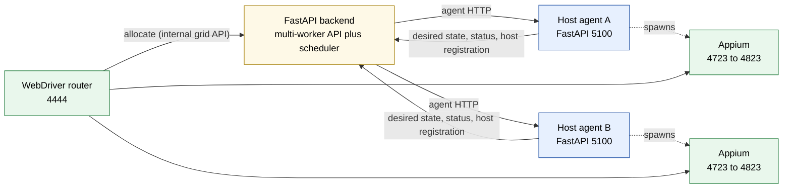
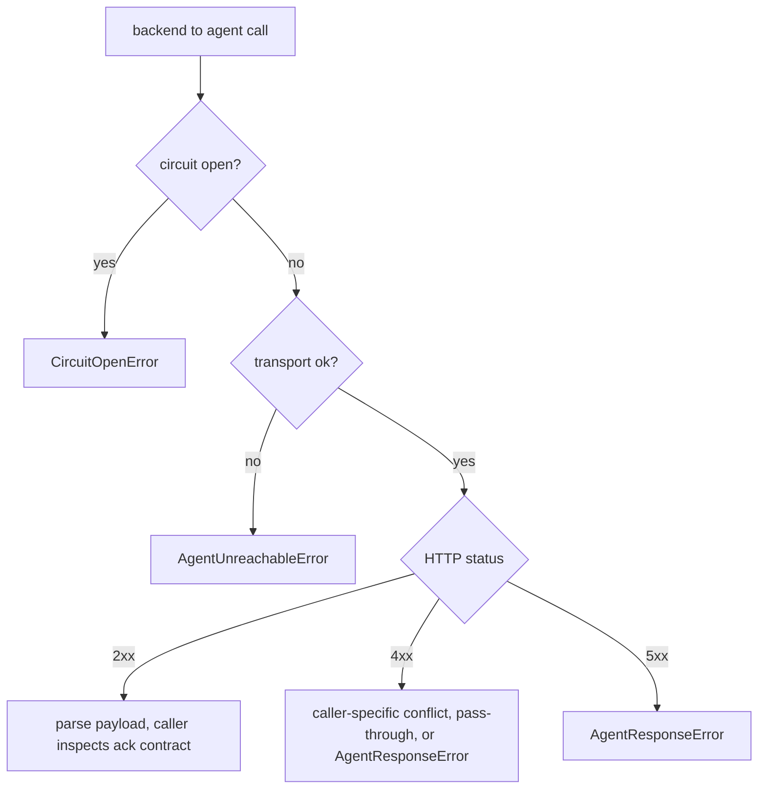
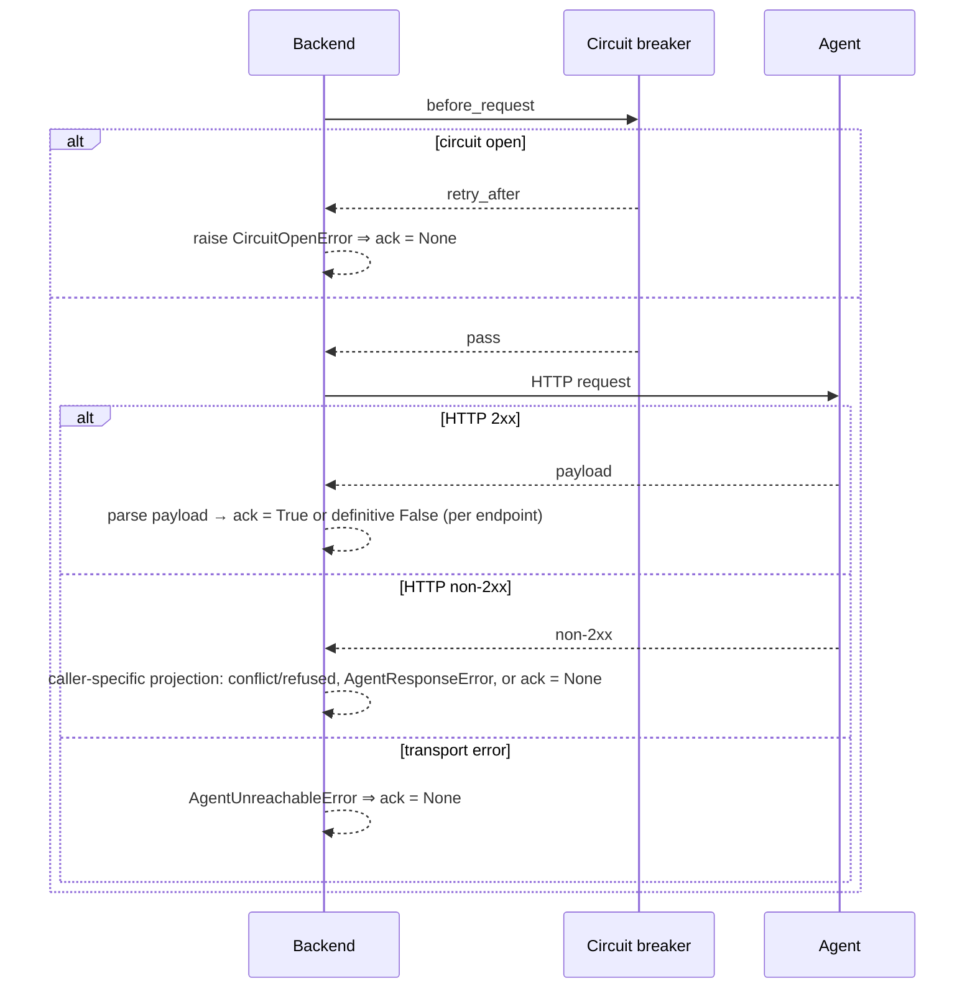

# Doc 4: Backend ↔ Agent Contract

> HTTP contract between the FastAPI manager and the FastAPI host agents. Covers endpoint catalog, ack semantics, failure model, circuit breaker, auth surface, and idempotency.

GridFleet has two HTTP-speaking processes per host: the centralised backend and the per-host agent. Most traffic flows backend to agent. The agent also registers itself (periodic enrollment refresh), pulls desired driver-pack and Appium-node state, pushes one consolidated status report, and downloads pack tarballs. All host-aware backend calls use the `agent_operations` typed wrapper (`backend/app/agent_comm/operations.py`, imported as `from app.agent_comm import operations as agent_operations`).

This doc specifies that contract.

## Topology



The CI runner / test client speaks **only** to the WebDriver router for sessions. The backend never proxies WebDriver traffic. For each new session the router calls the backend's internal grid API to allocate a device by capability match, then proxies the session's commands directly to that device's Appium server. Allocation and capability matching are owned by the backend; request forwarding is owned by the router.

## Auth surface

The two directions are asymmetric today.

- **Backend → agent.** Optional HTTP Basic auth is supported. The backend sends credentials from `GRIDFLEET_AGENT_AUTH_USERNAME` / `GRIDFLEET_AGENT_AUTH_PASSWORD` via `build_agent_basic_auth` in `backend/app/agent_comm/http_pool.py`, applied per request by the pool. The agent enforces Basic auth on every `/agent/*` HTTP route when `AGENT_API_AUTH_USERNAME` / `AGENT_API_AUTH_PASSWORD` are set, through `agent/agent_app/api_auth.py:BasicAuthMiddleware`. Leave all four unset for local dev or a trusted private lab network.
- **Agent → backend.** `agent/agent_app/lifespan.py` and `agent/agent_app/registration.py` construct `httpx.BasicAuth(manager_auth_username, manager_auth_password)` from `AGENT_MANAGER_AUTH_USERNAME` / `AGENT_MANAGER_AUTH_PASSWORD` when configured. The agent uses these credentials for desired-state polling, the consolidated status push, and host registration. This satisfies backend machine auth when `GRIDFLEET_AUTH_ENABLED=true`.
- **Browser → backend** (out of scope for this doc). Session cookie + CSRF for non-GET; that path never hits agents directly.

There is no HMAC or message signing. When the optional backend→agent Basic-auth credentials are unset, transport security relies entirely on the network boundary documented in `docs/guides/security.md`.

## Endpoint catalog (backend → agent)

All paths are under `http://<host_ip>:<host.agent_port>`. The wrapper module is `backend/app/agent_comm/operations.py` (imported as `agent_operations`).

| Method | Path | Caller (backend) | Purpose | Ack semantics |
| --- | --- | --- | --- | --- |
| GET | `/agent/health` | `host_sweep_loop` (cadence-gated reachability probe, `general.partition_probe_interval_sec`) | partition diagnostic + installer drain gate (local); metrics only, feeds no host-liveness or convergence state | 200 → ok; non-200 → `None`, logged as `agent_partition_suspected` |
| GET | `/agent/host/telemetry` | `host_sweep` host-resource-telemetry stage | CPU/memory/disk numbers | 200 → snapshot; non-200 → `None` |
| GET | `/agent/pack/devices` | `host_sweep` connectivity stage, intake/discovery | currently-visible devices per pack | 2xx required (raises on non-2xx) |
| GET | `/agent/pack/devices/{ct}/properties` | `host_sweep` property-refresh stage | per-device props (OS version, model, etc.) | 200 → dict, 404 → `None`, other → raise |
| GET | `/agent/pack/devices/{ct}/health` | verification flow | adapter-driven health probe | 200 → dict, otherwise → raise |
| GET | `/agent/pack/devices/{ct}/telemetry` | `host_sweep` hardware-telemetry stage | adapter-driven hardware telemetry | 200 → dict, 404 → `None` |
| POST | `/agent/pack/devices/{ct}/lifecycle/{action}` | lifecycle/operator actions | run a pack-defined lifecycle action (e.g. boot, shutdown) | 2xx required |
| POST | `/agent/pack/devices/normalize` | intake/discovery | normalise raw input to canonical device fields | 200 → dict, 404 → `None` |
| POST | `/agent/pack/{pack_id}/doctor` | host onboarding/diagnostics (`hosts/router`, wrapper `pack_doctor`) | run pack adapter doctor checks | 2xx → checks list |
| POST | `/agent/pack/features/{feat}/actions/{act}` | feature dispatch | dispatch arbitrary pack feature action | 2xx required |
| GET | `/agent/appium/{port}/status` | `node_health` reconcile path | "is the Appium on this port up?" | 200 → `{running: bool}`; non-200 → `None` |
| GET | `/agent/appium/{port}/logs` | host detail UI | return last N lines | 2xx required |
| POST | `/agent/appium-nodes/refresh` | `poke_node_refresh` (`app/agent_comm/node_poke.py`) after every desired-state write, and `converge_device_now` (`reconciler.py`) as the operator fast path | wake `NodeStateLoop`; correctness still comes from polling | 202; best-effort — failures are logged and swallowed |
| GET | `/agent/tools/status` | host onboarding | Node provider and host helper versions | 2xx required |

Most rows have a typed function in `agent_operations.py`. The function signature pins the response shape and the ack contract (`bool`, `bool | None`, `dict | None`, etc.). The one exception is the feature-dispatch endpoint (`/agent/pack/features/{feat}/actions/{act}`), which has no wrapper in `operations.py`: it is issued from `app/packs/services/feature_dispatch.py` via the shared `app.agent_comm.client.request`, so the circuit breaker and metrics still fire. Routers and services should never call `httpx` directly. Go through these wrappers (or that shared `request`) so the circuit breaker and metrics fire.

### `launch` payload cap surfaces

The `launch` payload inside `GET /agent/appium-nodes/desired`'s response (built by `build_node_launch_payload`) sends two capability surfaces to the agent. They have separate sources of truth and separate consumers; keep them disentangled when extending the contract.

| Field             | Source of truth                                                                                                                                                             | Consumer                                                                                |
| ----------------- | --------------------------------------------------------------------------------------------------------------------------------------------------------------------------- | --------------------------------------------------------------------------------------- |
| `extra_caps`      | `_build_session_aligned_start_caps(...)` in `app/appium_nodes/services/reconciler_agent.py`: full device dump (platform, os_version, manufacturer, model, ip, deviceName, sanitized `device_config.appium_caps`, tags, allocated caps) | Agent: merged into the Appium `/session` request body (`agent/agent_app/appium/process.py`) |
| `allocated_caps`  | `appium_node_resource_service.get_capabilities(...)` (UDID + reserved ports)                                                                                                | Agent → Appium driver                                                                   |

The desired-node spec also carries `accepting_new_sessions`, `stop_pending`, and `grid_run_id` alongside `launch`. The agent records these but does not route on them; new-session suppression and run scoping are enforced by the backend allocation service, not at the node.

**Backend-internal routing surface.** Capability matching now happens in the backend, not on the node: `device_match_surface` (`app/grid/allocation.py`, the pack platform's `platformName` scalar plus any identity/tag keys the manifest stereotype base declares, merged with `build_grid_stereotype_caps`'s deviceId + tag fanout) is the per-device routing surface the allocation service matches incoming session requests against when the router asks it to allocate a device. It carries only the keys the matcher consults. The rest of the pack stereotype is rendered only at node-start, never for matching. It is **not** part of the `launch` payload and is never sent to the agent.

**Cross-component invariant.** Keep the routing stereotype and the driver caps disjoint. The backend MUST NOT include Appium-only device metadata (manufacturer, model, ip, deviceName, sanitized `device_config.appium_caps`) in the routing stereotype. That metadata MUST flow to the driver via `extra_caps` only.

## Endpoint catalog (agent → backend)

| Method | Path | Caller (agent) | Purpose | Ack semantics |
| --- | --- | --- | --- | --- |
| POST | `/api/hosts/register` | bootstrap, then periodic enrollment refresh (`RegistrationService.run`, `AGENT_REGISTRATION_REFRESH_INTERVAL_SEC`, default 300 s) | host registration; refresh only touches enrollment fields (ip, os_type, agent_port, agent_version, capabilities, host_info) — it does not set `Host.status` or `last_heartbeat` | 2xx, returns `Host` row id |
| GET | `/agent/driver-packs/desired` | `PackStateLoop` (~10 s) | desired pack list for this host | 200 → `{packs: [...]}` |
| POST | `/agent/hosts/status` | consolidated status-push loop (`AGENT_STATUS_PUSH_INTERVAL_SEC`, default 10 s) | the one status-bearing channel: Appium nodes/processes, restart events, start failures, pack status, host telemetry, agent version/capabilities in a single envelope (`HostStatusPush`); stamps `Host.last_heartbeat` and flips a stale host back online | 204 |
| GET | `/agent/appium-nodes/desired` | `NodeStateLoop` (5 s default) | desired Appium-node projection for this host | 200 → `{nodes: [...], generation_hint}` |
| GET | `/api/driver-packs/{pack_id}/releases/{release}/tarball` | `tarball_fetch` | download the sha256-pinned pack tarball | 2xx → tarball bytes |

The node desired response contains `device_id`, `generation`, `desired_state`, `port`, drain flags, `grid_run_id`, and transition-token fields. A running node also receives `launch`, the complete payload built by `build_node_launch_payload`. If launch inputs are not runnable, the spec carries `launch: null` and `unrunnable_reason` instead of failing the whole host response.

`NodeStateLoop` starts whenever the agent has a backend URL. It starts, stops, reconfigures, and reaps local orphan processes from the desired projection on every poll (5 s default, or immediately on a wake poke). A node's `restart_requested_at` watermark (`docs/design/02-node-lifecycle.md`) forces one respawn per agent process; the backend confirms the watermark is satisfied by comparing it against the `started_at` the agent reports on each running-node entry — both `/agent/health` and the consolidated status push carry that entry via `process_snapshot()`. The agent advertises `orchestration_contract_version: 5` unconditionally; the backend validates that contract at registration, then always writes desired state and pokes (see `docs/reference/architecture.md` for the contract-version floor).

## Node lifecycle: pull only

Nodes converge by agent pull. The backend never starts, stops, restarts, or reconfigures an Appium process — the only backend→agent node signal is the refresh poke. There is no push path, no reconfigure-delivery machinery, and no `AgentReconfigureOutbox` table.

The agent no longer exposes `POST /agent/appium/start`, `POST /agent/appium/stop`, or `POST /agent/appium/{port}/reconfigure` HTTP routes — they were removed once pull mode became the only lifecycle channel. Node lifecycle happens entirely in-process inside the agent, via `AppiumManager.start`/`.stop`/`.reconfigure` driven by `NodeStateLoop` converging the pulled desired state.

Per host, `reconcile_host` (`app/appium_nodes/services/reconciler.py`) parses the agent's `/agent/health` payload and runs DB-writing convergence — confirm/mark-running, stale clears, expired-token clears — but every agent-effecting action (`start`, `stop`, `restart`) is translated to a no-op by `translate_action_for_pull` (`app/appium_nodes/services/reconciler_convergence.py`):

| Convergence action | Outcome |
| --- | --- |
| `start` | Skipped; `APPIUM_PULL_MODE_SKIPPED_ACTIONS{kind="start"}` increments. The agent's own `NodeStateLoop` starts the process. |
| `stop` | Skipped; `APPIUM_PULL_MODE_SKIPPED_ACTIONS{kind="stop"}` increments. The agent stops it. |
| `restart` | Skipped; `APPIUM_PULL_MODE_SKIPPED_ACTIONS{kind="restart"}` increments. The agent restarts it (forced by an unexpired transition token). |
| DB-only actions (confirm, mark-running, stale clears, etc.) | Writes observed columns, unchanged |
| Orphan reap | Metric-only: `APPIUM_PULL_MODE_ORPHANS_OBSERVED` counts strays; the backend stops nothing. The agent's `NodeStateLoop` already stopped anything running that isn't in its own desired projection. |

The agent owns start/stop and orphan cleanup for every host. The backend only observes.

**Ingests.** `_ingest_pull_host_reports` runs before convergence, against active rows:

1. **Applied-transition-token clear.** When a running-node health entry reports `applied_transition_token == node.transition_token`, the backend clears the token via the natural-clear path (it does not trip `APPIUM_TRANSITION_TOKEN_OVERRIDDEN`).
2. **Start-failure ingest.** The agent reports `start_failures: [{connection_target, port, kind, detail, at}]` inside `/agent/health`'s `appium_processes`, deduped per device by `(port, at)` — a level-style cursor that matches only failures newer than the last one seen for that device. Two kinds:
   - `kind="port_conflict"` — records the existing start-failure backoff (`_record_start_failure`) **and** re-pins `desired_port` to the next free candidate port via `write_desired_state`. The backend stays the single port authority (decision D3); the conflict converges within two poll cycles.
   - `kind="spawn_failed"` — records the start-failure backoff only; no re-pin.

"Never mark stopped unless the agent proved the process gone" still holds: the only stopped-observed write is the `db_clear_stale_running` pass-through, which fires only when the agent reports the process absent.

**Delivery: the poke is the only signal.** There is no outbox staging and no reconfigure push. Every desired-state write (`write_desired_state`) is followed by a fire-and-forget wake poke: `poke_node_refresh` (`app/agent_comm/node_poke.py`) fires `POST /agent/appium-nodes/refresh` (202, no payload, `NODE_POKE_TIMEOUT_SEC = 2.0`) for the device's host. `converge_device_now` (the operator start/stop/restart fast path, `app/appium_nodes/routers/nodes.py` and `app/verification/services/execution.py`) follows the same rule: it pokes and returns without any agent start/stop/restart I/O. The `device_intent_reconciler` loop pokes after every dirty-device reconcile too (`app/devices/services/intent_reconciler.py`). A lost poke costs at most one agent poll interval; correctness comes from the agent's own poll, not the poke.

## Request envelope

Every backend→agent call goes through `request()` in `backend/app/agent_comm/client.py`:

```text
1. agent_circuit_breaker.before_request(host)   # may raise CircuitOpenError
2. attach REQUEST_ID_HEADER (correlation id)    # build_agent_headers
3. perform httpx call                           # GET or POST, with Basic auth when GRIDFLEET_AGENT_AUTH_* is set
4. classify result:
     status >= 500                  → record_failure (transport-like)
     transport exception            → record_failure (transport)
     anything else                  → record_success
5. record_agent_call metric (host, endpoint, outcome, duration)
```

The wrapper guarantees:

- `AgentUnreachableError` for transport failures (DNS, TCP, TLS, idle timeout).
- `AgentResponseError` for non-2xx responses when the wrapper calls `_raise_for_status`.
- `CircuitOpenError` for hosts in the open state: body includes `retry_after_seconds`.
- `httpx.HTTPStatusError` only escapes when a caller chooses to inspect the response itself instead of going through `_raise_for_status`.

## Failure taxonomy



Loop callers map all three terminal errors to `None` (indeterminate). API mutators map them to user-visible 502/503 via the FastAPI exception handlers in `backend/app/core/errors.py`.

## Circuit breaker

`AgentCircuitBreaker` (`backend/app/agent_comm/circuit_breaker.py`).

- **Per host.** State is keyed by host IP/hostname. One bad host does not block others.
- **Failure threshold.** 5 consecutive failures → `open`. Cooldown is 30 s.
- **States.**
  - `closed`: pass through.
  - `open`: short-circuit with `CircuitOpenError(retry_after_seconds=...)`.
  - `half_open`: first probe is allowed through; concurrent probes get `retry_after_seconds=0`. Result decides next state.
- **Counted as failure.** Transport errors and HTTP `>= 500` from the response. 4xx is not a failure (the agent answered, just refused).
- **Events.** `host.circuit_breaker.opened` and `.closed` are published to the event bus when the state transitions, and surface on the dashboard.

This is what insulates the leader from "10 hosts unreachable" cascading into 14 loops × 10 hosts × 3 retries every cycle.

## Idempotency expectations

Per endpoint, a brief contract:

| Endpoint | Idempotent? | Notes |
| --- | --- | --- |
| `/agent/health` | yes | Read-only |
| `/agent/host/telemetry` | yes | Read-only |
| `/agent/pack/devices` (GET) | yes | Snapshot of currently-visible devices |
| `/agent/appium/{port}/status` | yes | Read-only. |
| `/agent/appium/{port}/logs` | yes | Read-only |
| `/agent/driver-packs/desired` | yes | Read-only by host_id |
| `/agent/hosts/status` | yes | Replaces previous snapshot; full consolidated status per push |
| `/agent/appium-nodes/desired` | yes | Read-only projection by `host_id` |
| `/agent/appium-nodes/refresh` | yes | Wake hint; a lost request costs at most one poll interval |

## Ack semantics for the lifecycle path

This is the most important part of the contract. Every state-changing call between manager and agent obeys a specific ack rule:



The agent endpoint whose result is a tri-state probe (`/agent/appium/{port}/status`) projects HTTP shapes into `bool | None`:

- **`appium_status`** (`agent_operations.py`). 200 → `dict` (and the consumer reads `running: bool`). Non-200 → `None`.

- **`mark_node_started` / `mark_node_stopped`** (`reconciler_agent.py`). These are not gated by an HTTP ack at all anymore — the node-lifecycle path (Doc 2) makes no state-changing agent call. They fire only when the observe-only reconciler (`reconciler.py`) matches a running/absent entry in the agent's self-reported `/agent/health.appium_processes.running_nodes` against the desired row. A stale or missing report changes nothing.

The agent does not expose a WebDriver session probe endpoint. Probe sessions are created by the backend directly against the device's Appium node (`probe_session_direct`, targeting `node_target(device)`), exercising the same Appium endpoint a router-proxied CI session lands on, minus the router hop.

When you add a new state-changing endpoint, follow this pattern: pick an explicit return type (`bool`, `bool | None`, or a dataclass) and document the projection from HTTP into that type at the wrapper layer. Do not let the lifecycle code do its own HTTP error handling; that is what `agent_operations.py` is for.

## Timeouts

Each wrapper picks a default. Override via the `timeout=` argument when the caller's loop has its own deadline:

| Endpoint | Default timeout | Reason |
| --- | --- | --- |
| `/agent/health` | 5 s | liveness ping |
| `/agent/appium/{port}/status` | 5 s | quick check |
| `/agent/appium/{port}/logs` | 10 s | small payload |
| `/agent/tools/status` | 15 s | local probe |
| `/agent/pack/devices` | 45 s | adapter discovery |
| `/agent/appium-nodes/desired` | 15 s | agent pull poll |
| `/agent/appium-nodes/refresh` | `NODE_POKE_TIMEOUT_SEC = 2.0` | best-effort wake; never load-bearing |

Timeouts are deliberately tight on health-path endpoints so a slow agent does not pin the leader's loops. They are deliberately loose on installer endpoints because operator-initiated install is allowed to take minutes.

## Request correlation

Every request carries a `REQUEST_ID_HEADER` (`X-Request-ID`) injected by `RequestContextMiddleware` on both backend and agent. Logs on both sides bind the request id, so operator-facing traces line up across backend + agent.

When a backend loop initiates a request with no inbound request id bound in structlog context, `build_agent_headers` does not synthesize one; the agent's `RequestContextMiddleware` generates one for the agent-side request and returns it on the response.

## Connection pooling

Backend → agent calls reuse `httpx.AsyncClient` instances pooled by `(host_ip, agent_port)` via `app.agent_comm.http_pool.AgentHttpPool`. A pooled client lives for the lifetime of the backend process; on lifespan shutdown the pool drains via `aclose()`.

The pool is opt-in via two guards: `agent.http_pool_enabled` (default `true`) **and** the caller using the default `httpx.AsyncClient` factory. Tests that inject a fake `http_client_factory` always go through the legacy per-call path. This is by design: the explicit-factory seam is used by unit tests and special-purpose call sites, and pooling must not surprise them.

`httpx.Limits(max_keepalive_connections=N, keepalive_expiry=S)` is read once at startup via `AgentHttpPool.configure_limits` and applied to every client the pool creates from then on. `agent.http_pool_max_keepalive` controls N (default 10); `agent.http_pool_idle_seconds` controls S in seconds (default 60). Retuning either setting requires a backend process restart; there is no runtime client-replacement path.

Auth is not part of the pool key because Basic auth is applied per request, not bound to the pooled `httpx.AsyncClient`. Credential changes are process-env changes; restart the backend process after changing `GRIDFLEET_AGENT_AUTH_*`.

Operational note: pooled clients do not refresh DNS until they are closed. If a host's IP changes mid-flight (lab reorg), restart the backend process. Toggling `agent.http_pool_enabled` off only routes new calls through the legacy path; existing pooled clients stay open and resume serving if the toggle is flipped back on. A process restart is the drain for both DNS/IP changes and pool tuning changes.

## Versioning

One axis is hard-enforced; the rest is soft guidance. `orchestration_contract_version` (agent registration capabilities, checked against `MIN_ORCHESTRATION_CONTRACT_VERSION = 5` in `app/hosts/service.py`) is the hard gate: a pre-v5 agent is rejected at registration with HTTP 426, and any already-registered pre-v5 host is marked offline at scheduler startup — this is what guarantees every online host pushes the consolidated status report. Beyond that floor, there is no formal endpoint-level API version. The backend separately records the agent's `version` (pushed on every consolidated status report, and on `/agent/health` for the local diagnostic) on the `Host` row and computes `agent_version_status` against `agent.min_version` for operator visibility. The bootstrap installer and `/agent/health` `version_guidance` payload help keep agents within compatible ranges. Adding/changing an endpoint requires a coordinated release of backend + agent (`docs/reference/release-policy.md`).

`agent.min_version` is backend-enforced guidance for hosts that report to the current backend. It protects new backend expectations for old agents, but it cannot protect the opposite direction: an old backend calling an endpoint removed from a newer agent. Backend-called endpoint removals are safe only when the backend stops calling the endpoint before or at the same time the agent removes it. Roll those changes out backend-first, or deploy backend and agent together; do not roll newer agents across the fleet while an older backend still depends on the removed endpoint.

When evolving an endpoint:

- Adding a field to a request payload: agents must tolerate unknown fields (FastAPI/Pydantic does by default unless `model_config = {extra: 'forbid'}`).
- Adding a field to a response: backend wrappers must tolerate missing fields (use `payload.get(...)`).
- Renaming or removing: needs a breaking component release in `release-please` and the coordinated rollout model above. Don't.

## Structured error codes

The Appium lifecycle endpoints return structured failure detail as `{"code": "<ENUM_VALUE>", "message": "<human text>"}`. Other agent endpoints may still use ordinary FastAPI `detail` strings or endpoint-specific payloads. The Appium error enum is mirrored on both sides:

- `agent/agent_app/error_codes.py:AgentErrorCode`
- `backend/app/agent_comm/error_codes.py:AgentErrorCode`

`backend/tests/contracts/test_agent_error_code_parity.py` enforces drift detection. Backend matches `code` via `agent_operations.parse_agent_error_detail`; substring matching on `detail.message` is forbidden.

The exception classes below are defined in `agent_app/appium/exceptions.py`; the exception → `AgentErrorCode` / HTTP-status mapping is done in `agent_app/appium/router.py` (and `agent_app/pack/router.py` for the pack-resolution codes). `appium/process.py` raises most of these classes but is not where they are defined.

| Code | Source | Meaning |
| --- | --- | --- |
| `PORT_OCCUPIED` | `appium.exceptions.PortOccupiedError` | External listener already bound the requested port |
| `ALREADY_RUNNING` | `appium.exceptions.AlreadyRunningError` | Managed Appium already running on this port |
| `STARTUP_TIMEOUT` | `appium.exceptions.StartupTimeoutError` | Appium did not become ready in `appium.startup_timeout_sec` |
| `RUNTIME_MISSING` | `appium.exceptions.RuntimeMissingError` / `RuntimeNotInstalledError` | Required runtime tools are absent |
| `DEVICE_NOT_FOUND` | `appium.exceptions.DeviceNotFoundError` | Connection target not visible to the host adapter |
| `INVALID_PAYLOAD` | `appium.exceptions.InvalidStartPayloadError` | Start request missing required fields |
| `NO_ADAPTER` | `pack.dependencies` / `pack.router` | No pack adapter available to serve the request |
| `UNKNOWN_PLATFORM` | `pack.dependencies` | Requested pack/platform is not in the host's desired list |
| `INTERNAL_ERROR` | route catch-all | Agent-side state corruption or unclassified adapter failure |

## Known gaps

- Wrappers do not retry requests. Loops own retry and backoff so a degraded agent cannot amplify traffic across layers.

## What this doc does NOT cover

- Internal node state machine: see Doc 2.
- Loop cadence and reconciliation pattern: see Doc 3.
- Owner allocations, port pools, WebDriver sessions: see Doc 5.
- Operator-facing onboarding flows: see `docs/guides/host-onboarding.md`.
