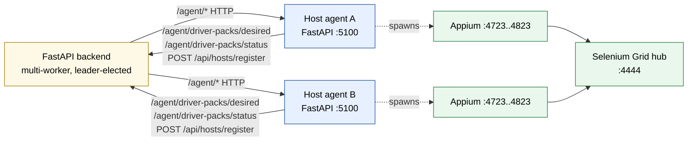
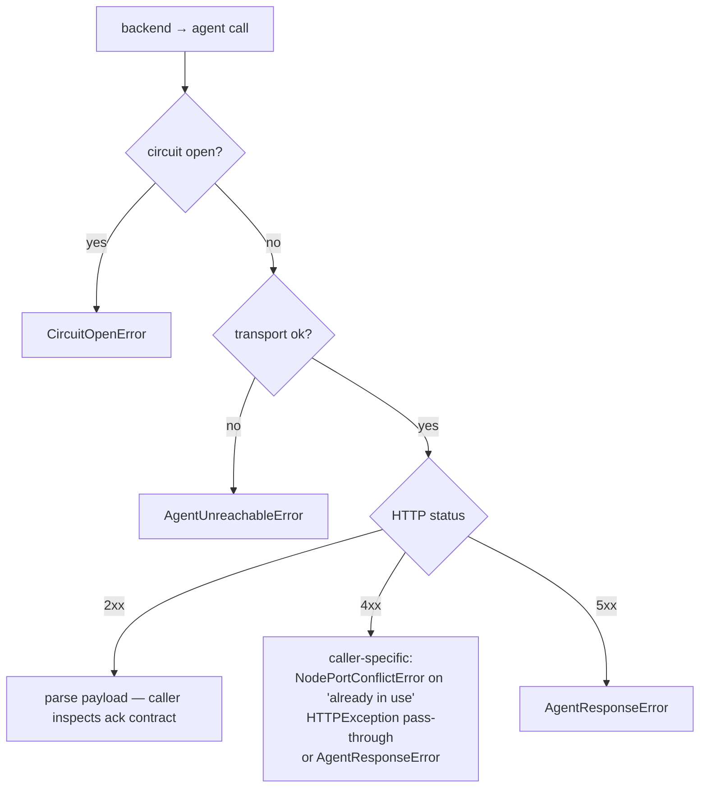
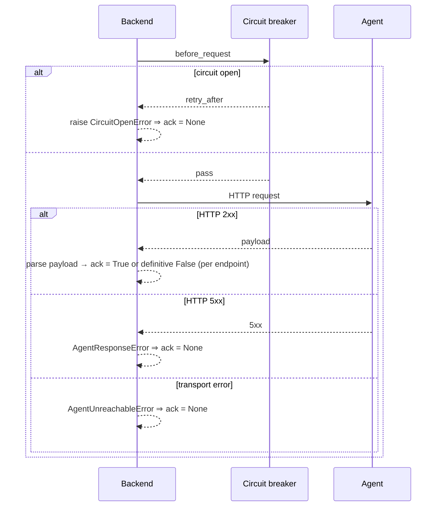

# Doc 4 — Backend ↔ Agent Contract

> HTTP contract between the FastAPI manager and the FastAPI host agents. Covers endpoint catalog, ack semantics, failure model, circuit breaker, auth surface, and idempotency.

GridFleet has two HTTP-speaking processes per host: the centralised backend and the per-host agent. Most traffic flows backend→agent; the agent talks back only for two flows (desired-pack pull and pack-state status push). All host-aware logic on the backend lives behind the `agent_operations` typed wrapper (`backend/app/services/agent_operations.py`).

This doc specifies that contract.

## Topology



The CI runner / test client speaks **only** to the Selenium Grid hub for sessions. The backend never proxies WebDriver traffic. Routing of WebDriver requests to the right Appium relay is owned by Grid's capability matcher, not by the backend.

## Auth surface

Both directions use HTTP Basic.

- **Backend → agent.** When `GRIDFLEET_AUTH_ENABLED=true`, agents require Basic from machine credentials configured at deploy time. The backend's `agent_request` helper (`backend/app/agent_client.py`) always attaches request-id headers; `httpx.BasicAuth` is supplied at the per-call level when configured.
- **Agent → backend.** `agent/agent_app/main.py` constructs `httpx.BasicAuth(manager_auth_username, manager_auth_password)` from `agent_settings`. Used for `/agent/driver-packs/desired` and `/agent/driver-packs/status`.
- **Browser → backend** (out of scope for this doc). Session cookie + CSRF for non-GET; that path never hits agents directly.

There is no HMAC, no message signing. Authn is only "do you know the shared password"; transport security relies on the network boundary documented in `docs/guides/security.md`.

## Endpoint catalog (backend → agent)

All paths are under `http://<host_ip>:<host.agent_port>`. The wrapper module is `backend/app/services/agent_operations.py`.

| Method | Path | Caller (backend) | Purpose | Ack semantics |
| --- | --- | --- | --- | --- |
| GET | `/agent/health` | `heartbeat_loop` | liveness + version + missing prerequisites | 200 → ok; non-200 → `None` (treated as missed heartbeat) |
| GET | `/agent/host/telemetry` | `host_resource_telemetry_loop` | CPU/memory/disk numbers | 200 → snapshot; non-200 → `None` |
| GET | `/agent/pack/devices` | `device_connectivity_loop`, intake/discovery | currently-visible devices per pack | 2xx required (raises on non-2xx) |
| GET | `/agent/pack/devices/{ct}/properties` | `property_refresh_loop` | per-device props (OS version, model, etc.) | 200 → dict, 404 → `None`, other → raise |
| GET | `/agent/pack/devices/{ct}/health` | verification flow | adapter-driven health probe | 200 → dict, otherwise → raise |
| GET | `/agent/pack/devices/{ct}/telemetry` | `hardware_telemetry_loop` | adapter-driven hardware telemetry | 200 → dict, 404 → `None` |
| POST | `/agent/pack/devices/{ct}/lifecycle/{action}` | lifecycle/operator actions | run a pack-defined lifecycle action (e.g. boot, shutdown) | 2xx required |
| POST | `/agent/pack/devices/normalize` | intake/discovery | normalise raw input to canonical device fields | 200 → dict, 404 → `None` |
| POST | `/agent/pack/features/{feat}/actions/{act}` | feature dispatch | dispatch arbitrary pack feature action | 2xx required |
| POST | `/agent/appium/start` | `node_service.start_node`, `restart_node_via_agent` | spawn an Appium node | 2xx → `{pid, port, connection_target}` |
| POST | `/agent/appium/stop` | `node_service.stop_node`, `restart_node_via_agent` | kill an Appium node | 2xx → `True`; transport/5xx → `False` |
| GET | `/agent/appium/{port}/status` | `node_health`, `_wait_for_remote_appium_ready` | "is the Appium on this port up?" | 200 → `{running: bool}`; non-200 → `None` |
| POST | `/agent/appium/{port}/probe-session` | `node_health`, `session_viability` | full session create+delete probe | 200 → `(True, None)`; 4xx with detail → `(False, detail)`; transport-shaped → `None` |
| GET | `/agent/appium/{port}/logs` | host detail UI | return last N lines | 2xx required |
| GET | `/agent/plugins` | plugin sync flow | currently-installed plugins | 2xx required |
| POST | `/agent/plugins/sync` | plugin sync flow | install/remove plugin set | 2xx required |
| GET | `/agent/tools/status` | host onboarding | Appium binary, Selenium jar status | 2xx required |
| POST | `/agent/tools/ensure` | host onboarding | install/upgrade tools | 2xx required |
| WS | `/agent/terminal` | host terminal feature | interactive shell over WebSocket | out of scope here |

Each row has a typed function in `agent_operations.py`. The function signature pins the response shape and the ack contract (`bool`, `bool | None`, `dict | None`, etc.). Routers and services should never call `httpx` directly — go through these wrappers so the circuit breaker and metrics fire.

## Endpoint catalog (agent → backend)

| Method | Path | Caller (agent) | Purpose | Ack semantics |
| --- | --- | --- | --- | --- |
| POST | `/api/hosts/register` | bootstrap | one-time host registration | 2xx, returns `Host` row id |
| GET | `/agent/driver-packs/desired` | `PackStateLoop` (~10 s) | desired pack list for this host | 200 → `{packs: [...]}` |
| POST | `/agent/driver-packs/status` | `PackStateLoop` after each tick | report runtime/adapter state | 204 |

Defined in `backend/app/routers/agent_driver_packs.py`. Note: there is **no agent-initiated callback for node state changes**. The agent reports node lifecycle only by responding to backend polls (status, probe-session) — the backend pulls, the agent does not push. This is intentional and important: it means the backend is the only authority deciding "is this node up", which is what makes the leader-only health loop sufficient.

## Request envelope

Every backend→agent call goes through `request()` in `backend/app/agent_client.py`:

```text
1. agent_circuit_breaker.before_request(host)   # may raise CircuitOpenError
2. attach REQUEST_ID_HEADER (correlation id)    # build_agent_headers
3. attach Basic auth                            # when manager creds configured
4. perform httpx call                           # GET or POST
5. classify result:
     status >= 500                  → record_failure (transport-like)
     transport exception            → record_failure (transport)
     anything else                  → record_success
6. record_agent_call metric (host, endpoint, outcome, duration)
```

The wrapper guarantees:

- `AgentUnreachableError` for transport failures (DNS, TCP, TLS, idle timeout).
- `AgentResponseError` for 5xx with structured payload (raised explicitly by `_raise_for_status`).
- `CircuitOpenError` for hosts in the open state — body includes `retry_after_seconds`.
- `httpx.HTTPStatusError` only escapes when a caller chose to inspect the response itself (e.g. `appium_start` to detect "already in use" details).

## Failure taxonomy



Loop callers map all three terminal errors to `None` (indeterminate). API mutators map them to user-visible 502/503 via the FastAPI exception handlers in `backend/app/errors.py`.

## Circuit breaker

`AgentCircuitBreaker` (`backend/app/services/agent_circuit_breaker.py`).

- **Per host.** State is keyed by host IP/hostname. One bad host does not block others.
- **Failure threshold.** 5 consecutive failures → `open`. Cooldown is 30 s.
- **States.**
  - `closed` — pass through.
  - `open` — short-circuit with `CircuitOpenError(retry_after_seconds=...)`.
  - `half_open` — first probe is allowed through; concurrent probes get `retry_after_seconds=0`. Result decides next state.
- **Counted as failure.** Transport errors and HTTP `>= 500` from the response. 4xx is not a failure (the agent answered, just refused).
- **Events.** `host.circuit_breaker.opened` and `.closed` are published to the event bus when the state actually transitions, surfacing on the dashboard and webhooks.

This is what insulates the leader from "10 hosts unreachable" cascading into 14 loops × 10 hosts × 3 retries every cycle.

## Idempotency expectations

Per endpoint, a brief contract:

| Endpoint | Idempotent? | Notes |
| --- | --- | --- |
| `/agent/health` | yes | Read-only |
| `/agent/host/telemetry` | yes | Read-only |
| `/agent/pack/devices` (GET) | yes | Snapshot of currently-visible devices |
| `/agent/appium/start` | **no** | Caller must allocate a free port first (`candidate_ports`). Re-issuing with the same port and the agent already running on it → `NodePortConflictError`. Re-issuing with a fresh port → second running node. |
| `/agent/appium/stop` | yes | Stop on a port that has nothing returns 2xx. Safe to retry. |
| `/agent/appium/{port}/status` | yes | Read-only. |
| `/agent/appium/{port}/probe-session` | yes-ish | Each probe creates and tears down its own Appium session. Concurrent probes are bounded by `node_health.PROBE_CONCURRENCY_PER_HOST = 2`. |
| `/agent/appium/{port}/logs` | yes | Read-only |
| `/agent/plugins/sync` | yes | Replaces full plugin set; converges to the requested state |
| `/agent/tools/ensure` | yes | Tool installer is idempotent |
| `/agent/driver-packs/desired` | yes | Read-only by host_id |
| `/agent/driver-packs/status` | yes | Replaces previous status; full snapshot |

The non-idempotent endpoint is `/agent/appium/start`. That is exactly where the split-brain rules from Doc 2 apply: a port is allocated, the agent is asked to start once, and the manager waits for the readiness probe before flipping DB state. If the agent times out mid-start the manager calls `/agent/appium/stop` to undo before raising. The pattern is "allocate, attempt, verify, persist — or rollback".

## Ack semantics for the lifecycle path

This is the most important part of the contract. Every state-changing call between manager and agent obeys a specific ack rule:



The endpoints whose result is a tri-state probe (`/agent/appium/{port}/status`, `/agent/appium/{port}/probe-session`) project HTTP shapes into `bool | None`:

- **`appium_status`** (`agent_operations.py`). 200 → `dict` (and the consumer reads `running: bool`). Non-200 → `None`. 

- **`appium_probe_session`** (`agent_operations.py`). 200 with `ok: True` → `(True, None)`. 200 with no `ok` → `(False, "Probe session returned an invalid payload")`. Non-200 → `(False, "Probe session failed (HTTP <code>)")`. The consumer in `node_health._check_node_health` maps the synthetic HTTP-shaped error string back to `None`.

- **`appium_stop`**. 2xx → `True`. Anything else → `False`. The caller (`stop_remote_temporary_node`) is what bridges into the DB-flip rule: only `True` allows `mark_node_stopped`.

When you add a new state-changing endpoint, follow this pattern: pick an explicit return type (`bool`, `bool | None`, or a dataclass) and document the projection from HTTP into that type at the wrapper layer. Do not let the lifecycle code do its own HTTP error handling — that is what `agent_operations.py` is for.

## Timeouts

Each wrapper picks a default. Override via the `timeout=` argument when the caller's loop has its own deadline:

| Endpoint | Default timeout | Reason |
| --- | --- | --- |
| `/agent/health` | 5 s | liveness ping |
| `/agent/appium/start` | `appium.startup_timeout_sec + 5` (~35 s), or `AVD_LAUNCH_HTTP_TIMEOUT_SECS = 190` for virtual devices | virtual devices boot is slow |
| `/agent/appium/stop` | 10 s | bounded shutdown |
| `/agent/appium/{port}/status` | 5 s | quick check |
| `/agent/appium/{port}/probe-session` | `timeout_sec` arg (default 15 s in `node_health`) | full session create+delete |
| `/agent/appium/{port}/logs` | 10 s | small payload |
| `/agent/plugins` | 15 s | adapter-fetched |
| `/agent/plugins/sync` | 180 s | npm install |
| `/agent/tools/status` | 15 s | local probe |
| `/agent/tools/ensure` | 360 s | tool install |
| `/agent/pack/devices` | 45 s | adapter discovery |

Timeouts are deliberately tight on health-path endpoints so a slow agent does not pin the leader's loops. They are deliberately loose on installer endpoints because operator-initiated install is allowed to take minutes.

## Request correlation

Every request carries a `REQUEST_ID_HEADER` (`X-Request-Id`) injected by `RequestContextMiddleware` on both backend and agent. Logs on both sides bind the request id, so operator-facing traces line up across backend + agent.

When a backend loop initiates a request (no inbound request id to forward), the wrapper still uses whatever the loop's context has set up via `set_request_id`. Loops should call `set_request_id(...)` at the start of each iteration with a generated UUID so the agent-side logs can be searched by that id.

## Connection pooling

Backend → agent calls reuse `httpx.AsyncClient` instances pooled by `(host_ip, agent_port)` via `app.services.agent_http_pool.AgentHttpPool`. A pooled client lives for the lifetime of the backend process; on lifespan shutdown the pool drains via `aclose()`.

The pool is opt-in via two guards: `agent.http_pool_enabled` (default `true`) **and** the caller using the default `httpx.AsyncClient` factory. Tests that inject a fake `http_client_factory` always go through the legacy per-call path. This is by design — the explicit-factory seam is used by unit tests and special-purpose call sites, and pooling must not surprise them.

`httpx.Limits(max_keepalive_connections=N, keepalive_expiry=S)` is set per client. `agent.http_pool_max_keepalive` controls N (default 10); `agent.http_pool_idle_seconds` controls S in seconds (default 60).

Auth is not part of the pool key today because backend → agent does not pass `httpx.Auth`. When machine credentials are added, extend the key in that change.

Operational note: pooled clients do not refresh DNS until they are closed. If a host's IP changes mid-flight (lab reorg), restart the backend process — toggling `agent.http_pool_enabled` off only routes new calls through the legacy path; existing pooled clients stay open and resume serving if the toggle is flipped back on. Process restart is the only drain.

## Versioning

There is no formal API version on either side today. The backend asserts the agent's `version` in `/agent/health` matches its expected range — the bootstrap installer keeps agents within compatible ranges via `version_guidance`. Adding/changing an endpoint requires a coordinated release of backend + agent (`docs/reference/release-policy.md`).

When evolving an endpoint:

- Adding a field to a request payload — agents must tolerate unknown fields (FastAPI/Pydantic does by default unless `model_config = {extra: 'forbid'}`).
- Adding a field to a response — backend wrappers must tolerate missing fields (use `payload.get(...)`).
- Renaming or removing — needs a version bump in `release-please` and a coordinated rollout. Don't.

## Structured error codes

Agent endpoints return failure detail as `{"code": "<ENUM_VALUE>", "message": "<human text>"}`. The enum is mirrored on both sides:

- `agent/agent_app/error_codes.py:AgentErrorCode`
- `backend/app/services/agent_error_codes.py:AgentErrorCode`

`backend/tests/test_agent_error_code_parity.py` enforces drift detection. Backend matches `code` via `agent_operations.parse_agent_error_detail`; substring matching on `detail.message` is forbidden.

| Code | Source | Meaning |
| --- | --- | --- |
| `PORT_OCCUPIED` | `appium_process.PortOccupiedError` | External listener already bound the requested port |
| `ALREADY_RUNNING` | `appium_process.AlreadyRunningError` | Managed Appium already running on this port |
| `STARTUP_TIMEOUT` | `appium_process.StartupTimeoutError` | Appium did not become ready in `appium.startup_timeout_sec` |
| `RUNTIME_MISSING` | `appium_process.RuntimeMissingError` / `RuntimeNotInstalledError` | Required runtime tools are absent |
| `DEVICE_NOT_FOUND` | `appium_process.DeviceNotFoundError` | Connection target not visible to the host adapter |
| `INVALID_PAYLOAD` | `appium_process.InvalidStartPayloadError` | Start request missing required fields |
| `PROBE_FAILED` | `/agent/appium/{port}/probe-session` route | Probe session create/delete failed |
| `INTERNAL_ERROR` | route catch-all | Agent-side state corruption or unclassified adapter failure |

## Open contract questions / known gaps

- **No agent-initiated state push.** Adding webhooks from agent → backend has been discussed but is intentionally absent: it would create a second authority for "is the node up", and the cost of polling at 30 s is acceptable. If we ever change this, every code path in Docs 2 and 3 needs revisiting.
- **No retry budget at the wrapper level.** Loops do their own retry/backoff (`RESTART_MAX_RETRIES`). The wrapper does not retry — that prevents accidental amplification when the agent is degraded.

## What this doc does NOT cover

- Internal node state machine — see Doc 2.
- Loop cadence and reconciliation pattern — see Doc 3.
- Owner allocations, port pools, Grid sessions — see Doc 5.
- Operator-facing onboarding flows — see `docs/guides/host-onboarding.md`.
