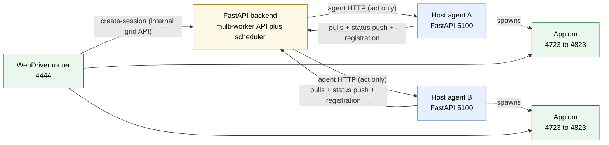

# Doc 4: Backend ↔ Agent Contract

> HTTP contract between the FastAPI manager and the FastAPI host agents: dial catalog, push surface, failure model, circuit breaker, auth, versioning. The dial catalog below is pinned to `backend/app/agent_comm/operations.py` in both directions by `backend/tests/contracts/test_design_doc_parity.py`.

GridFleet has two HTTP-speaking processes per host: the centralised backend and the per-host agent. The agent registers itself (periodic enrollment refresh), pulls desired driver-pack and Appium-node state plus its probe roster, pushes one consolidated status report, and downloads pack tarballs. The backend dials an agent **only to act, never to observe** — observation arrives exclusively on the push.

## Topology

The CI runner / test client speaks **only** to the WebDriver router for sessions. The backend never proxies WebDriver traffic. For each new session the router calls the backend's internal grid API; the backend allocates a device, creates the Appium session itself, and returns the target the router then proxies to (Doc 5). Allocation and capability matching are owned by the backend; request forwarding is owned by the router.

## Auth surface

- **Backend → agent.** Optional HTTP Basic auth: the backend sends `GRIDFLEET_AGENT_AUTH_USERNAME` / `GRIDFLEET_AGENT_AUTH_PASSWORD` per request via the pool; the agent enforces Basic auth on every `/agent/*` route when `AGENT_API_AUTH_USERNAME` / `AGENT_API_AUTH_PASSWORD` are set (`agent/agent_app/api_auth.py`). Leave all four unset for a trusted private lab network.
- **Agent → backend.** The agent uses `AGENT_MANAGER_AUTH_USERNAME` / `AGENT_MANAGER_AUTH_PASSWORD` for registration, pulls, and the status push, satisfying backend machine auth when `GRIDFLEET_AUTH_ENABLED=true`.
- **Browser → backend** is out of scope here (session cookie + CSRF; never hits agents).

There is no HMAC or message signing. Without the optional Basic auth, transport security relies entirely on the network boundary in `docs/guides/security.md`.

## Endpoint catalog (backend → agent)

All paths are under `http://<host_ip>:<host.agent_port>`. Every dial is a typed wrapper in `backend/app/agent_comm/operations.py` (imported as `agent_operations`); the wrapper signature pins the response shape, the default timeout, and the projection from HTTP into the ack contract — read the wrapper, not this table, for those details.

| Wrapper | Method + path | Purpose |
| --- | --- | --- |
| `agent_health` | GET `/agent/health` | cadence-gated partition diagnostic (`host_sweep`) and on-demand host diagnostics; carries version guidance |
| `appium_status` | GET `/agent/appium/{port}/status` | on-demand "is the Appium on this port up?" for operator/diagnostic and node-flow waits |
| `appium_logs` | GET `/agent/appium/{port}/logs` | host detail UI: last N Appium log lines |
| `agent_nodes_refresh` | POST `/agent/appium-nodes/refresh` | fire-and-forget wake poke after desired-state writes; callers go through `poke_node_refresh` (`app/agent_comm/node_poke.py`) and swallow failures |
| `get_tool_status` | GET `/agent/tools/status` | host onboarding: Node provider and host helper versions |
| `get_pack_devices` | GET `/agent/pack/devices` | presence enumeration on probe-miss; intake/discovery |
| `normalize_pack_device` | POST `/agent/pack/devices/normalize` | intake: normalise raw operator input to canonical device fields |
| `pack_device_health` | GET `/agent/pack/devices/{ct}/health` | adapter-driven health probe (verification, link-repair) |
| `pack_device_lifecycle_action` | POST `/agent/pack/devices/{ct}/lifecycle/{action}` | run a pack-defined lifecycle action (reconnect, release_forwarded_ports) or resolve a transport identity (resolve) |
| `pack_doctor` | POST `/agent/pack/{pack_id}/doctor` | pack adapter doctor checks during onboarding/diagnostics |

One deliberate exception rides outside the wrapper module: pack feature dispatch (`POST /agent/pack/features/{feature}/actions/{action}`) is issued from `app/packs/services/feature_dispatch.py` via the shared `app.agent_comm.client.request`, so the circuit breaker and metrics still fire. Routers and services never call `httpx` directly — go through a wrapper or that shared `request`.

Every dial is idempotent or a best-effort hint except the adapter-backed actions (`pack_device_lifecycle_action`, feature dispatch), whose semantics are defined by the pack adapter.

## Launch payload cap surfaces

The `launch` payload inside `GET /agent/appium-nodes/desired`'s response (built by `build_node_launch_payload`) sends two capability surfaces to the agent. They have separate sources of truth and separate consumers; keep them disentangled when extending the contract.

| Field | Source of truth | Consumer |
| --- | --- | --- |
| `extra_caps` | `_build_session_aligned_start_caps(...)` in `app/appium_nodes/services/reconciler_agent.py`: full device dump (platform, os_version, manufacturer, model, ip, deviceName, sanitized `device_config.appium_caps`, tags, allocated caps) | Agent: merged into the Appium `/session` request body |
| `allocated_caps` | `appium_node_resource_service.get_capabilities(...)` (UDID + reserved ports) | Agent → Appium driver |

The desired-node spec also carries `accepting_new_sessions`, `stop_pending`, and `grid_run_id` alongside `launch`. The agent records these but does not route on them; suppression and run scoping are enforced by the backend allocation service.

**Backend-internal routing surface.** Capability matching happens in the backend, never on the node: `device_match_surface` (`app/grid/allocation.py`, merged with `build_grid_stereotype_caps`) is the per-device routing surface. It carries only the keys the matcher consults and is never sent to the agent.

**Cross-component invariant.** Keep the routing stereotype and the driver caps disjoint: Appium-only device metadata flows to the driver via `extra_caps` only, never into the routing stereotype.

## Endpoint catalog (agent → backend)

| Method | Path | Caller (agent) | Purpose |
| --- | --- | --- | --- |
| POST | `/api/hosts/register` | bootstrap, then periodic enrollment refresh (`AGENT_REGISTRATION_REFRESH_INTERVAL_SEC`) | enrollment only: identity, ip, agent port, hardware descriptor, plus capabilities as the 426 contract-gate credential. Never writes runtime facts (`agent_version`, capabilities, `Host.status`, `last_heartbeat` are push-owned) |
| POST | `/agent/hosts/status` | consolidated status-push loop (`AGENT_STATUS_PUSH_INTERVAL_SEC`, default 10 s) | the one status-bearing channel (`HostStatusPush`): nodes, restart events, start failures, pack status, host telemetry, agent version/capabilities. Stamps `Host.last_heartbeat`; never writes `Host.status` (the sweep's edge detector owns both edges). 426 on a pre-v6 contract |
| GET | `/agent/appium-nodes/desired` | `NodeStateLoop` (5 s default, or on a poke) | desired Appium-node projection (incl. `launch` or `unrunnable_reason`) |
| GET | `/agent/driver-packs/desired` | `PackStateLoop` | desired pack list for this host |
| GET | `/agent/devices/probe-targets` | agent probe scheduler (`agent_app/probes.py`) | roster for the agent's local observation cadences |
| GET | `/api/driver-packs/{pack_id}/releases/{release}/tarball` | `tarball_fetch` | sha256-pinned pack tarball download |

## Node lifecycle: pull only

Nodes converge by agent pull. The backend never starts, stops, restarts, or reconfigures an Appium process — the only backend→agent node signal is the refresh poke. Desired state is written under the device row lock by `write_desired_state` and served as a projection; the agent's `NodeStateLoop` starts, stops, reconfigures, and reaps local orphan processes from that projection on every poll.

**The restart watermark.** `AppiumNode.restart_requested_at` means "the Appium process must have been spawned at or after T" and is written only by `write_desired_state`. The agent respawns to satisfy it; the backend confirms satisfaction by comparing the watermark against the `started_at` each running-node entry reports in the status push. There is no clearing protocol — a satisfied watermark is inert, and a stuck "restarting" projection self-clears at read time after `appium_reconciler.restart_window_sec`.

**Observed state comes only from the push.** The observe-only convergence pass (`app/appium_nodes/services/reconciler.py`) matches the pushed `appium_processes.running_nodes` entries against desired rows (`decide_convergence_action`) and performs the `mark_node_started` / `mark_node_stopped` DB flips (Doc 2). Start failures ride the same push (`start_failures`, kinds `port_conflict` / `spawn_failed`): `_record_start_failure` records the backoff for both kinds, and a `port_conflict` additionally re-pins `desired_port` to the next free candidate (`_repin_desired_port` via `candidate_ports`) — the backend stays the single port authority and the conflict converges within two poll cycles.

**Delivery: the poke is the only signal.** Every desired-state write is followed by a fire-and-forget `poke_node_refresh`; `converge_device_now` (the operator fast path) pokes and returns without agent I/O. A lost poke costs at most one agent poll interval; correctness comes from the agent's own poll.

## Request envelope

Every backend→agent call goes through `request()` in `backend/app/agent_comm/client.py`: circuit-breaker gate, `REQUEST_ID_HEADER` correlation (`build_agent_headers`), the HTTP call, failure classification (5xx and transport errors count against the breaker), and the per-call metric. The wrapper layer guarantees:

- `AgentUnreachableError` for transport failures.
- `AgentResponseError` for non-2xx responses when the wrapper raises for status.
- `CircuitOpenError` for hosts in the open state (body carries `retry_after_seconds`).

Loop callers map all three to `None` (indeterminate); API mutators map them to user-visible 502/503 via the handlers in `backend/app/core/errors.py`.

## Circuit breaker

`AgentCircuitBreaker` (`backend/app/agent_comm/circuit_breaker.py`), keyed per host so one bad host does not block others. `FAILURE_THRESHOLD = 5` consecutive failures open the circuit; `COOLDOWN_SECONDS = 30` later a single half-open probe decides the next state. Transport errors and HTTP ≥ 500 count as failures; 4xx does not (the agent answered, just refused). `host.circuit_breaker.opened` / `.closed` publish on transition. This is what keeps "N hosts unreachable" from amplifying across every loop cycle.

## Ack semantics

Two rules cover every case:

1. **Reads and probes** project HTTP shapes into explicit wrapper return types. Anything a loop consumes as a health signal must go through the tri-state `ProbeResult` projection (Doc 3); `indeterminate` never mutates state.
2. **Node lifecycle has no HTTP ack at all.** `mark_node_started` / `mark_node_stopped` fire only when the observe-only convergence pass matches the agent's pushed self-report; a stale or missing report changes nothing.

When adding an endpoint: pick an explicit return type, document the HTTP→type projection at the wrapper, and never let lifecycle code do its own HTTP error handling.

## Timeouts

Per-wrapper defaults are keyword defaults in `operations.py` — deliberately tight on health-path dials (a slow agent must not pin scheduler loops) and loose on adapter-backed dials (discovery and lifecycle actions may take tens of seconds). One cross-component constraint binds them: `_PACK_ADAPTER_BACKEND_TIMEOUT` must stay above the agent's `ADAPTER_HOOK_TIMEOUT_SECONDS`, or the backend times out (and trips the breaker) before the agent's adapter deadline fires. The lockstep rule is documented at the constant.

## Request correlation

Every request carries `REQUEST_ID_HEADER` (`X-Request-ID`); logs on both sides bind it so traces line up across backend + agent. When a backend loop initiates a request with no inbound id bound, the agent's middleware generates one and returns it on the response.

## Connection pooling

Backend→agent calls reuse `httpx.AsyncClient` instances pooled by `(host_ip, agent_port)` (`app.agent_comm.http_pool.AgentHttpPool`); the pool drains on lifespan shutdown. Basic auth is applied per request, not bound to the pooled client — credential changes are process-env changes (restart the backend). Pooled clients do not refresh DNS until closed; if a host's IP changes, restart the backend process.

## Versioning

`orchestration_contract_version` (floor `MIN_ORCHESTRATION_CONTRACT_VERSION` in `app/hosts/service.py`) is the one hard gate, enforced at two doors: registration rejects a pre-floor agent with HTTP 426, and the same check runs on every status push — so a stale agent stops stamping `last_heartbeat`, reads offline within the recency window, and the sweep emits the edge. Beyond that floor there is no endpoint-level API version; the backend records the pushed agent `version` and computes `agent_version_status` against `agent.min_version` for operator visibility.

`agent.min_version` protects new backend expectations against old agents; it cannot protect an old backend against a newer agent that removed an endpoint. Roll endpoint removals out backend-first (or deploy together). When evolving an endpoint: added request fields must be tolerated by the agent (Pydantic default), added response fields must be tolerated by wrappers (`payload.get(...)`), and renames/removals need a breaking component release plus the coordinated rollout above.

## Structured error codes

The Appium lifecycle endpoints return `{"code": "<ENUM_VALUE>", "message": "<human text>"}`. The enum is mirrored on both sides — `agent/agent_app/error_codes.py` and `backend/app/agent_comm/error_codes.py` — and `backend/tests/contracts/test_agent_error_code_parity.py` pins the mirror. Backend callers match on `code`; substring matching on `message` is forbidden.

## Known gaps

- Wrappers do not retry requests. Loops own retry and backoff so a degraded agent cannot amplify traffic across layers.

## What this doc does NOT cover

- Internal node state machine: see Doc 2.
- Loop cadence and reconciliation pattern: see Doc 3.
- Allocation, port pools, WebDriver sessions: see Doc 5.
- Operator-facing onboarding flows: see `docs/guides/host-onboarding.md`.
