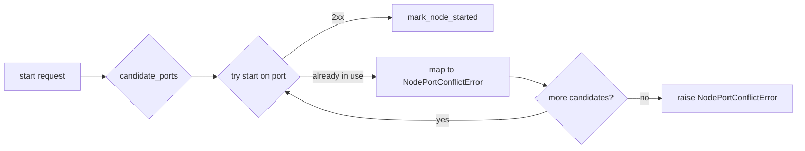
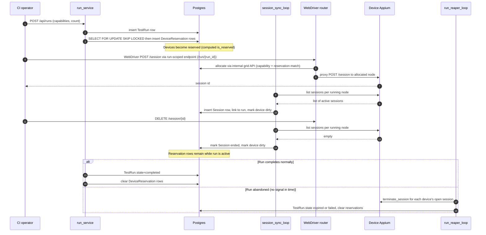

# Doc 5 — Allocations, Ports, and Sessions

> Cross-cutting reference for the resources a node grabs at start and gives back at stop: typed resource claims, Appium ports, WebDriver sessions, and run/reservation integration.

These resources are easy to leak. Most of the bugs that look like "node won't restart" or "router still allocates a dead device" are actually leaks here — a port that nobody released, a WebDriver session that survived its run, or a resource claim still pinned to an orphan process. This doc captures the lifecycle for each so we know who frees what, when.

## Three things called "session"

Before anything else, disambiguate:

| Name | What it is | Lives in | Lifetime |
| --- | --- | --- | --- |
| **WebDriver session** | The W3C session opened by a client against the router, proxied to the allocated device's Appium | router + downstream Appium | from `POST /session` to `DELETE /session/{id}` |
| **`Session` row** | DB row created by `session_sync_loop` from each node's live Appium session list | `sessions` table | recorded for the run's life + retention |
| **Run reservation** | Operator/CI hold on one or more devices for a test run | `device_reservations` table | from reserve to run completion/cancel |

A WebDriver session is what consumes a node. A `Session` row is the manager's record that one is in flight. A reservation is independent of any session and may exist before any client connects.

The split matters because the **reapers are different**:

- `session_sync_loop` reaps `Session` rows whose Appium session no longer exists on the node.
- Run release paths that end a run abnormally (`cancel_run`, `force_release`, `expire_run` through `run_reaper_loop`) explicitly call `appium_direct.terminate_session(...)` against the device's Appium node for each running session before clearing the reservation. Normal `complete_run` does not terminate sessions; the test client/operator owns normal WebDriver teardown.
- Operator stop/restart of a node never touches sessions directly — Appium's own teardown is what cancels them.

This doc focuses on resource ownership across those three.

## The typed allocation model

Appium parallel resources live in the table `appium_node_resource_claims`:

```sql
appium_node_resource_claims(
    id              uuid primary key,
    host_id         uuid not null,
    capability_key  text not null,
    port            integer not null,
    node_id         uuid not null references appium_nodes(id) on delete cascade,
    claimed_at      timestamptz not null,
    unique (host_id, capability_key, port)
);
```

Every claim is a **managed claim**: it is inserted already bound to a `node_id`. Lifetime is tied to `AppiumNode` — drop the node and the claim cascades via `ON DELETE CASCADE`. A confirmed stop can release claims early via `appium_node_resource_service.release_managed(node_id)`, or release a single capability via `release_capability(node_id, capability_key)`.

Besides the `(host_id, capability_key, port)` unique constraint, a partial unique index enforces one managed row per `(node_id, capability_key)`.

There is no temporary/promotion step: ports are reserved directly under `node_id` by `reserve_appium_port` (which calls `appium_node_resource_service.reserve(host_id, capability_key, start_port, node_id)`) around the agent start. `mark_node_started` upserts the `AppiumNode` row and promotes non-port capabilities via `set_node_extra_capability`.

Non-port managed capabilities, such as XCUITest `appium:derivedDataPath`, live in `appium_nodes.live_capabilities` and are merged with port claims by `appium_node_resource_service.get_capabilities(node_id)`.

**Why the FK matters.** The previous KV bundle had two correctness rules to remember: "release claims before the bundle" and "only release on confirmed stop". The first is now structural: `ON DELETE CASCADE` is atomic. The second still applies, but to a single DELETE instead of a sequence of namespace writes.

## Port allocation

Two ranges, two owners:

| Range | Owner | Purpose | Default |
| --- | --- | --- | --- |
| `appium.port_range_start..appium.port_range_end` | manager (DB-tracked via `AppiumNode.port`) | one Appium server per managed node | `4723..4823` |
| Per-device parallel resources (e.g. `mjpegServerPort`, `chromedriverPort`) | typed claim table | extra Appium-side ports the pack manifest declares | depends on manifest |

Only the first range is the "main" Appium port that the router proxies sessions to. The second comes into play after `/agent/appium/start` succeeds and Appium spawns its own helpers. (There is no per-node Grid relay port range anymore — the agent runs no Grid relay; the router reaches each Appium server directly on its managed port.)

### `candidate_ports`

`candidate_ports` in `backend/app/appium_nodes/services/reconciler_allocation.py`:

```text
1. used = ports of AppiumNode rows whose process is live
            (pid AND active_connection_target set) OR desired_state = running
            JOIN Device WHERE Device.host_id = :host_id
2. excluded = caller-provided exclude set (e.g. ports we already tried this attempt)
3. for port in [start..end]:
     if port in [used ∪ excluded]: skip
     else: candidate
4. preferred port (if free) goes first; the rest follow in numeric order
```

The DB row, not the agent, is the authority for "is this port in use by us". The `used` set is scoped to the target host: the main Appium listener is host-local, so two hosts can each run Appium on `appium.port_range_start` without colliding.

External listeners on a port in the managed range are detected only at start time, when the agent rejects with "already in use".

### Port conflict recovery



`_start_for_node` (`backend/app/appium_nodes/services/reconciler_agent.py`) iterates candidates until one succeeds or the pool is exhausted. The rule from commit `54707d1` — agent drops stale node state on a managed-port conflict — is what makes this loop converge: an agent that was bouncing requests on the same port should accept the next attempt instead of permanently rejecting.

The operator `restart_node` path marks the old node stopped after an acknowledged stop, so the old port is available and is passed as the preferred candidate. The loop-driven `restart_node_via_agent` path does **not** mark the node stopped between stop and start; the DB row keeps `desired_state=running` (and its observed process may still be live), so `candidate_ports` intentionally excludes the old port and the restart binds to a different free port. Doc 2 covers why this avoids racing an unconfirmed orphan.

## WebDriver sessions and routing

There is no per-node Grid relay and no central hub. The router (`router/`) listens on `:4444`, and for each new `POST /session` it calls the backend's internal grid API to allocate a device by capability match, then proxies that session's commands directly to the allocated device's Appium server on its managed port. The backend owns allocation and matching (`app/grid/allocation.py`); the router owns request forwarding. The backend observes live sessions directly per node — `session_sync_loop` lists each running node's Appium sessions via `appium_direct.list_sessions(node_target(device))`.

Two consequences for the lifecycle:

1. **Started Appium != usable node.** A successful `/agent/appium/start` returns 2xx as soon as Appium is alive. Post-cutover the agent `/agent/appium/{port}/status` probe is the authoritative liveness signal — there is no separate Grid registration step and no registration grace window.

2. **Stopped Appium must be confirmed.** Killing the Appium process is what frees the device. But only an agent-acknowledged stop proves the process is gone. An orphan Appium still listening on its managed port stays reachable by the router and can still be allocated a session. This is the operational reality behind the commit `4171847` rule: do not flip the DB to `stopped` without ack, because the process may still be serving.

The backend never scrapes a hub `/status`; "what is available right now" is read straight from the `devices`/`appium_nodes` tables (only `operational_state = available` devices are candidates in `app/grid/allocation.py`).

### Reaping a WebDriver session

`appium_direct.terminate_session(target, session_id)` issues `DELETE /session/{id}` directly to the device's Appium node (`target = node_target(device)`). A 404 is treated as success (the session was already gone). Used by the run release paths:

- `run_service.cancel_run`
- `run_service.force_release`
- `run_service.expire_run` (called by `run_reaper_loop` for heartbeat/TTL expiry)

`session_sync_loop` does not delete those sessions. It lists each node's live Appium sessions, creates `Session` rows for new sessions, and marks rows ended when the session disappears from the node.

## Reservations and run integration



Key facts:

- A **reservation** is the run's hold on a device, tracked as a `DeviceReservation` row (the computed `is_reserved` flag derives from it), separate from any active session. The row stays in place between sessions while the run is alive.
- A `DeviceReservation` row is inserted when the run is created (`is_reserved` becomes true). It is cleared when the run completes/cancels OR when the device is excluded from the run for health reasons (lifecycle policy).
- `operational_state: available → busy` is the per-session change, but `session_sync_loop` does not write it directly. On a new session it locks the device and marks it dirty via `IntentService`; the `device_intent_reconciler` derives `busy` (running session present). When the session ends, `session_sync_loop` again marks the device dirty and the reconciler derives `available` or `offline`, leaving any reservation row untouched.
- `node_health_loop` polls Appium `/status` on every running node — reserved or busy included — because the probe is a process-liveness check, not a session probe.

### Run-routed sessions

Run membership is enforced at allocation time by the backend rather than through per-worker reservation claims. Sessions bound to a run are created through the run-scoped router endpoint (`/run/{run_id}`); the router extracts the run id from the URL path and passes it to the backend's internal grid allocate call. The backend allocation gate (`_ticket_passes_reservation` / `_candidate_can_take`, `app/grid/allocation.py`) admits a candidate only if the ticket's run id matches the device's active reservation; otherwise the candidate is rejected and the allocator moves on. Admission is strictly symmetric — a run-bound session is admitted only to devices reserved for that run, and a reserved device admits only sessions from its run.

The testkit composes the run-scoped URL automatically from `GRIDFLEET_RUN_ID` (set externally by the run launcher/CI), so the backend performs the worker-to-device assignment without a manager-side claim/release API. Sessions without `GRIDFLEET_RUN_ID` use the bare router URL and land on unreserved devices only. The legacy `gridfleet:run_id` capability is no longer supported and is rejected with an explicit error pointing at the run-scoped endpoint.

Deploy order: upgrade the backend before (or together with) the router. A pre-run-scoped backend silently ignores the `run_id` field on the internal allocate call, so a new router against an old backend would mis-admit run-bound sessions as free sessions on unreserved devices.

## Failure-mode glossary (resource leaks)

| Symptom | Likely leak | Fix surface |
| --- | --- | --- |
| `start_node` keeps failing with "already in use" but the DB row says `desired_state=stopped` | Released a claim while orphan still running; allocator handed the port back | Release typed claims only on confirmed stop |
| Two Appium processes alive for the same device | Restart issued before stop ack; orphan + new node both alive | Refuse to start during restart unless stop is acknowledged (commit `4171847`) |
| Device shows `reserved` forever after run abandoned | `run_reaper_loop` did not run (leader down? frozen?) or session terminate failed | Inspect leader state; manually `DELETE /session/{id}` against the device's Appium node or use lifecycle exclusion |
| `Session` row stays `running` after the Appium session ended | `session_sync_loop` skipped a tick | Reaper retries on next cycle; only escalate if persistent |
| Port range exhausted | Confirmed stop did not release claims, or old managed rows were not deleted | `candidate_ports` raises `NodeManagerError("No free ports available...")`. Audit `appium_node_resource_claims` |

The recurring pattern: the device row, the `AppiumNode` row, typed resource claims, and the agent process must all agree on "is this device served right now". When they disagree, you have a leak. The split-brain rules in Doc 2 keep them aligned at write time; the reapers in Doc 3 catch what slips through.

## Sequencing rules summary

For new code that touches these resources, follow this order:

1. **Acquire.** Reserve resource claims (bound to the `node_id`) BEFORE asking the agent to start, via `reserve_appium_port` / `appium_node_resource_service.reserve`.
2. **Verify.** After agent says OK, poll `/agent/appium/{port}/status` until ready. Only then write DB state.
3. **Persist.** `mark_node_started` writes the `AppiumNode` row and node-health fields and calls `device_health.apply_node_state_transition`, which conditionally restores `Device.operational_state` (offline → available) only when health signals are healthy — it does not set `operational_state` directly. The public summary is derived on read.
4. **Release on stop.** Agent ack required for `release_managed`, `mark_node_stopped`, and the node-health transition.
5. **Reap on abandonment.** Loop-driven cleanup uses `terminate_session` + state restore, not direct DB writes that bypass the helpers.

If a code path skips one of these steps it will eventually leak, and the symptoms will look exactly like the failure-mode rows above.

## What this doc does NOT cover

- Multi-axis device state — see Doc 1.
- The DB↔agent ack contract for node lifecycle — see Doc 2.
- Loop cadence and tri-state probe — see Doc 3.
- HTTP shapes and circuit breaker — see Doc 4.
