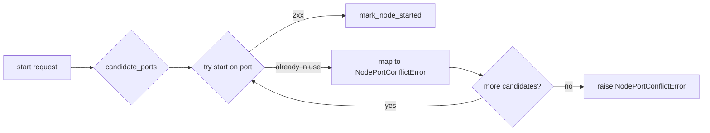
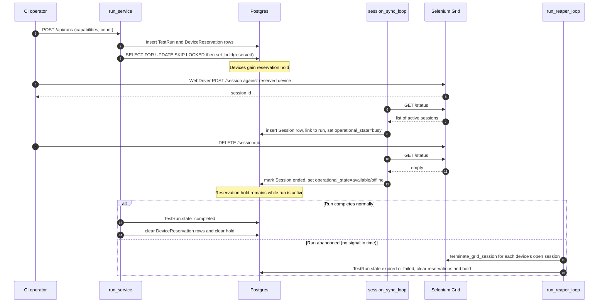

# Doc 5 — Allocations, Ports, and Sessions

> Cross-cutting reference for the resources a node grabs at start and gives back at stop: typed resource claims, Appium ports, Grid sessions, and run/reservation integration.

These resources are easy to leak. Most of the bugs that look like "node won't restart" or "Grid still routes to dead device" are actually leaks here — a port that nobody released, a Grid session that survived its run, or a resource claim still pinned to an orphan process. This doc captures the lifecycle for each so we know who frees what, when.

## Three things called "session"

Before anything else, disambiguate:

| Name | What it is | Lives in | Lifetime |
| --- | --- | --- | --- |
| **WebDriver session** | The W3C session opened by a client against the Grid hub | Selenium Grid + downstream Appium | from `POST /session` to `DELETE /session/{id}` |
| **`Session` row** | DB row created by `session_sync_loop` from Grid's `/status` | `sessions` table | recorded for the run's life + retention |
| **Run reservation** | Operator/CI hold on one or more devices for a test run | `device_reservations` table | from reserve to run completion/cancel |

A WebDriver session is what consumes a node. A `Session` row is the manager's record that one is in flight. A reservation is independent of any session and may exist before any client connects.

The split matters because the **reapers are different**:

- `session_sync_loop` reaps `Session` rows whose Grid session no longer exists.
- Run release paths that end a run abnormally (`cancel_run`, `force_release`, `expire_run` through `run_reaper_loop`) explicitly call `grid_service.terminate_grid_session(...)` on each running session before clearing the reservation. Normal `complete_run` does not terminate Grid sessions; the test client/operator owns normal WebDriver teardown.
- Operator stop/restart of a node never touches Grid sessions directly — Appium's own teardown is what cancels them.

This doc focuses on resource ownership across those three.

## The typed allocation model

Appium parallel resources live in the table `appium_node_resource_claims`:

```sql
appium_node_resource_claims(
    id              uuid primary key,
    host_id         uuid not null,
    capability_key  text not null,
    port            integer not null,
    node_id         uuid null references appium_nodes(id) on delete cascade,
    owner_token     text null,
    claimed_at      timestamptz not null,
    expires_at      timestamptz null,
    unique (host_id, capability_key, port),
    check (
      (node_id is not null and owner_token is null and expires_at is null)
      or
      (node_id is null and owner_token is not null and expires_at is not null)
    )
);
```

Two flavours of row:

- **Managed claim** — `node_id` set, `owner_token` null. Lifetime is tied to `AppiumNode`. Drop the node and the claim cascades. Confirmed stop can release early via `appium_node_resource_service.release_managed(node_id)`.
- **Temporary claim** — `node_id` null, `owner_token` set, `expires_at` set. Used during the start window for managed starts and verification probes. Released by `release_temporary(host_id, owner_token)` on teardown, or reaped by `appium_resource_sweeper_loop` after the TTL.

Additional partial unique indexes enforce one temporary row per `(host_id, owner_token, capability_key)` and one managed row per `(node_id, capability_key)`.

Every reservation begins as temporary. The token is `device:<uuid>` for first-time managed starts and refresh-of-managed verifications, or `temp:<host>:<identity>` for verification of a not-yet-saved transient device. Once the agent ACKs the start, `mark_node_started` upserts the `AppiumNode` row, then calls `transfer_temporary_to_managed(host_id, owner_token, node_id)` in the same transaction to rebind the claim under the FK.

Non-port managed capabilities, such as XCUITest `appium:derivedDataPath`, live in `appium_nodes.live_capabilities` and are merged with port claims by `appium_node_resource_service.get_capabilities(node_id)`.

**Why the FK matters.** The previous KV bundle had two correctness rules to remember: "release claims before the bundle" and "only release on confirmed stop". The first is now structural: `ON DELETE CASCADE` is atomic. The second still applies, but to a single DELETE instead of a sequence of namespace writes.

## Port allocation

Two ranges, two owners:

| Range | Owner | Purpose | Default |
| --- | --- | --- | --- |
| `appium.port_range_start..appium.port_range_end` | manager (DB-tracked via `AppiumNode.port`) | one Appium server per managed node | `4723..4823` |
| `AGENT_GRID_NODE_PORT_START` upward | agent (host-local) | one Selenium Grid relay per Appium node | per-host setting |
| Per-device parallel resources (e.g. `mjpegServerPort`, `chromedriverPort`) | typed claim table | extra Appium-side ports the pack manifest declares | depends on manifest |

Only the first range is the "main" Appium port. The other two come into play after `/agent/appium/start` succeeds and Appium spawns its own helpers.

### `candidate_ports`

`candidate_ports` in `backend/app/services/node_service.py`:

```text
1. used = ports of AppiumNode rows where state = running
            JOIN Device WHERE Device.host_id = :host_id
2. excluded = caller-provided exclude set (e.g. ports we already tried this attempt)
3. for port in [start..end]:
     if port in [used ∪ excluded]: skip
     else: candidate
4. preferred port (if free) goes first; the rest follow in numeric order
```

The DB row, not the agent, is the authority for "is this port in use by us". The `used` set is scoped to the target host: the main Appium listener is host-local, so two hosts can each run Appium on `appium.port_range_start` without colliding.

External listeners on a port in the managed range are detected only at start time, when the agent rejects with "already in use".

### Port conflict recovery



`_start_with_owner` (`node_service.py`) iterates candidates until one succeeds or the pool is exhausted. The rule from commit `54707d1` — agent drops stale node state on a managed-port conflict — is what makes this loop converge: an agent that was bouncing requests on the same port should accept the next attempt instead of permanently rejecting.

The operator `restart_node` path marks the old node stopped after an acknowledged stop, so the old port is available and is passed as the preferred candidate. The loop-driven `restart_node_via_agent` path does **not** mark the node stopped between stop and start; the DB row remains `state=running`, so `candidate_ports` intentionally excludes the old port and the restart binds to a different free port. Doc 2 covers why this avoids racing an unconfirmed orphan.

## Grid sessions and Selenium Grid registration

Each Appium node is paired on the agent host with a Selenium Grid relay process — a Java sidecar that registers the Appium server with the central hub. The backend sees this only indirectly via `grid_service.get_grid_status()` (`backend/app/services/grid_service.py`), which fetches `/status` from the hub.

Two consequences for the lifecycle:

1. **Started Appium != usable node.** A successful `/agent/appium/start` returns 2xx as soon as Appium is alive, but the Grid relay registration is asynchronous on the agent side. `node_health_loop` gives a "registration grace window" equal to `appium.startup_timeout_sec` before treating "not in Grid status" as a failure. Inside that window the derived node health stays running.

2. **Stopped Appium ≠ no Grid registration.** Killing the Appium process should also tear down the Grid relay, but only if the agent acknowledged the stop. An orphan Appium plus its still-registered relay means Grid will keep routing sessions to it. This is the operational reality behind the commit `4171847` rule: do not flip the DB to `stopped` without ack, because Grid is still using the slot.

`available_node_device_ids` (`grid_service.py`) extracts the set of GridFleet-tagged device IDs from `/status` so loops can see "what does Grid think is available right now" without scraping HTML.

### Reaping a Grid session

`grid_service.terminate_grid_session(session_id)` issues `DELETE /session/{id}` to the hub. A 404 is treated as success (the session was already gone). Used by:

- `run_service.cancel_run`
- `run_service.force_release`
- `run_service.expire_run` (called by `run_reaper_loop` for heartbeat/TTL expiry)

`session_sync_loop` does not delete Grid sessions. It observes Grid `/status`, creates `Session` rows for new sessions, and marks rows ended when the session disappears from Grid.

## Reservations and run integration



Key facts:

- `hold = reserved` is the **run's** hold on a device, separate from any active session. It stays `reserved` between sessions while the run is alive.
- `hold: null → reserved` happens when the run is created. `reserved → null` happens when the run completes/cancels OR when the device is excluded from the run for health reasons (lifecycle policy).
- `operational_state: available → busy` is the per-session flip done by `session_sync_loop`. The reverse sets operational state back to `available` or `offline` and leaves any reservation hold untouched.
- `node_health_loop` skips reserved and busy devices: it only probes devices whose chip status is allocatable and whose operational state is `available` (`_should_probe_node_health` in `node_health.py`). So a device under a run is invisible to auto-restart while it is being driven.

### Reservation cooldown and escalation

`POST /api/runs/{run_id}/devices/{device_id}/release-with-cooldown` lets a worker signal that a device behaved badly during a session without permanently excluding it. The handler calls `run_service.release_claimed_device_with_cooldown`, which — inside a `SELECT … FOR UPDATE` on the `DeviceReservation` row — sets `excluded=True`, records `excluded_at`, and writes `excluded_until = excluded_at + ttl_seconds`. It also increments `DeviceReservation.cooldown_count` and records a `lifecycle_run_cooldown_set` event. While the cooldown is active, `claim_device` skips the row; on the next call after the TTL elapses, `_clear_expired_cooldown` clears the `excluded` flag and makes the device claimable again.

**Escalation to maintenance.** The settings registry knob `general.device_cooldown_escalation_threshold` (default 3; 0 disables) gates automatic promotion. After the increment, if `cooldown_count >= threshold`, a second phase runs — deliberately outside the first `async with db.begin()` block (mirroring the `complete_auto_stop` pattern) so that nested commits are safe:

1. A `lifecycle_run_cooldown_escalated` event is written to `device_events` with `{cooldown_count, threshold, reason, worker_id, run_id, run_name}`.
2. `lifecycle_policy_actions.exclude_run_if_needed(...)` sets `excluded=True, excluded_until=None` on the reservation row, records `lifecycle_run_excluded`, and calls `maintenance_service.enter_maintenance(...)`. The device hold flips to `maintenance`; from the run's perspective the device is permanently excluded.

**Response surface.** The endpoint returns a discriminated union on the `status` literal: `"cooldown_set"` for a normal TTL-bounded cooldown, `"maintenance_escalated"` when the threshold was crossed and `enter_maintenance` was called.

## Failure-mode glossary (resource leaks)

| Symptom | Likely leak | Fix surface |
| --- | --- | --- |
| `start_node` keeps failing with "already in use" but the DB row says `stopped` | Released a claim while orphan still running; allocator handed the port back | Release typed claims only on confirmed stop |
| Two relays registered for the same device on Grid | Restart issued before stop ack; orphan + new node both alive | Refuse to start during restart unless stop is acknowledged (commit `4171847`) |
| Device shows `reserved` forever after run abandoned | `run_reaper_loop` did not run (leader down? frozen?) or grid session terminate failed | Inspect leader state; manually `DELETE /session/{id}` via Grid hub or use lifecycle exclusion |
| `Session` row stays `running` after Grid session ended | `session_sync_loop` skipped a tick | Reaper retries on next cycle; only escalate if persistent |
| Temporary claim exists but no `AppiumNode` row | `mark_node_started` never ran (start failed after reserve but before promotion) | `appium_resource_sweeper_loop` reaps after `appium.reservation_ttl_sec`; confirmed cleanup can call `release_temporary` |
| Port range exhausted | Confirmed stop did not release claims, or old managed rows were not deleted | `candidate_ports` raises `NodeManagerError("No free ports available...")`. Audit `appium_node_resource_claims` |

The recurring pattern: the device row, the `AppiumNode` row, typed resource claims, and the agent process must all agree on "is this device served right now". When they disagree, you have a leak. The split-brain rules in Doc 2 keep them aligned at write time; the reapers in Doc 3 catch what slips through.

## Sequencing rules summary

For new code that touches these resources, follow this order:

1. **Acquire.** Insert temporary resource claims BEFORE asking the agent to start. Promote only after agent ACK and node-row upsert.
2. **Verify.** After agent says OK, poll `/agent/appium/{port}/status` until ready. Only then write DB state.
3. **Persist.** `mark_node_started` writes `AppiumNode`, `Device.operational_state`, and node health via `device_health.apply_node_state_transition` in one transaction. The public summary is derived on read.
4. **Release on stop.** Agent ack required for `release_managed`, `mark_node_stopped`, and the node-health transition.
5. **Reap on abandonment.** Loop-driven cleanup uses `terminate_grid_session` + state restore, not direct DB writes that bypass the helpers.

If a code path skips one of these steps it will eventually leak, and the symptoms will look exactly like the failure-mode rows above.

## What this doc does NOT cover

- Multi-axis device state — see Doc 1.
- The DB↔agent ack contract for node lifecycle — see Doc 2.
- Loop cadence and tri-state probe — see Doc 3.
- HTTP shapes and circuit breaker — see Doc 4.
